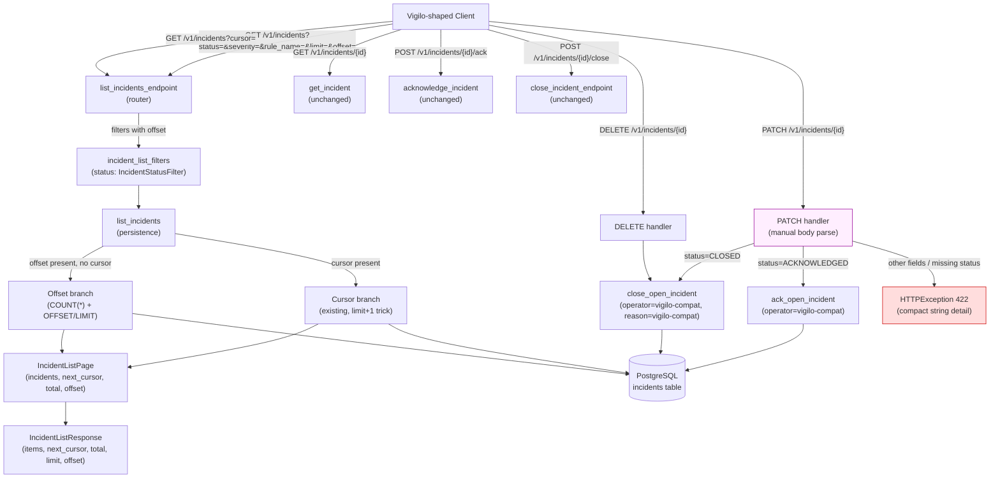

# Phase 6: Canonical Incident API Operation Parity - Research

**Researched:** 2026-06-17
**Domain:** FastAPI incident API compatibility — offset pagination, derived status filter, PATCH/DELETE mutation aliases, summary-mutation rejection
**Confidence:** HIGH

## Summary

Phase 6 extends the existing canonical `/v1/incidents` FastAPI router to support Vigilo-shaped list, detail, acknowledgement, and close workflows without adding a `/api/v1` facade, without downgrading Correlia's rich incident model, and without adding a new database `status` value. All work is pure Python within the existing FastAPI / async SQLAlchemy / Pydantic v2 stack — no new packages, no migrations, no external services.

The implementation touches four files in a tightly scoped way: `app/domain/incidents.py` (filter and response models), `app/persistence/incidents.py` (offset pagination branch + total count), `app/api/routers/incidents.py` (query-param dependency extension + PATCH/DELETE handlers), and `tests/test_incidents_api.py` (new test coverage). The existing `GET /v1/incidents/{id}`, `POST /ack`, and `POST /close` endpoints remain byte-for-byte unchanged; `IncidentDetailResponse` is preserved; cursor pagination is preserved. Phase 5's router-level `Security(require_operator_token)` dependency and the middleware route-class classification (`/v1/incidents` → `operator`) automatically protect the new PATCH/DELETE routes — no middleware or auth changes are needed.

**Primary recommendation:** Introduce a separate `IncidentStatusFilter` StrEnum (canonical values + `ACKNOWLEDGED`) for the `status` **query parameter only** — never add `ACKNOWLEDGED` to `IncidentStatus` (the DB CHECK constraint `ck_incidents_status` enforces `status IN ('OPEN','RESOLVED','CLOSED')`). For PATCH dispatch, compare the raw `status` string against `"ACKNOWLEDGED"`/`"CLOSED"` literals only (D-10), not against the filter enum, since the enum includes `OPEN`/`RESOLVED` which are not valid PATCH targets. Implement offset pagination as a branch inside `list_incidents` (cursor wins when both present per D-03; the no-param default preserves the existing cursor first-page behavior), always compute `total` via a `COUNT(*)` subquery, and parse the PATCH body manually via `Request` to produce the exact compact `422` string details required by D-16/D-17 (the global `RequestValidationError` handler in `app/main.py:48-57` produces a list-shaped detail, not a compact string).

<user_constraints>
## User Constraints (from CONTEXT.md)

### Locked Decisions

#### Offset Pagination and List Metadata
- **D-01:** Canonical `GET /v1/incidents` supports both cursor pagination (existing default) and offset pagination. When `offset` is supplied, the response is an offset-based page; when only `cursor` is supplied, cursor pagination is used.
- **D-02:** The list response always includes `items`, `total`, `limit`, and `offset` fields. For cursor-driven requests, `total`, `limit`, and `offset` are present (with `offset` reflecting the implied position or `0`) so the schema is stable for Vigilo clients.
- **D-03:** When both `cursor` and `offset` are supplied, cursor pagination wins. The `offset` parameter is ignored and `next_cursor` is populated as usual.
- **D-04:** For offset pagination, compute the total matching count so Vigilo clients receive accurate `total`/`limit`/`offset` metadata.

#### ACKNOWLEDGED Status Semantics
- **D-05:** `ACKNOWLEDGED` is a compatibility status alias, not a new canonical `IncidentStatus` or database value. It maps to `acknowledged_at IS NOT NULL` and `acknowledged_by IS NOT NULL` while canonical `status` remains `OPEN`.
- **D-06:** `GET /v1/incidents?status=ACKNOWLEDGED` returns open incidents where `acknowledged_at`/`acknowledged_by` are set.
- **D-07:** `GET /v1/incidents?status=OPEN` continues to include acknowledged incidents (Correlia lifecycle view). Status filters are not mutually exclusive.
- **D-08:** **Filter contract:** the canonical `status` query parameter continues to accept existing Correlia values (`OPEN`, `RESOLVED`, `CLOSED`) and additionally accepts derived `ACKNOWLEDGED`. The compatibility filter surface focuses on `OPEN`, `ACKNOWLEDGED`, and `CLOSED`; `RESOLVED` remains available for canonical use.
- **D-09:** `PATCH /v1/incidents/{id}` with `{"status": "ACKNOWLEDGED"}` calls the existing `ack_open_incident` path, records the compatibility operator/reason defaults, and returns the incident with canonical `status: OPEN` and the existing `acknowledgement` object populated.

#### Status Mutation Aliases
- **D-10:** `PATCH /v1/incidents/{id}` accepts only `ACKNOWLEDGED` and `CLOSED` status mutations. `OPEN` is not a meaningful target from a Vigilo client.
- **D-11:** `DELETE /v1/incidents/{id}` maps to `close_open_incident` with the compatibility default operator and reason.
- **D-12:** Existing explicit `POST /v1/incidents/{id}/ack` and `POST /v1/incidents/{id}/close` endpoints remain unchanged and continue to require caller-supplied operator/reason.
- **D-13:** Compatibility mutations (`PATCH` and `DELETE`) always use `operator="vigilo-compat"` and `reason="vigilo-compat"` because the `status`-only PATCH body does not accept caller-supplied operator or reason.
- **D-14:** Compatibility mutations are idempotent. Re-acknowledging an acknowledged incident or re-closing a closed incident returns `200` with the current incident state, matching the existing explicit endpoints.

#### Summary Mutation Rejection
- **D-15:** `PATCH /v1/incidents/{id}` accepts only a `status` field. Any body containing other fields (including `summary`) is rejected with HTTP `422`.
- **D-16:** The deterministic `422` detail for unsupported PATCH fields is `"summary mutation is not supported"`.
- **D-17:** An empty PATCH body or a body missing `status` returns `422` with detail `"status is required"`.

### Claude's Discretion
- Preserve the existing `IncidentDetailResponse` schema; do not down-project fields for compatibility.
- Implement the offset pagination helper in the existing persistence layer without removing cursor support.
- Keep `RESOLVED` as a canonical status value for recovery-driven transitions; do not expose it in compatibility PATCH mutations.

### Deferred Ideas (OUT OF SCOPE)
None — discussion stayed within phase scope.
</user_constraints>

<phase_requirements>
## Phase Requirements

| ID | Description | Research Support |
|----|-------------|------------------|
| API-01 | Operators can list incidents on canonical `/v1/incidents` using Vigilo-supported filters `status`, `severity`, `rule_name`, `limit`, and `offset`. | `IncidentListFilters` already supports `status`, `severity`, `rule_name`, `limit`; add `offset` field. The `status` filter must accept `ACKNOWLEDGED` via a new `IncidentStatusFilter` enum (see Pitfall 1). `offset` query param added to `incident_list_filters` dependency. |
| API-02 | Operators can request list metadata containing `items`, `total`, `limit`, and `offset` without removing Correlia's cursor pagination support. | `IncidentListResponse` extended with `total: int`, `limit: int`, `offset: int` (always present per D-02). `IncidentListPage` extended with `total: int` and `offset: int` so the endpoint passes them through to the response without re-deriving from filters. `list_incidents` always computes `COUNT(*)` for the matching predicate set. Cursor path preserves `next_cursor`; offset path omits it. |
| API-03 | Operators can fetch one incident on canonical `/v1/incidents/{id}` with Correlia's rich incident fields preserved. | `GET /{incident_id}` endpoint and `IncidentDetailResponse` are unchanged — no work needed. The existing `_incident_response` builder preserves all 17 rich fields. Verify with a regression test. |
| API-04 | Operators can acknowledge an open incident through a status mutation alias while Correlia records the operator as `vigilo-compat` when no operator is supplied. | `PATCH /{incident_id}` with `{"status":"ACKNOWLEDGED"}` → `ack_open_incident(session, id, operator="vigilo-compat")`. Reuses existing function verbatim (idempotent per D-14). |
| API-05 | Operators can close an open or acknowledged incident through status mutation or DELETE alias while Correlia records a compatibility close reason when no reason is supplied. | `PATCH /{incident_id}` with `{"status":"CLOSED"}` → `close_open_incident(session, id, operator="vigilo-compat", reason="vigilo-compat")`. `DELETE /{incident_id}` → same call. Both reuse existing function (idempotent). |
| API-06 | Operators receive `422` when attempting summary mutation because Correlia does not support unaudited incident text changes. | PATCH handler manually parses `Request` body, raises `HTTPException(422, detail="summary mutation is not supported")` for extra fields, `HTTPException(422, detail="status is required")` for missing/empty body. Must bypass global validation handler (see Pitfall 3). |
| API-07 | Operators can continue using Correlia's explicit `/ack` and `/close` endpoints alongside compatibility-friendly mutation aliases. | `POST /{incident_id}/ack` and `POST /{incident_id}/close` are unchanged. The new PATCH/DELETE handlers are separate route decorators on the same router. No conflict because different HTTP methods. |
</phase_requirements>

## Architectural Responsibility Map

| Capability | Primary Tier | Secondary Tier | Rationale |
|------------|-------------|----------------|-----------|
| Offset pagination + total count | Database / Storage | API / Backend | `list_incidents` in persistence layer computes `COUNT(*)` and applies `OFFSET`/`LIMIT`; the router endpoint maps the result to the response model. |
| ACKNOWLEDGED derived status filter | Database / Storage | API / Backend | The query-param dependency parses the filter value in the API tier; the SQL translation (`status='OPEN' AND acknowledged_at IS NOT NULL AND acknowledged_by IS NOT NULL`) runs in the persistence tier. |
| Cursor pagination (preserved) | Database / Storage | — | Unchanged `list_incidents` cursor branch; no tier reassignment. |
| PATCH/DELETE mutation aliases | API / Backend | Database / Storage | Router handlers call existing `ack_open_incident` / `close_open_incident` persistence functions with hardcoded compatibility defaults. |
| Summary mutation rejection (422) | API / Backend | — | Manual body parsing in the PATCH handler; no persistence involvement. The rejection happens before any database access. |
| Auth / rate-limit / size-limit protection | CDN / Static (middleware) | — | Inherited from Phase 5 router-level `Security(require_operator_token)` and middleware route classification. No changes needed. |
| Rich incident detail response (preserved) | API / Backend | — | `_incident_response` builder and `IncidentDetailResponse` unchanged. |

## Standard Stack

No new packages are installed in this phase. All work uses the existing project stack.

### Core (existing, no changes)
| Library | Version | Purpose | Why Standard |
|---------|---------|---------|--------------|
| FastAPI | (in uv.lock) | HTTP router, query-param dependencies, `Request` body parsing, `HTTPException` | Already the project's API framework; PATCH/DELETE handlers are native FastAPI route decorators. |
| SQLAlchemy 2.0+ (async) | (in uv.lock) | `select`, `func.count`, `offset`, `limit` for offset pagination; existing cursor query preserved | Already the persistence layer; offset pagination uses standard SQLAlchemy query composition. |
| Pydantic v2 | (in uv.lock) | `IncidentListFilters`, `IncidentListResponse`, new `IncidentStatusFilter` StrEnum | Already the validation/serialization layer; `ConfigDict(strict=True, extra="forbid")` is the project pattern. |
| asyncpg | (in uv.lock) | PostgreSQL async driver | Already configured; no driver changes. |

**Installation:** None required — all dependencies are already in `pyproject.toml` and `uv.lock`.

**Version verification:** Not applicable — no new packages. Existing stack confirmed via `pyproject.toml` lines 7-18 [VERIFIED: pyproject.toml read].

## Package Legitimacy Audit

No external packages are installed in this phase. All implementation uses the existing project stack (FastAPI, SQLAlchemy, Pydantic, asyncpg).

**Packages removed due to [SLOP] verdict:** none
**Packages flagged as suspicious [SUS]:** none

*This phase is pure code work within existing dependencies — no package legitimacy gate applies.*

## Architecture Patterns

### System Architecture Diagram



### Recommended Project Structure

No new files or directories. All changes are in existing files:

```
app/
├── api/routers/
│   └── incidents.py          # Add offset query param, PATCH/DELETE handlers
├── domain/
│   └── incidents.py          # Add IncidentStatusFilter enum, offset field, total/limit/offset on response
├── persistence/
│   └── incidents.py          # Add offset branch + COUNT to list_incidents, extend IncidentListPage
└── main.py                   # Unchanged — router already included, validation handler unchanged
tests/
└── test_incidents_api.py     # Add offset/ACKNOWLEDGED/PATCH/DELETE/422 tests
```

### Pattern 1: Separate Filter Enum for ACKNOWLEDGED (Derived Status)

**What:** The `status` **query parameter** uses a new `IncidentStatusFilter` StrEnum that includes `ACKNOWLEDGED` alongside the canonical values (`OPEN`, `RESOLVED`, `CLOSED`). This enum is **query-filter-only** — it is not used for PATCH dispatch (D-10 limits PATCH targets to `ACKNOWLEDGED`/`CLOSED` only; see Pattern 3). `IncidentStatus` (the canonical enum used in ORM, DB CHECK constraint, and `IncidentDetailResponse`) is never modified.

**When to use:** Any **list-filter** API surface that must accept `ACKNOWLEDGED` as a filter value while the database only stores `OPEN`/`RESOLVED`/`CLOSED`.

**Why this matters:** The `incidents` table has a CHECK constraint `ck_incidents_status` enforcing `status IN ('OPEN', 'RESOLVED', 'CLOSED')` [VERIFIED: migrations/versions/0001_create_incidents.py:67-70]. Adding `ACKNOWLEDGED` to `IncidentStatus` would require a migration and break the canonical lifecycle model. The filter enum is a presentation-layer concept that maps to SQL predicates, not a stored value.

**Example:**
```python
# Source: derived from app/domain/incidents.py:13-16 (IncidentStatus) and CONTEXT D-05/D-08
class IncidentStatusFilter(StrEnum):
    OPEN = "OPEN"
    ACKNOWLEDGED = "ACKNOWLEDGED"   # derived alias — not stored in DB
    RESOLVED = "RESOLVED"
    CLOSED = "CLOSED"
```

In the persistence layer, `ACKNOWLEDGED` maps to a compound SQL predicate requiring **both** `acknowledged_at` and `acknowledged_by` to be non-null (D-05 specifies both):
```python
# Source: derived from app/persistence/incidents.py:461-462 pattern and CONTEXT D-05
if filters.status == IncidentStatusFilter.ACKNOWLEDGED:
    stmt = stmt.where(
        Incident.status == IncidentStatus.OPEN.value,
        Incident.acknowledged_at.is_not(None),
        Incident.acknowledged_by.is_not(None),
    )
elif filters.status is not None:
    stmt = stmt.where(Incident.status == filters.status.value)
```
**D-05 note:** The `acknowledged_by` column is a `String` that the ack path sets to the operator value [VERIFIED: app/persistence/incidents.py:1076]. Requiring `IS NOT NULL` on both columns distinguishes genuinely-acknowledged incidents from any row where `acknowledged_at` might be set without an operator (defensive; in practice `ack_open_incident` always sets both atomically).

### Pattern 2: Offset Pagination Branch Inside list_incidents

**What:** `list_incidents` gains an offset branch that runs when `offset` is present and `cursor` is absent. The cursor branch (existing) runs when `cursor` is present (D-03: cursor wins if both supplied).

**When to use:** When both cursor and offset pagination must coexist on the same endpoint with a stable response schema.

**Example:**
```python
# Source: derived from app/persistence/incidents.py:456-496 (existing cursor implementation)
async def list_incidents(session, filters):
    # Build the WHERE clause (shared by both branches)
    stmt = select(Incident)
    # ... existing filters ...

    # Always compute total for the matching predicate set (D-02/D-04)
    count_stmt = select(func.count()).select_from(stmt.subquery())
    total = await session.scalar(count_stmt) or 0

    if filters.cursor is not None:
        # EXISTING cursor branch — unchanged
        cursor = decode_incident_cursor(filters.cursor)
        stmt = stmt.where(or_(...))
        stmt = stmt.order_by(...).limit(filters.limit + 1)
        result = await session.execute(stmt)
        rows = tuple(result.scalars().all())
        incidents = rows[:filters.limit]
        next_cursor = ...  # existing limit+1 trick
        offset_value = 0  # D-02: implied position or 0
    elif filters.offset is not None:
        # NEW offset branch
        stmt = stmt.order_by(...).offset(filters.offset).limit(filters.limit)
        result = await session.execute(stmt)
        incidents = tuple(result.scalars().all())
        next_cursor = None  # offset pages don't carry cursor
        offset_value = filters.offset
    else:
        # No pagination params — PRESERVE existing cursor first-page behavior.
        # This is the default path: use the same limit+1 trick as the cursor
        # branch so next_cursor is populated when more rows exist. Do NOT
        # silently downgrade to offset mode; existing Correlia clients that
        # call GET /v1/incidents with no params must still get cursor pagination.
        stmt = stmt.order_by(...).limit(filters.limit + 1)
        result = await session.execute(stmt)
        rows = tuple(result.scalars().all())
        incidents = rows[:filters.limit]
        next_cursor = None
        if len(rows) > filters.limit:
            last = incidents[-1]
            next_cursor = encode_incident_cursor(
                IncidentCursor(last_update_time=last.last_update_time, id=last.id)
            )
        offset_value = 0  # D-02: implied position or 0

    return IncidentListPage(
        incidents=incidents,
        next_cursor=next_cursor,
        total=total,
        offset=offset_value,
    )
```

**Key detail:** The `COUNT(*)` subquery is built from the same WHERE-clause `stmt` (before cursor/offset/limit/ordering are applied). The planner must ensure the count statement is derived from the filtered base, not the final paginated query. [VERIFIED: app/persistence/incidents.py:460-472 shows the shared filter construction]

### Pattern 3: Manual PATCH Body Parsing for Exact 422 Strings

**What:** The PATCH handler accepts `Request` (not a Pydantic model) and manually parses the JSON body to produce the exact compact string details required by D-16/D-17. This bypasses the global `RequestValidationError` handler in `app/main.py:48-57` which produces `{"detail": [{loc, msg, type}, ...]}` (a list, not a compact string).

**When to use:** Whenever an endpoint must return a specific compact `{"detail": "string"}` 422 body that differs from FastAPI's default validation error shape.

**Why this matters:** The global handler at `app/main.py:218` (`app.add_exception_handler(RequestValidationError, request_validation_exception_handler)`) intercepts all Pydantic validation failures and transforms them into list-shaped detail. If the PATCH body is typed as a Pydantic model (e.g., `body: IncidentPatchRequest = Body(...)`), FastAPI raises `RequestValidationError` before the handler runs, and the global handler produces the list shape — not the exact strings D-16/D-17 require. Manual `Request` parsing with `HTTPException(422, detail="...")` is the only way to get the compact string shape. [VERIFIED: app/main.py:37-57, 218]

**Precedence decision (locked for the plan):** The body checks run in this order — non-dict/empty is separated from extra-keys so that summary-only bodies are classified as summary-mutation attempts while malformed bodies are missing-status errors:
1. Non-JSON body, empty body, or valid JSON that is not a dict (array/scalar/null) → `"status is required"` (D-17). These are malformed mutation bodies, not summary-mutation attempts.
2. Body is a dict but contains any key other than `status` (including `summary`) → `"summary mutation is not supported"` (D-15/D-16). This fires whether or not `status` is also present, so `{"summary":"x"}` and `{"status":"ACKNOWLEDGED","summary":"x"}` both get this message.
3. Body is a dict with only `status` (or empty `{}`) but the value is not `ACKNOWLEDGED` or `CLOSED` → rejected (D-10: only `ACKNOWLEDGED`/`CLOSED` are valid PATCH targets; `OPEN`, `RESOLVED`, unknown strings, and missing `status` key are rejected — see Open Question 4 for the message choice)
4. Otherwise dispatch: `ACKNOWLEDGED` → `ack_open_incident`, `CLOSED` → `close_open_incident`

**Why this order:** `{"summary":"x"}` hits check 2 (extra key present) and returns `"summary mutation is not supported"` — the semantically correct response for a summary-mutation attempt, matching D-15's intent ("Any body containing other fields (including `summary`) is rejected"). `[1,2,3]` (valid JSON array) hits check 1 and returns `"status is required"` — it is a malformed body, not a summary-mutation attempt. `{}` hits check 3 (empty dict, no `status` key) and returns `"status is required"`.

**PATCH target values — do NOT use `IncidentStatusFilter` for dispatch:** `IncidentStatusFilter` includes `OPEN` and `RESOLVED` for *query filtering* (D-08), but D-10 says PATCH only accepts `ACKNOWLEDGED` and `CLOSED`. Reusing the filter enum for PATCH dispatch would imply `OPEN`/`RESOLVED` are patchable. Compare against raw string literals or a dedicated set of patch-target constants instead:

**Example:**
```python
# Source: derived from app/main.py:48-57 (global handler shape) and CONTEXT D-10/D-15/D-16/D-17
@router.patch("/{incident_id}", response_model=IncidentDetailResponse)
async def patch_incident(
    incident_id: UUID,
    request: Request,
    sessionmaker: Annotated[async_sessionmaker[AsyncSession], Depends(get_sessionmaker)],
) -> IncidentDetailResponse:
    try:
        body = await request.json()
    except Exception:
        raise HTTPException(status_code=422, detail="status is required")  # check 1 — D-17
    # Check 1 (continued): valid JSON but not a dict (array/scalar/null) → malformed body
    if not isinstance(body, dict):
        raise HTTPException(status_code=422, detail="status is required")  # D-17
    # Check 2: dict with any key other than "status" → summary-mutation attempt
    if any(k != "status" for k in body):
        raise HTTPException(status_code=422, detail="summary mutation is not supported")  # D-15/D-16
    # Check 3: dict with only "status" key (or empty {}) but value not a valid target
    status_value = body.get("status")
    if status_value == "ACKNOWLEDGED":
        # → ack_open_incident(session, id, operator="vigilo-compat")  D-09/D-13
        ...
    elif status_value == "CLOSED":
        # → close_open_incident(session, id, operator="vigilo-compat", reason="vigilo-compat")  D-11/D-13
        ...
    else:
        # Empty dict {}, missing "status" key, OPEN, RESOLVED, unknown strings,
        # or non-string values (int/bool/None) all land here.
        # D-10: only ACKNOWLEDGED and CLOSED are valid PATCH targets.
        raise HTTPException(status_code=422, detail="status is required")  # see Open Question 4
```
**Note on `status` value type:** `request.json()` returns raw Python values, so `status_value` may be a `str`, `int`, `bool`, `None`, etc. The `== "ACKNOWLEDGED"` / `== "CLOSED"` comparisons only match strings; any non-string or unknown string falls through to the `else` branch. Do not construct an `IncidentStatusFilter` from the raw value — that would raise `ValueError` and produce a 500 or get caught by the global handler.
**Note on empty dict `{}`:** `body.get("status")` returns `None` for `{}`, which fails both `==` checks and lands in the `else` branch, returning `"status is required"` (D-17). This is correct: an empty body is a missing-status error, not a summary-mutation attempt.
**Note on `body.get("status")` vs `body["status"]`:** Using `.get()` avoids a `KeyError` when `status` is absent. Since check 2 already rejected any dict with non-`status` keys, the only dicts reaching check 3 are `{}` (no keys) or `{"status": ...}`. Both are handled safely by `.get()`.

### Pattern 4: Compatibility Mutation Handler Reuse

**What:** PATCH and DELETE handlers call the existing `ack_open_incident` / `close_open_incident` functions with hardcoded `operator="vigilo-compat"` and `reason="vigilo-compat"`. No new persistence functions are created.

**When to use:** When compatibility aliases must produce the same database effect as explicit endpoints but with deterministic default actor/reason.

**Example:**
```python
# Source: derived from app/api/routers/incidents.py:136-192 (existing ack/close pattern)
# and app/persistence/incidents.py:1035-1090, 1093-1151 (existing functions)
VIGILO_COMPAT_OPERATOR = "vigilo-compat"
VIGILO_COMPAT_REASON = "vigilo-compat"

# PATCH {"status": "ACKNOWLEDGED"} →
result = await ack_open_incident(session, incident_id, operator=VIGILO_COMPAT_OPERATOR)
# PATCH {"status": "CLOSED"} or DELETE →
result = await close_open_incident(
    session, incident_id,
    operator=VIGILO_COMPAT_OPERATOR,
    reason=VIGILO_COMPAT_REASON,
)
```

The existing functions already handle idempotency (D-14): if the incident is not OPEN, they return a `LifecycleWriteResult` with `effect="noop"` and the current incident state; if the row doesn't exist, they return `None` (which the handler maps to 404). [VERIFIED: app/persistence/incidents.py:1048-1060, 1107-1119]

### Anti-Patterns to Avoid

- **Adding `ACKNOWLEDGED` to `IncidentStatus`:** The DB CHECK constraint `ck_incidents_status` (`status IN ('OPEN','RESOLVED','CLOSED')`) [VERIFIED: migrations/0001_create_incidents.py:67-70] would reject any row with `status='ACKNOWLEDGED'`. It also pollutes the canonical lifecycle enum used by `IncidentDetailResponse`, `validate_incident_transition`, and `is_terminal_status`. Use a separate `IncidentStatusFilter` enum for API surfaces only.

- **Typing the PATCH body as a Pydantic model:** FastAPI's global `RequestValidationError` handler (`app/main.py:48-57`) transforms Pydantic validation errors into `{"detail": [{loc, msg, type}, ...]}` — a list, not the compact string D-16/D-17 require. Parse `Request` manually and raise `HTTPException(422, detail="...")`.

- **Computing `total` only for offset requests:** D-02 requires `total` to be present for cursor-driven requests too ("so the schema is stable for Vigilo clients"). The `COUNT(*)` subquery must always run.

- **Removing `next_cursor` from the response:** The `IncidentListResponse` must keep `next_cursor` (nullable) so cursor pagination clients continue to work. Offset pages set `next_cursor=None`.

- **Down-projecting `IncidentDetailResponse` for compatibility:** CONTEXT discretion area says "do not down-project fields for compatibility." The detail response preserves all 17 rich fields [VERIFIED: app/domain/incidents.py:168-189].

- **Creating a new router or facade:** The project explicitly excludes `/api/v1/incidents` [VERIFIED: REQUIREMENTS.md:87, ROADMAP.md:10]. All new endpoints are on the existing `/v1/incidents` router.

## Don't Hand-Roll

| Problem | Don't Build | Use Instead | Why |
|---------|-------------|-------------|-----|
| Offset pagination SQL | Manual offset computation in Python | SQLAlchemy `.offset(n).limit(n)` query composition | Standard SQLAlchemy; same ordering as cursor branch (`last_update_time desc, id desc`). |
| Total count | Client-side row counting or separate count endpoint | `select(func.count()).select_from(filtered_stmt.subquery())` | Single SQL `COUNT(*)` on the filtered predicate; accurate total for D-04. |
| ACKNOWLEDGED filter | New DB column or status enum value | SQL predicate: `status='OPEN' AND acknowledged_at IS NOT NULL AND acknowledged_by IS NOT NULL` | D-05: derived alias, not stored. No migration. Reuses existing nullable columns. |
| PATCH/DELETE lifecycle logic | New ack/close persistence functions | Existing `ack_open_incident` / `close_open_incident` | Already idempotent (D-14), already handle 404/noop, already use `with_for_update()`. |
| 422 error responses | Custom exception classes | `HTTPException(status_code=422, detail="...")` | Matches the compact `{"detail": "..."}` shape used by Phase 5 error responses. |
| Safe structured logging | Custom logging | `safe_log_extra(event="operator_mutation", ...)` | Existing helper filters to `SAFE_LOG_KEYS` and prevents secret leakage. [VERIFIED: app/processing/logging.py:7-70] |

**Key insight:** Every piece of Phase 6 has a direct reuse path in the existing codebase. The only new constructs are: the `IncidentStatusFilter` enum (query-only), the `offset` field on filters/page/response, the `total`/`offset` fields on page/response, the PATCH/DELETE route handlers, and the manual body-parse logic. No new persistence functions, no new middleware, no new models beyond filter/response extensions.

## Common Pitfalls

### Pitfall 1: IncidentStatus Enum Collision on ACKNOWLEDGED Query Param

**What goes wrong:** The current `status` query parameter is typed as `Annotated[IncidentStatus | None, Query(alias="status")]` [VERIFIED: app/api/routers/incidents.py:80]. `IncidentStatus` is a `StrEnum` with only `OPEN`, `RESOLVED`, `CLOSED` [VERIFIED: app/domain/incidents.py:13-16]. A request with `?status=ACKNOWLEDGED` fails Pydantic enum validation and returns a 422 before the handler runs — the value never reaches the persistence layer.

**Why it happens:** FastAPI coerces query params against the declared type. `IncidentStatus("ACKNOWLEDGED")` raises `ValueError` because `ACKNOWLEDGED` is not a member. With `model_config = ConfigDict(strict=True)`, Pydantic v2 does not accept unknown enum values.

**How to avoid:** Change the `status` query param type from `IncidentStatus | None` to a new `IncidentStatusFilter | None` enum that includes `ACKNOWLEDGED`. The `IncidentListFilters.status` field type changes correspondingly. The persistence layer translates `ACKNOWLEDGED` to `status='OPEN' AND acknowledged_at IS NOT NULL AND acknowledged_by IS NOT NULL` (D-05 requires both columns). `IncidentStatus` (the canonical enum) is never modified.

**Warning signs:** A `?status=ACKNOWLEDGED` request returning 422 with a validation error list instead of filtered results.

### Pitfall 2: Global Validation Handler Producing List-Shaped 422 for PATCH

**What goes wrong:** If the PATCH body is typed as a Pydantic model (e.g., `body: SomeModel = Body(...)`), FastAPI validates it and raises `RequestValidationError` on failure. The global handler at `app/main.py:218` (`app.add_exception_handler(RequestValidationError, request_validation_exception_handler)`) catches this and returns `{"detail": [{loc, msg, type}, ...]}` — a **list**, not the compact string `"summary mutation is not supported"` or `"status is required"` that D-16/D-17 require.

**Why it happens:** The global handler is registered for all `RequestValidationError` instances and runs before any route-level error handling. It always produces the list shape.

**How to avoid:** Type the PATCH body parameter as `Request` (not a Pydantic model). Call `await request.json()` manually inside the handler, catch `Exception` for non-JSON/empty bodies, and raise `HTTPException(422, detail="status is required")` or `HTTPException(422, detail="summary mutation is not supported")` directly. `HTTPException` is not intercepted by the `RequestValidationError` handler — FastAPI's default `HTTPException` handler produces `{"detail": "the string"}`. [VERIFIED: app/main.py:37-57, 218]

**Warning signs:** PATCH 422 responses containing `{"detail": [{"loc": ["body", ...], "msg": ..., "type": ...}]}` instead of `{"detail": "status is required"}`.

### Pitfall 3: COUNT(*) Subquery Built From Wrong Query Stage

**What goes wrong:** If the `COUNT(*)` subquery is built from the statement *after* cursor/offset/limit/ordering are applied, the total reflects only the current page, not the full matching set. D-04 requires the total matching count.

**Why it happens:** SQLAlchemy statements are mutable builders. Applying `.offset()`, `.limit()`, `.order_by()`, or cursor `WHERE` clauses mutates the statement before the count is derived.

**How to avoid:** Build the count subquery from the filtered base statement (after `status`/`severity`/`rule_name`/`host`/`service`/`updated_since` WHERE clauses, but *before* cursor/offset/limit/ordering). Use `select(func.count()).select_from(base_stmt.subquery())`. Then apply cursor/offset/limit/ordering to a separate statement for the page rows. [VERIFIED: app/persistence/incidents.py:460-472 shows the shared filter construction before cursor/limit/ordering at 473-484]

**Warning signs:** `total` equals `len(items)` on every page, or `total` changes depending on `offset`.

### Pitfall 4: IncidentListFilters extra="forbid" Rejecting New offset Field

**What goes wrong:** `IncidentListFilters` uses `model_config = ConfigDict(strict=True, extra="forbid")` [VERIFIED: app/domain/incidents.py:149]. If `offset` is added as a query parameter to the `incident_list_filters` dependency function but not declared as a field on `IncidentListFilters`, the `IncidentListFilters(...)` constructor call in the dependency function raises `ValidationError` because `extra="forbid"` rejects unknown kwargs.

**Why it happens:** The filter dependency function (`incident_list_filters`) constructs `IncidentListFilters(...)` with explicit kwargs. Adding `offset` to the function signature without adding it to the model class causes a construction failure.

**How to avoid:** Add `offset: int | None = Field(default=None, ge=0)` to `IncidentListFilters` and pass it through in the dependency function. The `extra="forbid"` config is correct and should stay — it catches typo'd query params.

**Warning signs:** `GET /v1/incidents?offset=0` returning 422 with an "extra inputs not permitted" error.

### Pitfall 5: IncidentListResponse extra="forbid" and Missing total/limit/offset

**What goes wrong:** `IncidentListResponse` uses `extra="forbid"` [VERIFIED: app/domain/incidents.py:193]. If `total`, `limit`, `offset` are not declared as fields on the model but the endpoint tries to pass them to the constructor, the construction raises `ValidationError`.

**How to avoid:** Declare `total: int`, `limit: int`, `offset: int` as fields on `IncidentListResponse` and pass them from the endpoint. For cursor requests, `offset=0` and `limit=filters.limit` (D-02).

### Pitfall 6: DELETE Route Shadowing GET /{incident_id}

**What goes wrong:** FastAPI routes are matched by method + path. `@router.get("/{incident_id}")` and `@router.delete("/{incident_id}")` use different HTTP methods, so they do not shadow each other. However, if `@router.delete("")` or `@router.delete("/")` is accidentally used, it could conflict with the list endpoint.

**How to avoid:** Use `@router.delete("/{incident_id}")` (with the path parameter), matching the pattern of the existing `@router.get("/{incident_id}")` and `@router.post("/{incident_id}/ack")` decorators. [VERIFIED: app/api/routers/incidents.py:122, 136, 163]

### Pitfall 7: Acknowledged Incident Not Re-acknowledgable via PATCH (Idempotency)

**What goes wrong:** `ack_open_incident` selects `WHERE status = 'OPEN'` with `FOR UPDATE` [VERIFIED: app/persistence/incidents.py:1041-1046]. An acknowledged incident still has `status='OPEN'` (D-05: canonical status remains OPEN), so the SELECT succeeds and the function re-acknowledges. This is correct and idempotent (D-14). However, a planner might mistakenly think "acknowledged" means the status changed and add a guard that rejects re-ack.

**How to avoid:** Do not add any pre-check in the PATCH handler. Call `ack_open_incident` directly — it already handles the OPEN selection. The existing `func.coalesce(Incident.acknowledged_at, func.now())` [VERIFIED: app/persistence/incidents.py:1075] preserves the first acknowledgement timestamp on re-ack.

## Code Examples

### Current list_incidents (cursor-only, to be extended)

```python
# Source: app/persistence/incidents.py:456-496 [VERIFIED — read verbatim]
async def list_incidents(
    session: AsyncSession,
    filters: IncidentListFilters,
) -> IncidentListPage:
    stmt = select(Incident)
    if filters.status is not None:
        stmt = stmt.where(Incident.status == filters.status.value)
    if filters.severity is not None:
        stmt = stmt.where(Incident.severity == filters.severity.value)
    if filters.rule_name is not None:
        stmt = stmt.where(Incident.rule_name == filters.rule_name)
    if filters.host is not None:
        stmt = stmt.where(Incident.affected_hosts.contains([filters.host]))
    if filters.service is not None:
        stmt = stmt.where(Incident.affected_services.contains([filters.service]))
    if filters.updated_since is not None:
        stmt = stmt.where(Incident.last_update_time >= filters.updated_since)
    if filters.cursor is not None:
        cursor = decode_incident_cursor(filters.cursor)
        stmt = stmt.where(
            or_(
                Incident.last_update_time < cursor.last_update_time,
                and_(
                    Incident.last_update_time == cursor.last_update_time,
                    Incident.id < cursor.id,
                ),
            )
        )
    stmt = stmt.order_by(Incident.last_update_time.desc(), Incident.id.desc()).limit(
        filters.limit + 1
    )
    result = await session.execute(stmt)
    rows = tuple(result.scalars().all())
    incidents = rows[: filters.limit]
    next_cursor = None
    if len(rows) > filters.limit:
        last = incidents[-1]
        next_cursor = encode_incident_cursor(
            IncidentCursor(last_update_time=last.last_update_time, id=last.id)
        )
    return IncidentListPage(incidents=incidents, next_cursor=next_cursor)
```

### Current ack_open_incident (idempotent, to be reused by PATCH)

```python
# Source: app/persistence/incidents.py:1035-1090 [VERIFIED — read verbatim]
async def ack_open_incident(
    session: AsyncSession,
    incident_id: UUID,
    *,
    operator: str,
) -> LifecycleWriteResult | None:
    selected = await session.execute(
        select(Incident)
        .where(Incident.id == incident_id)
        .where(Incident.status == IncidentStatus.OPEN.value)
        .with_for_update()
    )
    incident = selected.scalar_one_or_none()
    if incident is None:
        current = await session.execute(select(Incident).where(Incident.id == incident_id))
        row = current.scalar_one_or_none()
        if row is None:
            return None  # → handler maps to 404
        return LifecycleWriteResult(  # → noop, already non-OPEN
            incident=row, effect="noop", transitioned_to=None,
            previous_host_count=len(row.affected_hosts),
            previous_service_count=len(row.affected_services),
            affected_object_removed=False,
        )
    # ... UPDATE with coalesce(acknowledged_at, now()) → preserves first ack timestamp
```

**Key reuse fact:** `ack_open_incident` takes only `operator` (no `reason`). The compatibility PATCH passes `operator="vigilo-compat"`. `close_open_incident` takes `operator` and `reason`; the compatibility PATCH/DELETE passes both as `"vigilo-compat"`.

### Current endpoint handler pattern (to be followed by new handlers)

```python
# Source: app/api/routers/incidents.py:136-160 [VERIFIED — read verbatim]
@router.post("/{incident_id}/ack", response_model=IncidentDetailResponse)
async def acknowledge_incident(
    incident_id: UUID,
    sessionmaker: Annotated[
        async_sessionmaker[AsyncSession], Depends(get_sessionmaker)
    ],
    body: IncidentAckRequest = Body(...),
) -> IncidentDetailResponse:
    async with sessionmaker() as session:
        result = await ack_open_incident(session, incident_id, operator=body.operator)
        if result is None:
            raise HTTPException(status_code=status.HTTP_404_NOT_FOUND, detail="incident not found")
        await session.commit()
        logger.info(
            "incident acknowledged",
            extra=safe_log_extra(
                event="operator_mutation",
                incident_id=str(result.incident.id),
                status=result.incident.status,
                effect=result.effect,
                reason="acknowledged",
                operator=body.operator,
            ),
        )
    return _incident_response(result.incident)
```

### Current test pattern (httpx.ASGITransport + create_app injection)

```python
# Source: tests/test_incidents_api.py:83-96, 142-213 [VERIFIED — read verbatim]
def _settings() -> Settings:
    return Settings(
        DATABASE_URL=VALID_DATABASE_URL,
        api_auth_enabled=False,
    )

def _app(session_factory: async_sessionmaker[AsyncSession]):
    return create_app(
        settings=_settings(),
        sessionmaker=session_factory,
        lifecycle_worker=NoopLifecycleWorker(),
    )

async def get_client(app) -> AsyncIterator[AsyncClient]:
    async with app.router.lifespan_context(app):
        async with AsyncClient(transport=ASGITransport(app=app), base_url="http://test") as client:
            yield client

# Test usage:
app = _app(session_factory)
async for client in get_client(app):
    page1 = await client.get("/v1/incidents", params={"limit": 2})
    filtered = await client.get("/v1/incidents", params={
        "status": "OPEN", "severity": "CRITICAL", "rule_name": "disk-full",
        "host": "db-1", "service": "disk",
        "updated_since": _event_time(1).isoformat(),
    })
```

**Test infrastructure:** Tests use `testcontainers.postgres.PostgresContainer` with Alembic upgrade head [VERIFIED: tests/test_incidents_api.py:13, 26-39]. The `_seed_incident` helper creates incidents via `upsert_open_incident` [VERIFIED: tests/test_incidents_api.py:102-139]. `conftest.py` auto-clears all `CORRELIA_*` env vars per test [VERIFIED: tests/conftest.py:40-44]. Tests disable auth via `api_auth_enabled=False` in `_settings()`.

## State of the Art

| Old Approach | Current Approach | When Changed | Impact |
|--------------|------------------|--------------|--------|
| Vigilo `/api/v1/incidents` facade with down-projection | Canonical `/v1/incidents` with rich fields preserved | Phase 6 CONTEXT (superseded VIGILO_COMPATIBILITY.md §1) | No facade; Vigilo clients use canonical path with extended filters/mutations. |
| Cursor-only pagination | Cursor + offset pagination coexistence | D-01 through D-04 | Vigilo clients get offset/total; Correlia clients keep cursor. |
| Explicit POST /ack and /close only | POST /ack, /close + PATCH/DELETE aliases | D-09 through D-14 | Vigilo clients can PATCH status or DELETE; explicit endpoints unchanged. |
| Vigilo status=ACKNOWLEDGED as stored enum value | Derived SQL filter on acknowledged_at/by | D-05/D-06 | No DB migration; canonical status stays OPEN. |

**Deprecated/outdated:**
- `VIGILO_COMPATIBILITY.md` §1 "Incident API compatibility facade" — **superseded** by Phase 6 CONTEXT: parity is on canonical `/v1/incidents` only, no `/api/v1` facade, no down-projection. [VERIFIED: VIGILO_COMPATIBILITY.md:30-41, CONTEXT canonical_refs]

## Assumptions Log

| # | Claim | Section | Risk if Wrong |
|---|-------|---------|---------------|
| A1 | `HTTPException(422, detail="...")` bypasses the global `RequestValidationError` handler and produces `{"detail": "..."}` compact string. | Pitfall 2, Pattern 3 | If FastAPI intercepts `HTTPException` 422 through the validation handler, the compact strings would not appear. Mitigation: `HTTPException` is a different exception type than `RequestValidationError` — the global handler explicitly checks `isinstance(exc, RequestValidationError)` and re-raises otherwise [VERIFIED: app/main.py:52-53]. LOW risk. |
| A2 | `func.count()` on `stmt.subquery()` produces an efficient `COUNT(*)` for the filtered predicate. | Pattern 2 | For very large incident tables, the subquery COUNT could be slow. The operator API is low-traffic and the incidents table is bounded by active incidents (closed incidents remain but are typically small volume). LOW risk for v1.1. |
| A3 | The `offset` query parameter default of `None` (not `0`) means "no offset pagination requested" so the default behavior remains cursor-style first page. | Pattern 2 | If the planner defaults `offset=0`, every request without explicit cursor would use the offset branch. D-01 says "when offset is supplied" — `None` default correctly means "not supplied". The query param should be `offset: Annotated[int | None, Query(ge=0, le=...)] = None`. LOW risk. |
| A4 | `request.json()` on an empty body raises an exception (not returns `None` or `{}`). | Pattern 3 | If `request.json()` returns `{}` for empty bodies, the `"status" not in body` check still catches it and returns `"status is required"`. If it returns `None`, `isinstance(body, dict)` catches it. Either way, D-17 is satisfied. LOW risk. |

**If this table has unverified entries:** All remaining claims in this research were verified by reading the actual source files (tagged with file:line references) or copied verbatim from CONTEXT.md. No training-data-only claims are presented as fact.

## Open Questions

1. **Offset upper bound**
   - What we know: `limit` is bounded `ge=1, le=200` [VERIFIED: app/domain/incidents.py:157]. `offset` should be `ge=0`.
   - What's unclear: Should `offset` have an upper bound? Large offsets on a growing table produce slow `OFFSET N` scans.
   - Recommendation: Add a generous upper bound (e.g., `le=10000`) or leave unbounded with a note that offset pagination is for compatibility, not high-volume scanning. The planner can decide; this is a Claude's-discretion-level detail.

2. **Should offset pagination also compute `next_cursor`?**
   - What we know: D-03 says cursor wins when both are supplied. D-02 says `next_cursor` is populated "as usual" for cursor requests.
   - What's unclear: For pure offset requests, should `next_cursor` be `None` or computed?
   - Recommendation: `None` for offset requests. Offset clients use `offset + limit` for the next page. Mixing cursor into offset responses would confuse Vigilo clients. [ASSUMED — aligns with D-02 "next_cursor is populated as usual" implying cursor-only context]

3. **Should the DELETE handler accept a body?**
   - What we know: D-11 maps DELETE to `close_open_incident` with defaults. D-13 says compatibility mutations always use `vigilo-compat` defaults.
   - What's unclear: Does a Vigilo client send a body with DELETE?
   - Recommendation: Do not parse a body on DELETE. The handler ignores any body and uses the hardcoded defaults. This is simplest and matches D-13. [ASSUMED]

4. **422 detail string for invalid PATCH `status` values (D-10 rejection)**
   - What we know: D-10 says PATCH accepts only `ACKNOWLEDGED` and `CLOSED`. `OPEN`, `RESOLVED`, unknown strings, and non-string values are rejected with 422. D-17 locks the missing-status message as `"status is required"` but does not explicitly lock the message for a *present but invalid* `status` value like `{"status":"OPEN"}`.
   - What's unclear: Should `{"status":"OPEN"}` return `"status is required"` (reusing D-17's message) or a distinct message like `"unsupported status"` or `"invalid status"`?
   - Recommendation: Reuse `"status is required"` for all D-10 rejections (invalid value, missing key, empty dict). Rationale: D-17 already locks this string for missing `status`, and D-10 does not define a separate message. Using one consistent message for all "status not acceptable" cases keeps the contract simple and avoids introducing an unlocked error string. The plan should lock this choice and tests should assert `{"status":"OPEN"}`, `{"status":"RESOLVED"}`, and `{"status":"UNKNOWN"}` all return `422 {"detail":"status is required"}`. [ASSUMED — D-10/D-17 do not define a distinct message for present-but-invalid values]

## Environment Availability

| Dependency | Required By | Available | Version | Fallback |
|------------|------------|-----------|---------|----------|
| PostgreSQL (via Testcontainers) | Integration tests for incident API | ✓ | (testcontainers-managed) | — |
| Python 3.14+ | Runtime | ✓ | (project requires >=3.14) | — |
| uv | Dependency management / test runner | ✓ | (project-managed) | — |
| FastAPI | API framework | ✓ | (in uv.lock) | — |
| SQLAlchemy (async) | Persistence layer | ✓ | (in uv.lock) | — |
| Pydantic v2 | Validation/serialization | ✓ | (in uv.lock) | — |

**Missing dependencies with no fallback:** none
**Missing dependencies with fallback:** none

*This phase has no external dependencies beyond the existing project stack. All required tools and libraries are confirmed available.*

## Security Domain

### Applicable ASVS Categories

| ASVS Category | Applies | Standard Control |
|---------------|---------|-----------------|
| V2 Authentication | yes (inherited) | Phase 5 static Bearer token via `require_operator_token` on router-level `Security` dependency. PATCH/DELETE inherit automatically. [VERIFIED: app/api/routers/incidents.py:35] |
| V3 Session Management | no | Stateless Bearer token; no sessions. |
| V4 Access Control | yes (inherited) | Router-level `Security(require_operator_token)` protects all `/v1/incidents` routes including new PATCH/DELETE. Route class `operator` for rate limiting and size limits. [VERIFIED: app/middleware/classification.py:9] |
| V5 Input Validation | yes | `IncidentListFilters` with `strict=True, extra="forbid"`; query params bounded (`limit ge=1 le=200`, `offset ge=0`); `IncidentStatusFilter` enum constrains accepted `status` **query** values. PATCH body manually parsed via `Request`: status-only, reject extra fields with 422, raw-string compare against `ACKNOWLEDGED`/`CLOSED` (not the filter enum, per D-10). |
| V6 Cryptography | no | No crypto operations in this phase. |

### Known Threat Patterns for FastAPI + SQLAlchemy incident API

| Pattern | STRIDE | Standard Mitigation |
|---------|--------|---------------------|
| Query parameter injection | Tampering | Pydantic strict enum/typed query params with bounds; `extra="forbid"` on filter model. |
| PATCH body field injection (summary mutation) | Tampering | Manual body parse: reject any field other than `status` with 422. D-15/D-16. |
| Unauthorized mutation | Elevation of privilege | Router-level `Security(require_operator_token)` inherited by PATCH/DELETE. |
| Rate limit bypass | Denial of service | Route class `operator` rate limiting inherited from Phase 5 middleware. [VERIFIED: app/middleware/classification.py:9] |
| Oversized PATCH body | Denial of service | Size limiter middleware (`operator` class limit) rejects before handler. [VERIFIED: app/main.py:238-242] |
| SQL injection via filter values | Tampering | SQLAlchemy parameterized queries; no string interpolation in WHERE clauses. Existing pattern uses `.where(Column == value)`. [VERIFIED: app/persistence/incidents.py:461-472] |
| Acknowledgement audit forgery | Repudiation | Compatibility mutations use deterministic `operator="vigilo-compat"` so audit context is traceable. D-13. Safe logs via `safe_log_extra` filter to `SAFE_LOG_KEYS`. [VERIFIED: app/processing/logging.py:7-40] |

## Project Constraints (from CLAUDE.md)

The project-level `CLAUDE.md` at `/home/bgshi/.claude/CLAUDE.md` contains only a graphify skill directive (not triggered in this phase). No additional project-specific coding conventions, security requirements, or testing rules beyond what is already documented in `.planning/PROJECT.md` and the existing codebase patterns.

## Sources

### Primary (HIGH confidence)
- `app/api/routers/incidents.py:1-192` — existing GET/POST endpoints, filter dependency, response builder (read verbatim)
- `app/domain/incidents.py:13-16, 36-229` — IncidentStatus enum, IncidentListFilters, IncidentDetailResponse, IncidentListResponse, IncidentAckRequest, IncidentCloseRequest (read verbatim)
- `app/persistence/incidents.py:456-497, 1035-1152` — list_incidents, ack_open_incident, close_open_incident implementations (read verbatim)
- `app/persistence/incidents.py:2-24, 198-216, 433-453` — imports, IncidentListPage, LifecycleWriteResult, cursor encode/decode (read verbatim)
- `app/persistence/models.py:1-57` — Incident ORM model columns (read verbatim)
- `app/main.py:37-112, 209-267` — create_app, validation handler, middleware installation, router inclusion (read verbatim)
- `app/api/security.py:1-69` — require_operator_token, token matching (read verbatim)
- `app/middleware/classification.py:1-24` — route class prefixes (read verbatim)
- `app/processing/logging.py:1-85` — SAFE_LOG_KEYS, safe_log_extra, JsonFormatter (read verbatim)
- `migrations/versions/0001_create_incidents.py:1-92` — table schema, CHECK constraints, partial unique index (read verbatim)
- `tests/test_incidents_api.py:1-427` — test patterns, fixtures, assertion style (read verbatim)
- `tests/conftest.py:1-45` — env var cleanup fixture (read verbatim)
- `.planning/phases/06-canonical-incident-api-operation-parity/06-CONTEXT.md` — D-01 through D-17 locked decisions (read verbatim)
- `.planning/REQUIREMENTS.md` — API-01 through API-07 (read verbatim)
- `.planning/ROADMAP.md` — Phase 6 goal, success criteria, no-facade constraint (read verbatim)
- `.planning/PROJECT.md` — API-first architecture, strict validation posture (read verbatim)
- `.planning/config.json:60-90` — nyquist_validation=false, security_enforcement=true (read verbatim)
- `VIGILO_COMPATIBILITY.md:1-115` — original compatibility target, superseded facade section (read verbatim)

### Secondary (MEDIUM confidence)
- `app/middleware/rate_limit.py:1-63` — rate limiter structure (read verbatim, full middleware not needed for this phase)
- `.planning/phases/05-security-and-http-controls/05-CONTEXT.md` — Phase 5 route protection decisions (read verbatim)

### Tertiary (LOW confidence)
- None — all findings are source-verified.

## Metadata

**Confidence breakdown:**
- Standard stack: HIGH — no new packages; existing stack confirmed via pyproject.toml and source reads.
- Architecture: HIGH — all four target files read verbatim; patterns derived from existing code with file:line references.
- Pitfalls: HIGH — each pitfall verified against actual source code (enum members, CHECK constraint, global validation handler, extra="forbid" config, idempotency behavior).
- Security: HIGH — auth/rate/size inheritance confirmed via router-level dependency and middleware classification source.

**Research date:** 2026-06-17
**Valid until:** 2026-07-17 (30 days — stable codebase, no external dependency drift)

## RESEARCH COMPLETE
