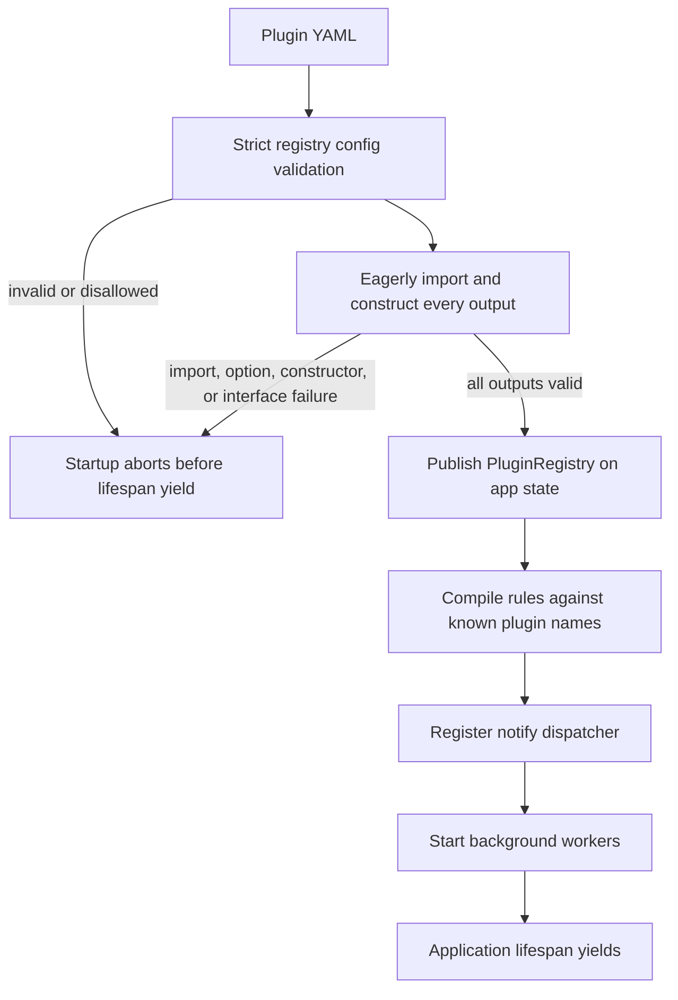
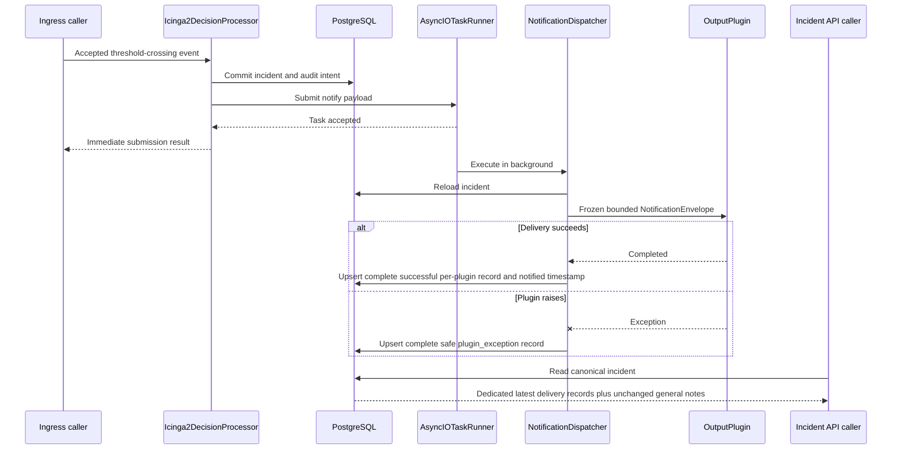

# Plugin and Notification Boundary Convergence - Plan

## Goal Capsule

- **Objective:** Close the remaining Phase 9 gaps so Correlia loads output plugins fail-closed without exposing constructor secrets, passes immutable bounded notification values, retains one complete latest result for every distinct selected plugin once submission fails or delivery completes, and keeps ingress independent from delivery latency.
- **Authority:** `.planning/PROJECT.md`, `.planning/REQUIREMENTS.md`, and `.planning/ROADMAP.md` define product intent; current source and tests determine what is already implemented; `.planning/STATE.md` and completed summaries provide continuity only.
- **Execution profile:** Standard convergence work with an approved PLG-03 production-scope expansion and one security-review correction at the existing loader boundary. Production changes are limited to secret-free construction failure, immutable envelope data, and the dedicated bounded delivery-result contract; strengthen tests at the registry, model, persistence, ingress, task-runner, dispatcher, and operator-inspection seams.
- **Prerequisite:** Phase 5 security and HTTP controls are complete in `.planning/ROADMAP.md`, `.planning/REQUIREMENTS.md`, and `.planning/STATE.md`. Stop only if implementation finds an exact Phase 5 regression that directly blocks a Phase 9 contract.
- **Stop conditions:** Stop for a conflict with PLG-01 through PLG-04, an API change outside the approved nested decision-context result field, or evidence that satisfying the plan requires a durable queue, another plugin namespace, a delivery-attempt history, or a new notification transport.
- **Completion signal:** Every remaining gap is closed by focused behavioral proof, all confirmed production defects are corrected, each valid rule selects at most 20 unique output plugins, every terminal submission failure or completed delivery is retained through later aggregation and process restart, and the repository lint, strict type-check, focused test, and full test gates pass.

---

## Product Contract

### Summary

Converge the existing output-only plugin path without adding durable delivery infrastructure. Keep loading strict, allowlisted, eager, and fail-closed; make constructor/plugin-specific validation failures secret-free at the loader boundary; preserve post-commit fire-and-forget submission; freeze the envelope; and replace flattened notes with a dedicated bounded per-plugin result collection.

### Problem Frame

The current implementation already contains the intended Phase 9 execution architecture. Plugin declarations are strict and namespace-allowlisted, `PluginRegistry` eagerly constructs configured outputs, ingress commits before submitting work, `AsyncIOTaskRunner` schedules handlers with `asyncio.create_task`, and `NotificationDispatcher` converts plugin failures into bounded `NotificationResult` values.

Convergence remains incomplete in four areas. Plugin-specific validation/constructor failures can expose raw input across startup. `NotificationEnvelope` is bounded but mutable. Tests do not directly prove fail-closed multi-plugin construction or non-blocking ingress with a deliberately slow output handler. PLG-03 results are flattened into four general-purpose notes per plugin, and terminal submission failures remain response-only, so operators can lose or never receive complete incident-local outcomes.

### Actors

- A1. **Maintainer** — configures application-owned output plugins and expects invalid or disallowed declarations to prevent startup; constructor and plugin-specific validation failures must not expose options, credentials, or raw error text.
- A2. **Ingress caller** — submits an accepted alert and must receive the ingress result after notification work is accepted, without waiting for delivery.
- A3. **Operator** — inspects canonical incident data for safe eventual delivery outcomes, including plugin exceptions.

### Requirements

#### Plugin loading

- R1. PLG-01 — Maintainers can load output plugins only from Correlia's allowlisted output-plugin namespace, with strict registry and plugin-specific configuration validation, fail-closed startup, and secret-free construction failures.

#### Notification boundary

- R2. PLG-02 — Output plugins receive a frozen, bounded `NotificationEnvelope` value instead of an incident ORM object or a raw configuration mapping.

#### Outcome ownership

- R3. PLG-03 — Every distinct output plugin selected by a valid rule retains one complete, bounded, latest terminal result when submission fails or delivery completes, including safe plugin exceptions; the result survives later aggregation and process restart and is inspectable without logs.
- R4. PLG-04 — Notification task acceptance remains non-blocking, so ingress does not wait for output-plugin delivery after submission.

### Success Criteria

| Criterion | Required outcome | Convergence signal |
|---|---|---|
| SC1 | Only strictly configured classes under Correlia's output namespace can load. | Namespace/config rejection remains green; multi-plugin construction and application startup are fail-closed; credential-bearing constructor failures expose only a fixed safe error. |
| SC2 | Plugins receive bounded immutable notification data, never mutable persistence/config objects. | The envelope is frozen; field and collection bounds reject overflow; a real dispatcher call supplies only the envelope value. |
| SC3 | Operators can inspect terminal notification outcomes and plugin exceptions as structured facts. | Every valid rule selects at most 20 unique output plugins, and each submission failure or completed delivery has one complete latest record in a dedicated decision-context collection that survives aggregation/restart; general notes remain unchanged. |
| SC4 | Ingress returns after task acceptance rather than delivery completion. | A synchronized slow plugin remains blocked while the ingress response completes; delivery outcome appears only after release and drain. |

### Key Flows

- F1. **Fail-closed startup**
  - **Trigger:** A1 starts Correlia with a configured output registry.
  - **Decision points:** Generic config validation, namespace validation, import/class validation, plugin-specific option validation, and constructor/interface validation.
  - **Outcome:** All outputs construct before the application yields a running lifespan; any failure prevents an accessible registry, notify registration, and worker startup, and constructor/plugin-specific validation errors cross the loader boundary only as fixed secret-free failures.
  - **Covered by:** R1, SC1.
- F2. **Accepted ingress and eventual delivery**
  - **Trigger:** A2 submits an event that crosses a notification threshold.
  - **Steps:** Incident and audit state commit. If submission for a selected plugin fails or cannot start, ingress upserts that terminal failure and returns it. Otherwise the task runner accepts one notify task per distinct selected plugin, ingress returns acceptance results, and each dispatcher later upserts its plugin's terminal result. Later aggregation preserves the collection; A3 reads the same data before and after a fresh application runtime starts.
  - **Outcome:** Task acceptance is never mistaken for delivery completion; every synchronous submission failure or completed delivery becomes one complete result per selected plugin without waiting for plugin execution or depending on process-local state after persistence.
  - **Covered by:** R2, R3, R4, SC2, SC3, SC4.

### Acceptance Examples

- AE1. **Invalid second plugin fails safely:** Given one valid output followed by an output whose strict options or constructor fail with a credential sentinel, when the registry and application lifespan load, then no registry is returned, the lifespan never yields, notify/background workers do not start, and the raised/logged failure contains no sentinel, options, or raw constructor text.
- AE2. **Envelope is bounded immutable value data:** Given an envelope at every documented field and collection limit, when a plugin receives it, then the value validates and cannot be reassigned; one-over-limit values, extra raw-config fields, and mutation attempts fail validation.
- AE3. **Slow successful delivery does not delay ingress:** Given a plugin paused on a deterministic synchronization gate, when an event crosses threshold, then the ingress response reports task submission while the plugin is still paused; after release, the operator-visible incident contains that plugin's complete successful delivery record.
- AE4. **Accepted task can later fail delivery:** Given a slow plugin that raises only after release, when ingress returns, then the immediate result reports accepted submission rather than completed delivery; after release and drain, the incident contains a safe `plugin_exception` delivery record and remains unnotified.
- AE5. **Bounded multi-output retention is complete:** Given a rule with 20 actions that reference 20 unique output plugins and an incident with existing general notes, when every output reaches a terminal result, then all 20 complete per-plugin records and every pre-existing note remain inspectable after later aggregation and runtime restart; a 21st action or duplicate plugin reference fails startup validation.
- AE6. **Terminal submission failure is incident-visible:** Given a committed incident whose selected plugin is missing, whose runner is unavailable, or whose task submission raises, when ingress returns the immediate safe failure, then no delivery task exists and the same terminal category is already present as that plugin's dedicated incident record.

### Existing Behavior to Preserve

| Contract area | Current evidence | Plan treatment |
|---|---|---|
| Generic registry validation | `app/config/plugins.py` uses strict Pydantic models, forbids extras, bounds declarations/options, rejects duplicates, and allowlists `app.plugins.outputs.`. | Preserve; add only missing focused cases to the existing parametrized tests. |
| Eager construction | `app/plugins/loader.py` constructs every configured output during `PluginRegistry` initialization and propagates raw constructor/plugin-validation failures. | Preserve all-or-nothing construction, but sanitize failures at the loader boundary so options, credentials, and raw exception text cannot reach startup output. |
| Structured dispatcher outcomes | `app/processing/notification_dispatcher.py` safely handles invalid payloads, stale config, missing plugin/incident, plugin exceptions, and success as `NotificationResult`. | Persist terminal dispatcher outcomes when a valid incident identity exists: success, plugin exception, stale-config `dispatch_failed`, and runtime `missing_plugin`. Malformed payloads and `missing_incident` remain safe returned results but cannot create an incident-local record. |
| Eventual operator visibility | `app/persistence/incidents.py` currently spreads each plugin/category/success/message result across four general-purpose notes that share a 20-entry cap. | Replace new flattened-note writes with a bounded `notification_delivery_results` collection; preserve legacy notes as readable historical data and add no attempts table or outbox. |
| Post-commit submission | `app/processing/ingress.py` commits incident and audit state before `_submit_notifications`. | Preserve; persist safe terminal missing-runner, missing-plugin, and submission-exception results after commit, while accepted submissions wait for the dispatcher outcome. |
| Fire-and-forget execution | `app/processing/task_runner.py` copies payloads, schedules handlers with `asyncio.create_task`, tracks pending work, and drains on shutdown. | Preserve; add deterministic slow-handler proof without changing queue semantics. |

### Scope Boundaries

#### In scope

- Freeze `NotificationEnvelope` while retaining its exact bounded field set and tuple collection limits.
- Replace flattened `notification.N.*` note writes with a strict, frozen, bounded decision-context collection containing one latest terminal result per plugin.
- Require at most 20 rule actions with distinct plugin references during startup validation so plugin-keyed records provide exactly one retained slot per selected output; keep the registry-wide output definition cap unchanged.
- Move shared notification result types out of `app/domain/rules.py` so ingress, incident context, persistence, and dispatch consume one dependency-neutral contract.
- Prove strict generic and plugin-specific configuration rejection at the existing registry seam.
- Prove eager multi-plugin construction and application startup fail closed without entering a partially loaded/running state or exposing constructor options, credentials, or raw exception text.
- Prove the real post-commit ingress, task-runner, dispatcher, output-plugin, dedicated result persistence, later-aggregation preservation, fresh-runtime reload, and operator-inspection flow with deliberately slow success and exception outcomes.
- Make task acceptance versus terminal result ownership explicit without changing top-level ingress response fields: accepted submission is not persisted as completed delivery, but a submission failure with no possible background outcome is persisted immediately under the approved nested `decision_context` field.

#### Deferred for later

- FUT-01 — Durable broker-backed execution, retry, outbox, delivery guarantees, timeout policy, and task-runner replacement.
- FUT-02 — Input, enrichment, decision/processor, and task-runner plugin namespaces.
- FUT-03 — LLM enrichment or decision-assist plugins, secrets, timeouts, and static-rule validation.
- FUT-04 — API-managed suppressions, silences, maintenance windows, config dry-run, and config reload.
- FUT-05 — Slack, generic webhook, PagerDuty Events API, Grafana OnCall, and other output transports.

#### Outside Phase 9

- Deployment/container changes, broker infrastructure, a notification attempts table, and general lifespan rollback redesign.
- Additional compatibility facades, endpoint aliases, top-level notification response fields, or unrelated extensibility abstractions.
- Legacy `.planning/phases/09-*` artifacts, GSD commands, state/roadmap updates, and legacy requirement checkbox changes.

---

## Planning Contract

### Gap Classification

| Requirement | Production state | Remaining work | Classification |
|---|---|---|---|
| R1 / PLG-01 | Strict, allowlisted, eager loading exists, but plugin-specific validation/constructor exceptions can cross the loader boundary with raw input. | Sanitize construction failures and add strict-option, constructor, multi-plugin, secret-redaction, and lifespan fail-closed proof. | Confirmed production security defect plus focused startup tests. |
| R2 / PLG-02 | Envelope fields and tuple counts are bounded and dispatcher-created. | Freeze the model; prove max/overflow, extra-field, mutation, and dispatcher-boundary behavior. | Confirmed production defect plus focused tests. |
| R3 / PLG-03 | Dispatcher exception conversion is safe, but persistence fragments outcomes across general notes and terminal ingress submission failures remain response-only. | Introduce a dedicated bounded per-plugin collection, align rule actions to 20 unique plugin references, persist both terminal submission failures and completed deliveries, and prove complete operator visibility. | Confirmed production contract defect plus domain, persistence, config, API, and integration tests. |
| R4 / PLG-04 | Task submission schedules a background task and returns without awaiting the handler. | Prove ingress completes while a real output handler is intentionally blocked. | Integration-proof gap. |

### Key Technical Decisions

- KTD1. **Converge the existing ports instead of adding delivery infrastructure.** `PluginRegistry`, `NotificationEnvelope`, `AsyncIOTaskRunner`, `NotificationDispatcher`, and incident JSONB remain the required boundary. A dedicated field inside existing `DecisionContext` is the minimum change that makes PLG-03 records complete; new registries, tables, queues, or adapter layers would violate scope.
- KTD2. **Make the envelope shallowly and transitively immutable with its existing field types.** Pydantic frozen-model enforcement closes assignment mutation, while bounded strings, enums, and tuples prevent mutable ORM/config data from crossing the port.
- KTD3. **Define fail-closed startup by safe runtime reachability.** A configured plugin failure must prevent the lifespan from yielding, prevent a registry from becoming available, and prevent notify/worker startup. Constructor and plugin-specific validation failures must cross the loader boundary as a fixed secret-free error with suppressed exception chaining. General cleanup of pre-yield resource objects is not Phase 9 work unless the focused test proves a live background component survives.
- KTD4. **Keep task acceptance and terminal outcome as separate owners.** Ingress owns immediate `NotificationResult` values. An accepted `dispatched` submission is not a delivery record; the dispatcher later owns its terminal incident-local result. If no task can exist because the runner is absent, the plugin is absent before submission, or `submit()` raises, ingress owns and persists the safe terminal failure after incident commit. The dispatcher owns `dispatched`, `plugin_exception`, stale-config `dispatch_failed`, and runtime `missing_plugin` when the incident exists. Malformed payloads lack validated identity, and `missing_incident` has no incident-local target. Top-level ingress fields remain unchanged.
- KTD5. **Retain one latest terminal result per uniquely selected plugin with no eviction.** `DecisionContext.notification_delivery_results` is a strict frozen tuple capped at 20, keyed/upserted by plugin name and stored in deterministic plugin-name order. Rule validation rejects more than 20 actions and duplicate plugin references, so a valid first-transition dispatch cannot exceed capacity. The model and persistence boundary reject an impossible 21st distinct record rather than truncate or evict; general notes never compete for capacity. Attempt history, timestamps, retries, and outbox semantics remain FUT-01.
- KTD6. **Use deterministic synchronization for non-blocking proof.** Slow-plugin tests coordinate with events/gates and assert ordering while the plugin is blocked; wall-clock latency thresholds are only safety guards, not the behavioral contract.
- KTD7. **Centralize notification domain types without creating a cycle.** Move `NotificationCategory` and `NotificationResult` from `app/domain/rules.py` into `app/domain/notifications.py`, alongside `NotificationDeliveryRecord`, so rules, incidents, ingress, dispatch, and persistence import the same dependency-neutral contract.

### High-Level Technical Design

#### Startup fail-closed gate

#### Submission and delivery ownership

### Sequencing

1. U1 closes the immutable-envelope defect and establishes the value contract used by output plugins.
2. U2 closes secret-bearing construction errors and pins strict all-or-nothing startup semantics; lifespan changes beyond loader redaction remain conditional on a failing runtime-reachability proof.
3. U3 closes the PLG-03 production defect by defining shared result types, enforcing the 20-action boundary, and replacing flattened-note writes with dedicated records.
4. U4 composes the final boundary end to end and proves the immediate/eventual ownership split against the new operator-visible field.

### System-Wide Impact

- **Maintainers:** Invalid output config or construction continues to stop startup, but raw constructor errors and options no longer cross the loader boundary. Rules with more than 20 actions or repeated plugin references fail strict startup validation.
- **Ingress callers:** Top-level response shape and auth/HTTP controls stay unchanged. Accepted work still reports submission rather than delivery; a terminal submission failure is both returned immediately and persisted after the incident commit.
- **Operators:** Canonical incident inspection gains `decision_context.notification_delivery_results`; every terminal submission failure or completed delivery has one latest per-plugin record that survives later aggregation and a fresh application runtime, while existing general and legacy notification notes remain readable. No new endpoint, table, or migration is introduced.
- **Output plugins:** The plugin call contract becomes frozen. Existing SMTP output reads the envelope and requires no behavioral adaptation.
- **Domain maintainers:** Notification result types move to a dependency-neutral module; all exported callsites must migrate in one cutover with no compatibility re-export.
- **Runtime:** No change to fire-and-forget scheduling, shutdown drain, process-local durability, or task cardinality.

### Risks and Mitigations

- **A test accidentally proves a mock instead of the boundary.** U4 must use the real ingress processor, database commit, `AsyncIOTaskRunner`, `NotificationDispatcher`, and operator incident route; only the output implementation and synchronization gate are test doubles.
- **A timing assertion becomes flaky.** Coordinate plugin entry, ingress completion, release, and drain with explicit events; use timeouts solely to terminate a broken test.
- **Freezing reveals an undocumented mutation dependency.** Existing SMTP and dispatcher code only read the envelope. Focused tests and strict type-checking must identify any other caller before the change lands.
- **Startup proof expands into general lifecycle cleanup.** Keep acceptance on no lifespan yield, no published registry, and no started notify/worker component. Defer unrelated resource-cleanup policy.
- **Immediate and eventual results are conflated by assertions.** Require accepted work to have no terminal record while the plugin is blocked, then inspect the dispatcher result after drain. Separately require a rejected/unavailable submission to return and persist the same terminal failure without scheduling a task.
- **Existing rules exceed or alias the new action boundary.** Treat 20 as the already-implied domain limit (`action_names` and ingress notification results are capped at 20), reject 21 actions and repeated plugin references at startup, and test both exact edges rather than relying on ingress's current set-based deduplication.
- **Historical flattened notes cannot become structured records without inventing data.** Leave old `notification.N.*` notes readable, stop producing new ones, and default the new collection to empty for historical incidents.
- **Latest-state records are mistaken for attempt history.** Name the field and tests around terminal delivery state; defer timestamps, attempt identity, retries, and historical sequencing to FUT-01.
- **Later incident aggregation erases delivered outcomes.** Merge the existing delivery collection into every incoming decision-context update under the incident row lock; remove or align any alternate upsert helper that can overwrite it, and prove delivery-then-aggregation behavior.
- **Strict tuple validation rejects JSONB arrays.** Normalize `notification_delivery_results` from list to tuple in both persistence validation and API serialization before strict `DecisionContext` validation; prove a real PostgreSQL JSONB round trip instead of only model-dump behavior.
- **A same-process test is mistaken for restart durability.** Complete delivery, shut down the first application/runtime and database engine, create a fresh application against the same PostgreSQL data, and inspect the canonical incident again.
- **Startup redaction hides useful validation detail.** Keep the public error deterministic and identify the plugin safely, but suppress raw constructor/plugin-validation text and exception chaining; prove both fail-closed behavior and sentinel absence through direct registry and lifespan failures.
- **The process exits after task acceptance but before a terminal result.** This remains the acknowledged process-local runner loss window: accepted submission is not persisted as delivery, and crash recovery/retry belongs to FUT-01. Restart proof begins only after terminal persistence.

---

## Implementation Units

### U1. Freeze and prove the notification envelope boundary

- **Goal:** Make `NotificationEnvelope` immutable and prove its finite field/collection bounds and dispatcher-only value semantics.
- **Requirements:** R2 / PLG-02; SC2; AE2; KTD2.
- **Dependencies:** None.
- **Files:**
  - `app/plugins/interfaces.py`
  - `tests/test_notification_dispatch.py`
  - `tests/test_smtp_output.py` — preserve the existing SMTP rendering compatibility proof after freezing the envelope.
- **Approach:** Add frozen-model enforcement to the existing strict, extra-forbidden envelope without changing field names, severity type, 256-character string limits, or 100-item host/service tuple limits. Keep all members transitively value-like. Strengthen the dispatcher tests rather than introducing a second model-test convention.
- **Execution note:** Start with failing boundary tests for mutation and one-over-limit inputs; then make the smallest model configuration change.
- **Patterns to follow:** Strict Pydantic configuration in `app/config/plugins.py` and bounded tuple/value models in `app/domain/rules.py`; existing capturing plugin in `tests/test_notification_dispatch.py`.
- **Test scenarios:**
  1. **Happy path:** Construct an envelope at all string and collection maxima; validation succeeds and values remain tuples/enums/scalars.
  2. **Boundary:** Each required string rejects empty and 257-character values; host/service collections reject 101 entries and entries over 256 characters.
  3. **Mutation:** Reassigning any envelope field after construction raises the project's normal Pydantic frozen-instance error and leaves the original value unchanged.
  4. **Raw-data exclusion:** Extra fields representing raw plugin options or incident/config mappings are rejected; the dispatcher capturing plugin receives a `NotificationEnvelope`, not an ORM incident or mapping.
  5. **Regression:** Existing SMTP rendering and dispatcher success/exception tests continue to consume the same read-only fields.
- **Verification:** The model is demonstrably bounded and immutable, dispatcher behavior is unchanged, and no production caller requires mutation.

### U2. Pin strict all-or-nothing startup and secret-free construction failures

- **Goal:** Make configured outputs validate and construct as one fail-closed startup gate, with no secret-bearing constructor/plugin-specific validation error, partially available registry, or running application.
- **Requirements:** R1 / PLG-01; SC1; AE1; KTD1; KTD3.
- **Dependencies:** None.
- **Files:**
  - `tests/test_plugin_registry.py`
  - `app/config/plugins.py` — expected unchanged; modify only if a new strict-validation case fails.
  - `app/plugins/loader.py` — sanitize constructor/plugin-specific validation failures while preserving eager all-or-nothing construction.
  - `app/main.py` — expected unchanged; modify only if the lifespan reaches notify/worker startup or re-exposes a sanitized loader failure.
- **Approach:** Extend the registry matrix with a multi-output case whose first plugin is valid and whose later plugin fails plugin-specific validation or construction with a credential sentinel. At the loader boundary, replace the raw failure with a fixed plugin-identified error and suppress exception chaining so startup output cannot contain options, credentials, or constructor text. Assert direct registry loading and the real lifespan abort before any registry/worker becomes reachable.
- **Execution note:** Characterize fail-closed reachability first, but treat raw constructor/plugin-validation propagation as a confirmed defect. Make the redaction change at the narrow loader boundary; do not weaken validation, log the source exception, or invent a general exception framework.
- **Patterns to follow:** Existing YAML helpers and invalid-declaration parameterization in `tests/test_plugin_registry.py`; app lifespan-context usage in `tests/test_health.py` and `tests/test_ingress_router.py`.
- **Test scenarios:**
  1. **Happy path:** Multiple valid configured outputs construct before the registry becomes available, remain cached, and list deterministic safe status.
  2. **Invalid generic config:** Unknown top-level/entry fields, unsupported option value shapes, over-limit option data, duplicate names, and unsupported plugin types fail before a usable registry exists; retain existing coverage and add only missing cases.
  3. **Disallowed namespace:** A class outside `app.plugins.outputs.` remains rejected before import or construction; preserve the existing direct assertion.
  4. **Plugin-specific invalid config:** Strict SMTP option type/range or unknown-option failure aborts the complete registry load through a fixed safe loader error; a credential sentinel is absent from `str`, `repr`, and captured startup logs/traceback.
  5. **Partial construction:** With one valid output followed by a constructor failure, no `PluginRegistry` is returned or exposed even though an earlier constructor may have run; the public error identifies the failed plugin without raw constructor text.
  6. **Application integration:** The same sanitized failure prevents lifespan yield, notify registration, and lifecycle/rate-limit worker startup; the application never serves as partially running and does not re-expose the source exception.
- **Verification:** Every invalid plugin case fails before runtime availability; constructor/plugin-validation errors are secret-free at direct loader and lifespan boundaries; production changes remain limited to the loader/lifespan seam required by a failing reachability or redaction scenario.

### U3. Store bounded per-plugin delivery records

- **Goal:** Give PLG-03 a complete bounded persistence contract: one latest terminal delivery record for every uniquely referenced output plugin in a valid rule, independent from general incident notes and preserved across aggregation and runtime restart.
- **Requirements:** R3 / PLG-03; SC3; F2; AE3; AE4; AE5; AE6; KTD1; KTD4; KTD5; KTD7.
- **Dependencies:** None.
- **Files:**
  - `app/domain/notifications.py` — create the dependency-neutral result and delivery-record models.
  - `app/domain/rules.py`
  - `app/domain/incidents.py`
  - `app/config/rules.py`
  - `app/api/routers/incidents.py`
  - `app/persistence/incidents.py`
  - `app/processing/ingress.py`
  - `app/processing/incident_manager.py`
  - `app/processing/notification_dispatcher.py`
  - `tests/test_domain_incidents.py`
  - `tests/test_rule_topology_yaml.py`
  - `tests/test_notification_dispatch.py`
  - `tests/test_incidents_api.py`
  - `tests/test_incident_repository.py`
- **Approach:** Move `NotificationCategory` and `NotificationResult` to the new domain module and add a strict, frozen `NotificationDeliveryRecord` containing schema version, bounded plugin name, and the result value. Add `DecisionContext.notification_delivery_results` as an empty-default tuple capped at 20. Make rule actions strict at 1–20 entries and reject duplicate plugin references. Use the same row-locked latest-per-plugin helper for dispatcher outcomes and post-commit ingress failures that cannot produce a task; never persist accepted submission as completed delivery. Replace or append by plugin name, sort deterministically, preserve general notes byte-for-byte, set `notified_at` only on success, and reject an impossible 21st distinct record without eviction. Merge existing records into later aggregation decision-context updates, align or remove alternate overwrite paths, and normalize JSONB lists before strict persistence/API validation. Stop flattened-note writes; keep historical keys readable; add no migration or dual-write shim.
- **Execution note:** Start with domain/config boundary tests, then persistence tests that fail under the current shared-note cap and aggregation overwrite. Move every `NotificationResult` import in the same cutover; do not leave a compatibility re-export in `app/domain/rules.py`.
- **Patterns to follow:** Strict frozen domain values in `app/domain/incidents.py`; fail-fast YAML constraints in `app/config/rules.py`; row-locked JSONB updates and safe redaction fallback in `app/persistence/incidents.py`; tuple normalization and canonical decision-context serialization in `app/api/routers/incidents.py` and `tests/test_incidents_api.py`.
- **Test scenarios:**
  1. **Shared result contract:** Existing valid/invalid category, message-bound, extra-field, and strict-type tests pass against `app.domain.notifications.NotificationResult`; the delivery record is frozen, extra-forbidden, and bounds plugin names.
  2. **Action identity and capacity:** A rule with 20 actions referencing 20 unique plugins compiles; 21 actions and any duplicate plugin reference fail startup configuration validation before ingress can run.
  3. **Complete retention:** Twenty distinct plugin results coexist with existing general notes; every record remains complete and notes are unchanged. Model validation and direct persistence reject a 21st distinct record without truncation or eviction.
  4. **Latest per plugin:** Recording another terminal result for the same plugin replaces its prior record instead of appending attempt history; output remains sorted by plugin name.
  5. **Terminal category ownership:** Ingress persists post-commit `dispatch_failed` for an unavailable/raising runner and `missing_plugin` when no task can start. The dispatcher persists success, `plugin_exception`, stale-config `dispatch_failed`, and runtime `missing_plugin` when the incident exists. Accepted submission alone creates no record; malformed payload and `missing_incident` return safely without an incident-local target.
  6. **Notification timestamps:** Any successful plugin sets `notified_at`; failures alone leave it unset, while a later failure cannot clear a timestamp established by another successful plugin.
  7. **Safe failure:** A result that cannot satisfy safe persistence policy is replaced with a fixed redacted message without losing plugin/category/success structure or escaping as an uncaught task error.
  8. **Historical compatibility and JSONB round trip:** Contexts without the field parse as an empty tuple; legacy `notification.N.*` notes remain readable but receive no new writes; PostgreSQL-decoded list values normalize and serialize through the API without blanking the decision context.
  9. **Aggregation preservation:** After delivery records exist, a later problem-event aggregation updates ordinary decision fields while preserving the complete delivery collection.
  10. **Operator serialization:** Canonical incident detail exposes the nested delivery records with no new endpoint or top-level response field.
- **Verification:** Every distinct output plugin selected by a valid rule maps to one record slot; repeated plugin writes are deterministic current-state updates; impossible overflow fails without eviction; aggregation and JSONB normalization preserve records; unrelated notes remain unchanged; and source/tests import notification models only from the new module.

### U4. Prove non-blocking ingress and eventual structured outcomes end to end

- **Goal:** Demonstrate that ingress returns on task acceptance while slow output work completes later, writes dedicated terminal records, persists submission failures that cannot produce background work, and exposes all completed records after aggregation and a fresh runtime.
- **Requirements:** R3 / PLG-03; R4 / PLG-04; SC3; SC4; F2; AE3; AE4; AE5; AE6; KTD4; KTD5; KTD6.
- **Dependencies:** U1, U2, U3.
- **Files:**
  - `tests/test_ingress_router.py`
  - `tests/test_notification_dispatch.py` — retain focused dispatcher failure coverage; extend only if the integration exposes a missing terminal assertion.
  - `tests/test_task_runner.py` — retain unit-level scheduling/drain coverage; extend only if deterministic runner ordering needs an isolated proof.
- **Approach:** Add a PostgreSQL-backed integration using real application wiring, post-commit processor, `AsyncIOTaskRunner`, `NotificationDispatcher`, result persistence, and canonical incident route. For accepted work, inject only synchronized output plugins, observe the response before release, then release, drain, aggregate a fresh later event, and inspect records/general notes. In separate no-runner, missing-plugin, and raising-submit paths, assert the immediate failure is persisted after commit with no task. Finally shut down the first runtime/engine, create a fresh application against the same PostgreSQL data, and inspect the records again.
- **Execution note:** Build the slow failing case first because it proves non-blocking acceptance, safe eventual failure, and the strongest immediate/eventual distinction; extend the same setup to successful and multi-plugin outcomes.
- **Patterns to follow:** Existing Testcontainers/session fixture and threshold-crossing vertical slice in `tests/test_ingress_router.py`; capturing/failing plugins and safe-context assertions in `tests/test_notification_dispatch.py`; runner drain behavior in `tests/test_task_runner.py`.
- **Test scenarios:**
  1. **Slow success:** The plugin has started and remains blocked; incident and audit intent are committed; ingress completes with a submission result while no delivery record exists. After release and drain, the incident contains the complete successful record and notified timestamp.
  2. **Slow exception:** Ingress returns successful submission acceptance while the plugin is blocked. After release, the dispatcher records safe `plugin_exception`, leaves notified timestamp unset unless another plugin succeeded, and completes without an uncaught runner failure.
  3. **Maximum-cardinality multi-output:** A rule selecting 20 unique synchronized output plugins produces 20 complete latest records, sorted by plugin name, while pre-existing general notes remain unchanged; the same state passes later aggregation and fresh-runtime canonical inspection without loss.
  4. **Later aggregation:** A subsequent accepted event updates the existing incident without erasing or mutating its delivery records.
  5. **Fresh-runtime inspection:** After the first app, runner, sessions, and engine are shut down, a newly constructed application against the same PostgreSQL database returns the same records and general notes through canonical incident detail.
  6. **Operator inspection:** Canonical incident detail returns plugin name, category, success, and bounded message through `notification_delivery_results`; the test does not depend on logs as evidence.
  7. **Terminal submission failure:** Missing plugin, unavailable runner, and raising `submit()` paths return their immediate safe category, schedule no task, and persist the same plugin/category/success/message record on the already-committed incident.
  8. **Existing terminal outcomes:** Focused U3 tests own stale config, dispatcher-time missing plugin, missing incident, malformed task payload, success, and safe exception mapping; the ingress integration composes success/exception paths without duplicating every dispatcher branch.
  9. **Post-commit invariant:** Incident and audit state are queryable while output plugins are blocked, proving delivery latency cannot roll back or delay the committed ingress decision.
- **Verification:** The integration crosses every required seam without mocking away task scheduling, dispatch, persistence, aggregation, runtime reconstruction, or operator serialization; accepted work has no terminal record before plugin release, rejected work has an immediate persisted failure without a task, and completed records survive restart.

## Verification Contract

| Gate | Scope | Required outcome |
|---|---|---|
| Notification model and dispatcher focus | U1 | Frozen assignment, field/count limits, raw-data exclusion, SMTP compatibility, and existing dispatcher branches pass. |
| Registry and startup focus | U2 | Strict config, namespace, multi-output construction, fixed secret-free failure, sentinel absence, and lifespan fail-closed scenarios pass. |
| Delivery domain and persistence focus | U3 | Shared result imports, unique-plugin/20-action validation, frozen records, no-eviction overflow rejection, ingress/dispatcher terminal-category persistence, latest replacement, 20-record retention, timestamp rules, aggregation preservation, JSONB normalization, legacy parsing, and API serialization pass. |
| PostgreSQL ingress integration focus | U4 | Accepted slow success/exception, mixed output, terminal submission failure, later aggregation, and fresh-runtime paths prove commit-before-result, non-blocking response, dedicated persistence, restart survival, and operator inspection. |
| Task-runner regression focus | U4 | Unknown tasks, copied payloads, exception retrieval, pending tracking, and drain behavior remain green. |
| Repository lint gate | U1-U4 | Ruff reports no violations under the project Python 3.14 rules. |
| Repository type-check gate | U1-U4 | Strict mypy reports no errors in application code. |
| Full repository test gate | U1-U4 | The complete pytest suite passes, including PostgreSQL/Testcontainers coverage, with no ordering, leaked-task, or historical-context failures. |

### Verification Invariants

- Accepted submission is never treated or persisted as completed delivery; a terminal submission failure with no task is persisted as the ingress-owned result.
- No non-blocking assertion depends on a performance threshold instead of deterministic ordering.
- No test replaces PostgreSQL-specific persistence with SQLite or mocks away the ingress-to-dispatch integration.
- No raw payload, plugin options, credentials, exception text, or transport-rendered body crosses the output-plugin call boundary, appears in operator-visible results, or escapes through a plugin-construction startup failure; the bounded rule summary remains the explicit envelope/incident field.
- Invalid plugin configuration prevents a running application rather than degrading to a partial registry; constructor/plugin-specific validation failures also cannot escape as secret-bearing startup errors.
- Every terminal submission failure or completed delivery has one dedicated latest per-plugin record; general notes never compete for notification-result capacity.
- A duplicate plugin reference or twenty-first rule action fails startup validation; a direct twenty-first distinct record is rejected rather than truncated or evicted.
- New deliveries never write flattened `notification.N.*` notes, while historical incident JSON remains readable.
- Later aggregation, PostgreSQL JSONB decoding, API validation, and fresh application construction cannot erase or hide delivery records.

---

## Definition of Done

- R1 / PLG-01: Allowlist and strict validation remain intact; multi-plugin construction and application startup are all-or-nothing, fail-closed, and secret-free for constructor/plugin-validation failures.
- R2 / PLG-02: `NotificationEnvelope` is frozen, bounded at every field/collection edge, extra-forbidden, and the only value passed to output handlers.
- R3 / PLG-03: Every valid rule selects at most 20 uniquely referenced output plugins, and each terminal submission failure or completed delivery has one complete safe latest `NotificationDeliveryRecord` under canonical incident `decision_context.notification_delivery_results`; records survive aggregation/fresh runtime, and general notes remain unchanged.
- R4 / PLG-04: A deliberately blocked output handler cannot prevent the ingress response from completing after task acceptance.
- Immediate results and terminal records have explicit owners: accepted submission is not delivery, ingress persists failures that cannot create a task, dispatcher categories are persisted when an incident exists, and malformed/missing-incident outcomes are proven unable to have an incident-local target.
- Rule YAML accepts 20 unique plugin actions and rejects 21 actions or duplicate plugin references at startup; direct record overflow fails without truncation, eviction, or silent result loss.
- New delivery writes use only the dedicated collection; historical flattened notes remain readable without a migration or dual-write compatibility path, and JSONB list normalization preserves strict API validation.
- Delivery records remain value-for-value equivalent after a later aggregation update and after the original application, task runner, sessions, and engine are replaced by a fresh runtime against the same PostgreSQL database.
- Existing invalid-config, disallowed-namespace, missing-plugin, missing-incident, stale-config, malformed-payload, and plugin-exception tests remain green without duplicate scenarios.
- No database migration, new endpoint, top-level response facade, durable queue, retry/outbox mechanism, attempt history, plugin namespace, LLM path, transport, deployment artifact, or legacy Phase 9 planning artifact is added.
- Focused tests and repository lint, strict type-check, and full test gates pass without leaked pending tasks or nondeterministic timing.
- Any experimental fixtures, abandoned production changes, compatibility re-exports, duplicate helpers, and dead test scaffolding created during implementation are removed before completion.

---

## Appendix

### Source and Research Map

- `.planning/PROJECT.md` — API-first product posture, output-plugin modularity, asyncio task-runner decision, and future-scope boundaries.
- `.planning/REQUIREMENTS.md` — authoritative PLG-01 through PLG-04 and FUT-01 through FUT-05 contracts.
- `.planning/ROADMAP.md` — Phase 5 prerequisite completion, Phase 9 goal, dependency, and success criteria.
- `.planning/STATE.md` — continuity evidence that Phase 8 shipped and Phase 9 is next; not authority for current behavior.
- `.planning/milestones/v1.0-phases/03-problem-aggregation-and-notification-dispatch/03-03-SUMMARY.md` — prior decision to keep safe delivery outcomes incident-local and leave a separate attempts/outbox store out of v1.
- `app/config/plugins.py`, `app/plugins/loader.py`, `app/plugins/interfaces.py`, `app/config/rules.py` — strict plugin loading, envelope port, unique per-rule plugin references, and aligned 20-action boundary.
- `app/domain/notifications.py`, `app/domain/incidents.py`, `app/domain/rules.py` — shared notification values, dedicated decision-context delivery records, and ingress response contracts.
- `app/processing/notification_dispatcher.py`, `app/processing/ingress.py`, `app/processing/task_runner.py`, `app/main.py` — runtime submission, dispatch, and lifespan behavior.
- `app/persistence/incidents.py`, `app/api/routers/incidents.py` — row-locked latest-result persistence, aggregation preservation, JSONB normalization, and operator inspection.
- `tests/test_domain_incidents.py`, `tests/test_rule_topology_yaml.py`, `tests/test_incident_repository.py`, `tests/test_plugin_registry.py`, `tests/test_notification_dispatch.py`, `tests/test_task_runner.py`, `tests/test_ingress_router.py`, `tests/test_incidents_api.py`, `tests/test_smtp_output.py` — focused existing conventions and coverage to strengthen.

No `CONCEPTS.md` or `docs/solutions/` corpus exists in the current tree, so no institutional glossary or prior solution document shaped this plan. External research was intentionally skipped because the relevant architecture and technologies are already established locally and the phase introduces no external dependency or unsettled option.
