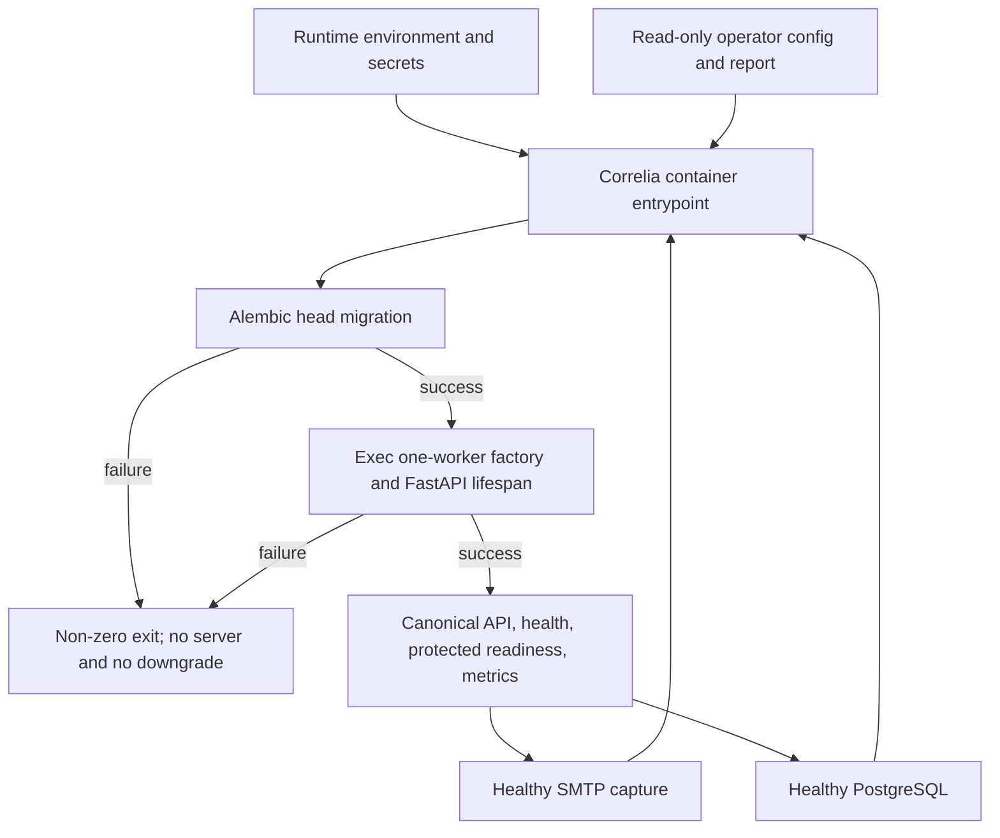
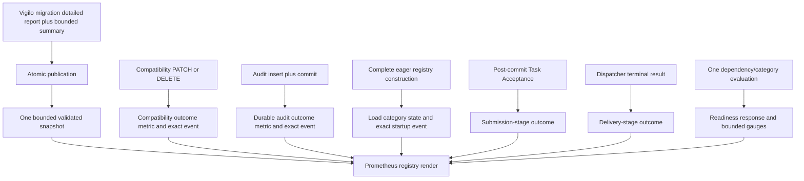

# Deployment and Operational Visibility - Plan

## Goal Capsule

- **Objective:** Make Correlia runnable as a one-worker container and deterministic local Compose stack, then close the required low-cardinality metrics, bounded readiness, and safe structured-log gaps without changing the existing incident, plugin, or notification lifecycle.
- **Authority:** `.planning/PROJECT.md`, `.planning/REQUIREMENTS.md`, and `.planning/ROADMAP.md` define product intent; current source and tests define implemented behavior; `.planning/STATE.md` is continuity evidence only.
- **Execution profile:** Deep convergence work across deployment artifacts, strict configuration samples, startup sequencing, metrics, readiness, logs, and real-container proof.
- **Prerequisite evidence:** Phase 9 is present on `main` in merge commit `d898124`. `app/config/plugins.py`, `app/plugins/loader.py`, `app/plugins/interfaces.py`, `app/domain/notifications.py`, `app/processing/ingress.py`, `app/processing/notification_dispatcher.py`, and their focused tests establish strict loading, bounded immutable envelopes, structured terminal outcomes, and post-commit non-blocking Task Acceptance.
- **Stop conditions:** Stop for a requirement conflict, a need to weaken fail-closed startup or the public-liveness/protected-readiness split, or evidence that completion requires multiple workers, a durable queue, leader election, a new plugin namespace or transport, a Pushgateway/collector service, or a compatibility facade.
- **Completion signal:** The image and Compose stack satisfy DEP-01 through DEP-04; all required event classes have truthful bounded visibility under OPS-01 through OPS-03; every checked-in sample passes the real strict loaders; focused, constrained-environment, real-container, and repository quality gates pass.

---

## Product Contract

### Summary

Converge Correlia's existing operational surface into a one-worker container and deterministic local Compose stack, add strict credential-free sample configuration, and instrument the required runtime boundaries with bounded metrics, readiness categories, and secret-safe structured events. Preserve the app factory, Alembic environment contract, canonical `/v1` APIs, fail-closed plugin startup, in-process TaskRunner, and the distinction between Task Acceptance and terminal delivery.

### Problem Frame

Correlia already has a production-shaped FastAPI factory, environment-backed settings, Alembic migrations, PostgreSQL readiness, a Prometheus registry, safe JSON logging, strict YAML loaders, and SMTP output. It has no `Dockerfile`, Compose file, `.env.example`, or checked-in `config/` samples, so maintainers cannot exercise those pieces as one deployment path.

The current observability surface also predates the v1.1 compatibility work. Compatibility aliases, Vigilo config migration, incident audit writes, and plugin startup lack complete metric/log coverage. Notification metrics conflate Task Acceptance and terminal delivery, while existing `rule_name`, `plugin_name`, rejection `reason`, and `task_name` labels are not closed low-cardinality domains. Readiness safely aggregates plugins but does not expose stable configured plugin-category state.

A short-lived config migration process cannot leave an in-memory metric for pull-based Prometheus. The approved design projects a bounded, versioned summary from the CLI's existing JSON report through the long-lived Correlia metrics endpoint. A plugin construction failure remains intentionally fail-fast and therefore cannot be scraped from the failed process; its truthful operational contract is a safe startup event plus container exit, while successful load and serving-time category state remain metric-visible.

### Actors

- A1. **Maintainer** — builds and runs the image, supplies runtime secrets, mounts operator configuration, starts the local Compose stack, and runs migration/deployment verification.
- A2. **Operator** — queries canonical APIs, protected readiness, Prometheus metrics, structured logs, and SMTP capture to understand service and notification state.

### Requirements

#### Container and local deployment

- R1. DEP-01 — A1 can run an image whose default startup applies the current Alembic head revision and launches the `app.main:create_app` Uvicorn factory only after migration succeeds.
- R2. DEP-02 — A1 can run PostgreSQL, Correlia, and SMTP capture through one deterministic Compose topology using environment configuration and read-only operator mounts.
- R3. DEP-03 — The image launches one Uvicorn worker through a literal, inspectable default that cannot be multiplied by `WEB_CONCURRENCY`, reload mode, or shell expansion.
- R4. DEP-04 — A1 receives `.env.example` and strict `config/rules.yaml`, `config/topology.yaml`, and `config/plugins.yaml` samples aligned with the real settings, loaders, and SMTP plugin schema.

#### Operational visibility

- R5. OPS-01 — A2 can observe compatibility mutation outcomes, config migration failures, durable audit-write outcomes, successful plugin load and serving-time plugin-category state, Task Acceptance, terminal delivery, and required dependency state through Prometheus families whose label domains are closed and small. Failed pre-serve plugin loads are observable through the bounded startup event and container exit because the failed process has no scrape target.
- R6. OPS-02 — A2 can inspect required dependencies and configured output-plugin categories through stable readiness categories without receiving endpoints, credentials, plugin names/options, raw configuration, exception details, or payload data.
- R7. OPS-03 — A2 receives bounded structured events for compatibility mutations, config migration, audit writes, plugin loading, Task Acceptance, and terminal delivery without credentials, authorization data, database URLs, raw payload/config bodies, source-derived exception strings, or unbounded event fields.

### Success Criteria

| ID | Criterion | Proof |
|---|---|---|
| SC1 | The image migrates before serving and defaults to one Uvicorn factory worker. | Ordering and failure tests prove Uvicorn is never invoked after migration failure; image inspection and runtime proof show one worker with no reload or ambient worker override. |
| SC2 | The Compose topology deterministically starts PostgreSQL, Correlia, and SMTP capture with environment-provided secrets and read-only configuration. | Rendered topology checks plus a real stack smoke prove health ordering, config immutability, readiness, canonical API access, and SMTP capture. |
| SC3 | All checked-in samples match current settings and strict schemas. | Tests instantiate settings with substituted test secrets and load/construct rules, topology, and the email output registry through production loaders. |
| SC4 | Required events, dependencies, and plugin categories are visible without high-cardinality metric labels. | Collector and behavior tests prove each event and fixed outcome, remove configured names/raw reasons/task names, and reject forbidden label dimensions. |
| SC5 | Required logs and readiness output are operationally useful and secret-safe. | Success/failure tests inject credential, DSN, payload, hostile-name, path, and exception sentinels and prove only finite event/category/outcome fields escape. |

### Key Flows

- F1. **Direct image startup**
  - **Trigger:** A1 starts the image with a database URL, required application secrets, and configuration paths.
  - **Steps:** The entrypoint applies Alembic migrations; successful migration hands PID 1 to one Uvicorn factory process; lifespan then loads strict plugins/config and starts in-process workers.
  - **Outcome:** The app serves only after both schema and lifespan initialization succeed. Migration or startup validation failure exits non-zero without a ready or partially usable service.
  - **Covered by:** R1, R3, SC1.

- F2. **Local Compose operation**
  - **Trigger:** A1 supplies local environment values and starts the checked-in topology.
  - **Steps:** PostgreSQL and SMTP capture pass bounded healthchecks; Correlia runs the image default against the healthy database; mounted samples initialize the app; A2 checks liveness/readiness and exercises ingress plus SMTP capture.
  - **Outcome:** The stack reaches a deterministic ready state without sleeps, embedded operational credentials, writable configuration, or hidden process multiplication.
  - **Covered by:** R2, R4, SC2, SC3.

- F3. **Compatibility and audit observation**
  - **Trigger:** A2 uses canonical compatibility PATCH/DELETE behavior or ingress accepts an event that writes the append-only audit row.
  - **Steps:** The owning transaction completes or fails; the boundary records a finite operation/outcome metric and matching structured event.
  - **Outcome:** Compatibility traffic and durable audit writes are distinguishable without route strings, incident IDs, rule names, operators, payloads, or database error text in metric labels or required events.
  - **Covered by:** R5, R7, SC4, SC5.

- F4. **Plugin submission and delivery observation**
  - **Trigger:** Startup constructs configured outputs or a threshold crossing plans notification work.
  - **Steps:** Startup records bounded category state; ingress records Task Acceptance or terminal submission failure after commit; the dispatcher later records terminal delivery success/failure.
  - **Outcome:** Metrics and logs preserve the timing distinction between accepted work and completed delivery, while startup failures remain fail-closed and secret-safe.
  - **Covered by:** R5, R6, R7, SC4, SC5.

- F5. **Config migration failure projection**
  - **Trigger:** A1 runs the Vigilo config migrator with its existing JSON report output.
  - **Steps:** The CLI writes a versioned bounded result summary atomically on success or failure; a configured Correlia metrics projection validates and exposes only that summary and completion timestamp.
  - **Outcome:** A2 can alert on the latest migration failure through the live metrics endpoint without a Pushgateway, textfile collector, raw report error, path, config body, or exception message.
  - **Covered by:** R5, R7, SC4, SC5.

### Acceptance Examples

- AE1. **Fresh database startup** — Given an empty reachable PostgreSQL database and valid runtime configuration, when the image starts, then Alembic reaches head before the factory accepts requests and one Uvicorn worker owns the in-process runtime.
- AE2. **Migration failure blocks serving** — Given an invalid database URL or forced Alembic failure, when the image starts, then it exits non-zero, never invokes Uvicorn, exposes no readiness endpoint, and emits no credential-bearing diagnostic.
- AE3. **Compose notification smoke** — Given the checked-in samples and test-only environment values, when the stack becomes ready and an event crosses the sample threshold, then ingress returns after Task Acceptance and SMTP capture eventually contains the expected message.
- AE4. **Immutable operator configuration** — Given the Compose app container, when a process attempts to change a mounted sample, then the write fails and the host file remains unchanged.
- AE5. **Closed metric domains** — Given arbitrary rule names, plugin names, task names, hosts, services, incident IDs, fingerprints, raw routes, paths, and exception messages, when required events are exercised and metrics rendered, then none of those values appears as a label value or creates a series.
- AE6. **Bounded readiness projection** — Given healthy, unavailable, misconfigured, and partially non-ready dependency/plugin states, when A2 requests protected readiness, then only fixed dependency/category keys and `ready`, `not_ready`, or `not_configured` states appear; public liveness remains independent.
- AE7. **Safe failure events** — Given credentials, authorization values, SMTP secrets, a database URL, raw payload/config text, and hostile exception text embedded in failure inputs, when each required failure path logs, then the JSON contains only its fixed event, stage/operation, outcome/category, and bounded counts.
- AE8. **Migration report projection** — Given absent, valid-success, valid-failure, malformed, oversized, and unsupported-version migration reports, when metrics render, then the projection exposes fixed report status/outcome/failure-code series and a completion timestamp only for validated data, without blocking the metrics route or leaking report details.

### Scope Boundaries

#### In scope

- A locked, non-root, read-only-capable image with a small exec-handoff startup entrypoint.
- One Compose topology for PostgreSQL, one Correlia app, and SMTP capture with health-based ordering.
- Credential-free operator samples and environment-provided database/auth/audit secrets.
- Narrow changes at existing metrics, logging, readiness, compatibility, audit, migration, plugin-load, submission, and delivery boundaries.
- An optional, read-only runtime projection of the existing config migration JSON report.
- Real-container smoke proof where Docker is available and deterministic behavior-level fallback proof everywhere else.

#### Deferred to Follow-Up Work

- A dedicated one-shot migration service if Correlia later runs multiple app containers.
- First-class SMTP credential environment references or Docker secret-file ingestion; the local Mailpit sample remains unauthenticated and contains no credential values.
- Prometheus exemplars, dashboards, alert rules, remote write, Node Exporter textfile collection, Pushgateway, or another telemetry backend.

#### Outside this plan

- Multi-worker defaults, multi-process Prometheus mode, Gunicorn, process supervisors, durable queues, retries/outbox semantics, leader election, or delivery-attempt history.
- New input/output transports, broader plugin namespaces, LLM dependencies or hot-path processing, long-term raw-event warehousing, webhook compatibility, `/api/v1`, or summary mutation.
- Changes to canonical incident lifecycle, Task Acceptance semantics, terminal Notification Delivery Records, or the append-only audit trail's decision role.
- Legacy `.planning/phases/10-*` artifacts or tracking updates to `.planning/STATE.md`, `.planning/ROADMAP.md`, or requirement checkboxes.

---

## Planning Contract

### Gap Classification

| Area | Current production state | Remaining production work | Proof-only work |
|---|---|---|---|
| Image/runtime | Factory, lifespan, Alembic environment, and one-process workers exist separately. | Add the image, locked install, non-root runtime, migration gate, exec handoff, and literal one-worker default. | Prove ordering, failure, PID/signal behavior, worker count, and read-only runtime. |
| Compose/samples | SMTP output and strict loaders exist; deployment artifacts do not. | Add healthy services, environment wiring, read-only mounts, and strict samples. | Render topology, validate settings/loaders, run the stack, and exercise SMTP capture. |
| Metrics | One centralized registry exists, but required event families are missing and four current labels are open/config-derived. | Replace unsafe labels; add bounded operation/stage/outcome/category families and migration-report projection. | Audit every collector and exercise all required event/result combinations with hostile values. |
| Readiness | Safe database/config/registry/aggregate-plugin/worker checks already preserve liveness separation. | Add stable configured plugin-category state and corresponding bounded readiness metrics. | Prove healthy, absent, misconfigured, aggregate partial failure, auth, and secrecy. |
| Logs | JSON formatting and a scalar-key allowlist exist; several required boundaries are absent or use identifier-rich fields. | Add fixed operational events and safe migration terminal output; remove identifiers from the required compatibility/plugin events. | Capture actual success/failure logs with credential, payload, config, and exception sentinels. |

### Key Technical Decisions

- KTD1. **The image default remains one authoritative migrate-then-serve path.** The entrypoint invokes Alembic synchronously with only the inherited `DATABASE_URL`, never a DSN-bearing command argument, then execs the Uvicorn factory only after success. The final server is PID 1; migration failures propagate non-zero and never trigger an automatic downgrade or server start. A future dedicated migrator must replace, not run alongside, entrypoint migration.
- KTD2. **The worker count is a literal safety invariant.** The image starts `app.main:create_app` in factory mode with worker count one and no reload. Ambient `WEB_CONCURRENCY` or deployment defaults cannot change it; scaling requires a later durable-task/leader design.
- KTD3. **Build, image, and runtime disclosure surfaces are separate contracts.** Build from the repository lock, omit development dependencies, use `.dockerignore` and narrow copy rules to exclude `.env*`, VCS/tool state, and local secret-bearing artifacts, and run as a dedicated user with a read-only-capable root. Secret values may enter only through the app service runtime environment; they are forbidden from Dockerfile arguments/environment, image history/config, labels, command, entrypoint, healthcheck, checked-in samples, and persisted test diagnostics.
- KTD4. **Compose uses health conditions, not time delays.** PostgreSQL and SMTP capture have bounded token-free healthchecks, and Correlia depends on their healthy states before its own migrate-then-serve startup. The app healthcheck uses public dependency-free `/v1/health`, never a token or DSN. Checked-in settings make `/v1/readyz` protected with the distinct operator token; smoke tests use readiness for dependency diagnosis without broadening the existing metrics exposure policy.
- KTD5. **Samples are executable configuration, not illustrative pseudocode.** The sample rule crosses its notification threshold deterministically, the topology uses current strict hostname/subnet fields, and the output points to the Compose SMTP service without credentials. Tests parse the declarative artifacts and use the same settings and loaders as startup, including cross-validation of rule action plugin names.
- KTD6. **All metric label domains become code-owned and closed.** Keep enum-backed `event_type`, fixed incident `effect`, and closed notification categories. Remove `rule_name` and `plugin_name`; normalize human rejection text to a fixed rejection code; remove open task names or map them to a fixed task category. New labels are limited to fixed operation, stage, outcome, dependency, plugin category, and report status/failure code domains. Identity remains in durable records or approved redacted logs, never metric labels.
- KTD7. **Record metrics at the state-owning event boundary.** Compatibility aliases own compatibility request outcomes; ingress owns the post-commit audit outcome and Task Acceptance; lifespan/registry construction owns plugin load; the dispatcher owns terminal delivery. Existing attempt/failure calls are replaced at those seams rather than supplemented. An accepted submission is never counted as completed delivery, and terminal delivery is never backfilled into the append-only audit row.
- KTD8. **Project config migration metrics from one safely published report snapshot.** A single report-emission seam adds a versioned bounded metrics summary and timezone-aware completion timestamp to the existing detailed report and atomically replaces the target from the same directory on every migration success or failure path where report emission itself succeeds. A report-emission failure preserves its non-zero exit and finite terminal event without claiming that a new report was published. An optional, disabled-by-default setting lets the app consume a read-only mount. The consumer opens one bounded non-symlink regular-file snapshot, validates exact keys/version/types/finite domains and a plausible non-future timestamp, then replaces the last projection only with the validated object. Missing, malformed, partial, oversized, special-file, raced, or unsupported input returns promptly with fixed unavailable/invalid state and cannot block or break `/v1/metrics`.
- KTD9. **Failed pre-serve plugin startup is logs-and-exit observable.** Logging is configured before registry/config loading in lifespan. Every eager load failure—registry shape, module/class, interface, constructor, or status—maps to a fixed plugin category/result event and a redacted ordinal/finite startup error; no name, class path, option, or exception-derived value survives. No registry, runner, or worker becomes reachable, and no pull-metric scrapeability is claimed. The serving process exposes successful category inventory and readiness.
- KTD10. **Readiness reports one evaluated category result, not instances or endpoints.** Preserve required dependency keys and add fixed output-plugin categories derived from strict `plugin_type`, with states `ready`, `not_ready`, or `not_configured`. `not_configured` is visible but non-blocking; any configured category with a non-ready member blocks readiness. The HTTP response and gauges consume the same evaluation, and the SMTP plugin's synchronous declared status remains the contract—no side-effecting network probe.
- KTD11. **Required operational output has exact finite schemas.** Compatibility, migration, audit, plugin-load, submission, delivery, and readiness events have event-specific allowed key sets and finite value vocabularies enforced before the generic formatter; unknown keys and values are dropped or normalized. They omit incident/rule/group/plugin/operator identities, routes, paths, endpoints, credentials, raw inputs, report details, and exception class/message text. Every config-migration CLI terminal path emits only one fixed event/outcome/failure-code/count shape on stdout/stderr; detailed messages, locations, generated paths, and parser/validation text stay in the private report contract and are never projected.
- KTD12. **Runtime proof has a mandatory fallback floor, not a substitute for container proof.** Always-run tests own controlled entrypoint ordering/failure, parsed Compose and sample semantics, collector/log/readiness behavior, and safe report projection. Docker-capable smoke alone proves image user and contents, read-only filesystem, PID/signal handoff, container health/networking, SMTP capture, and runtime secret placement. An unavailable engine is reported only for those engine-specific assertions.

### High-Level Technical Design

#### Deployment topology



#### Startup sequence

```mermaid
sequenceDiagram
  participant O as Compose or maintainer
  participant C as Container entrypoint
  participant A as Alembic
  participant U as One-worker Uvicorn
  participant L as FastAPI lifespan
  O->>C: Start after declared dependencies are healthy
  C->>A: Apply head using inherited DATABASE_URL
  alt migration fails
    A-->>C: Non-zero failure
    C-->>O: Exit; no Uvicorn and no downgrade
  else migration succeeds or is already at head
    A-->>C: Head reached
    C->>U: Exec factory server with literal one worker
    U->>L: Configure logs and run strict startup
    alt config, plugin, or worker startup fails
      L-->>O: Finite safe event and process exit
    else startup succeeds
      L-->>U: Lifespan ready
      U-->>O: Public health and protected operational surface available
    end
  end
```

#### Operational event ownership



### Output Structure

```text
.
├── .dockerignore
├── .env.example
├── Dockerfile
├── compose.yaml
├── config/
│   ├── plugins.yaml
│   ├── rules.yaml
│   └── topology.yaml
├── scripts/
│   └── container-entrypoint.sh
└── tests/
    └── test_deployment.py
```

Existing application, test, migration, and configuration documentation files are modified in place; no legacy Phase 10 planning tree is created.

### System-Wide Impact

- **Process ownership:** The image formalizes a single PID 1 Uvicorn process around existing per-process TaskRunner, lifecycle worker, rate limiter, and Prometheus registry state.
- **Persistence:** Alembic remains the only schema mutation path. Audit-write telemetry stays in the existing incident/audit transaction; no telemetry table or second commit is introduced.
- **Security:** Runtime secrets remain outside images and sample YAML. Required logs, healthchecks, readiness, and metrics become hostile-input tested disclosure boundaries.
- **API compatibility:** `/v1/health`, `/v1/readyz`, `/v1/metrics`, canonical incident aliases, ingress responses, and Notification Result payloads retain their established auth and response contracts except for additive bounded readiness categories and metrics.
- **Operations:** Existing metric series that include configured rule/plugin/task identity are intentionally removed or reshaped. This is an observability compatibility change required to meet the low-cardinality contract; operators must update any local queries that used those labels.

### Risks and Dependencies

- **Docker/Compose availability:** Real runtime proof depends on a compatible Docker engine and Compose implementation. The deterministic fallback proves artifact and in-process semantics but cannot prove image networking, filesystem permissions, signal delivery, SMTP capture, or runtime secret placement.
- **Migration concurrency:** Migrate-then-serve is correct for the required single app container. A future dedicated migrator must be mutually exclusive with entrypoint migration; multiple app replicas cannot each race the schema upgrade.
- **Read-only runtime:** Python/dependency caches or temporary files may fail under a read-only root. The image must disable unnecessary writes and add only measured temporary storage.
- **Migration report freshness:** The completion timestamp is data, not a success assertion. The app rejects implausible future values and exports the validated timestamp; alert policy determines staleness without treating an old report as current success.
- **Report trust boundary:** The operator-controlled path may name hostile filesystem objects or change during acquisition. The writer must publish atomically. The reader must reject symlinks and non-regular files, cap bytes while reading one snapshot, validate exact schema and finite domains before replacing projection state, and keep malformed/partial/raced input from blocking metrics. The app mount is read-only; report details never become metric or log fields.
- **Pre-serve failure physics:** Failed migrations and plugin construction have no live app scrape target. Container state and finite safe terminal events remain authoritative; a successful serving process can project a completed migration report but cannot retroactively expose a failed plugin-start metric.
- **Metric reset behavior:** The registry is process-local and resets on restart. Tests and operational docs must not imply durable counters; only the migration report persists its latest bounded batch summary.

### Alternative Approaches Considered

- **Dedicated Compose migration service:** Stronger future multi-container sequencing, but would duplicate startup authority in the required one-app topology. Deferred until replicas are supported; if introduced, it must replace entrypoint migration and gate app creation on successful completion.
- **Pushgateway or Node Exporter textfile collection:** Both can persist short-lived batch metrics, but add external service/path ownership and stale-series handling. The approved existing-report projection satisfies the current requirement without new telemetry infrastructure.
- **Run migrations inside FastAPI lifespan:** Rejected because schema migration must complete before the server starts and would race if the process model changed.
- **Retain rule/plugin labels with string-length limits:** Rejected because bounded string length does not bound the number of series and the real config domains are not small fixed vocabularies.
- **Active SMTP readiness probe:** Rejected because the current plugin protocol declares readiness synchronously and probing would add network side effects, latency, and transport-specific policy to every readiness request. The real stack smoke proves SMTP reachability instead.

### Sources and Research

- Product intent: `.planning/PROJECT.md`, `.planning/REQUIREMENTS.md`, `.planning/ROADMAP.md`, `.planning/prompts/phase-10-ce-plan.md`.
- Existing runtime seams: `app/main.py`, `app/config/settings.py`, `migrations/env.py`, `app/processing/metrics.py`, `app/api/routers/health.py`, `app/processing/logging.py`, `scripts/migrate_vigilo_config.py`.
- Phase 9 lifecycle: `docs/plans/2026-07-10-001-fix-plugin-notification-boundaries-plan.md`, `docs/solutions/security-issues/plugin-notification-boundary-convergence.md`, and `CONCEPTS.md`.
- Docker exec-form and PID 1 behavior: [Dockerfile reference](https://docs.docker.com/reference/dockerfile/) and [JSON arguments recommendation](https://docs.docker.com/reference/build-checks/json-args-recommended/).
- Compose dependency health semantics: [Control startup order](https://docs.docker.com/compose/how-tos/startup-order/) and [Compose services reference](https://docs.docker.com/reference/compose-file/services/).
- Uvicorn 0.49 process/factory behavior: [Settings](https://www.uvicorn.org/settings/), [Docker deployment](https://www.uvicorn.org/deployment/docker/), and [Lifespan](https://www.uvicorn.org/concepts/lifespan/).
- Prometheus label and batch-job constraints: [Instrumentation practices](https://prometheus.io/docs/practices/instrumentation/), [Metric and label naming](https://prometheus.io/docs/practices/naming/), and [When to use Pushgateway](https://prometheus.io/docs/practices/pushing/).
- Structured-log disclosure guidance: [OWASP Logging Cheat Sheet](https://cheatsheetseries.owasp.org/cheatsheets/Logging_Cheat_Sheet.html) and [Secrets Management Cheat Sheet](https://cheatsheetseries.owasp.org/cheatsheets/Secrets_Management_Cheat_Sheet.html).

---

## Implementation Units

### U1. Build the one-worker migrate-then-serve image

- **Goal:** Create the locked, non-root image and startup entrypoint that applies Alembic before handing PID 1 to one factory worker.
- **Requirements:** R1 / DEP-01, R3 / DEP-03; F1; AE1, AE2; SC1.
- **Dependencies:** None.
- **Files:** Create `Dockerfile`, `.dockerignore`, `scripts/container-entrypoint.sh`, and `tests/test_deployment.py`; extend `tests/test_migrations.py` where the existing real-Alembic seam applies.
- **Approach:** Install production dependencies from `uv.lock`, copy only required runtime/migration assets, and run under a dedicated user. `.dockerignore` and copy rules exclude `.env*`, VCS/tool state, development outputs, and local artifacts. The entrypoint passes the inherited environment to Alembic without putting the database URL in arguments, then execs the factory server with literal worker count one. Missing/invalid database configuration and migration failures propagate without invoking the server; ambient concurrency settings are ignored.
- **Execution note:** U1 owns always-run entrypoint/artifact semantics. U7 owns built-container user, filesystem, process, signal, and network proof so an unavailable engine cannot look like runtime success.
- **Patterns to follow:** `migrations/env.py` for inherited `DATABASE_URL`; `app/main.py::create_app` and `lifespan`; `tests/test_migrations.py` subprocess/Testcontainers style.
- **Test scenarios:**
  1. Covers F1 / AE1. A controlled successful migration records head completion before the server double is invoked; the server receives the factory target, worker count one, and no reload flag.
  2. Covers F1 / AE2. A migration double exits non-zero; the entrypoint returns that failure, invokes no server or downgrade path, and emits no database URL, credential, or injected exception sentinel.
  3. Missing and invalid database configuration fail before serving; the database value is inherited rather than copied into a command argument.
  4. An ambient `WEB_CONCURRENCY` greater than one does not alter the literal server worker count.
  5. Parsed Dockerfile and `.dockerignore` semantics prove locked production installation, narrow runtime copies, dedicated user, and exclusion of `.env*`, VCS/tool state, development outputs, and local secret-bearing context; engine-specific inspection remains U7.
- **Verification:** Always-run tests prove startup order, fail-closed behavior, factory/worker arguments, and artifact semantics. No U1 fallback claim substitutes for U7's conditional real-image proof.

### U2. Add the deterministic Compose topology and strict samples

- **Goal:** Provide the local PostgreSQL, Correlia, and SMTP-capture stack plus executable credential-free environment/configuration samples.
- **Requirements:** R2 / DEP-02, R4 / DEP-04; F2; AE3, AE4; SC2, SC3.
- **Dependencies:** U1.
- **Files:** Create `compose.yaml`, `.env.example`, `config/rules.yaml`, `config/topology.yaml`, and `config/plugins.yaml`; modify `CONFIGURATION.md`, `tests/test_deployment.py`, and `tests/test_settings.py`.
- **Approach:** Use required environment interpolation for database/auth/audit secrets and ordinary environment settings for config paths/exposure. Runtime service environment injection is the only approved secret-bearing location. The raw Compose model contains no secret in build arguments, commands, entrypoints, labels, or healthchecks; tests never persist or print a rendered secret-bearing model. PostgreSQL and SMTP capture have bounded non-secret healthchecks; Correlia depends on them, uses public `/v1/health` for its token-free healthcheck, mounts config read-only, and runs with a read-only root. Samples set API auth on, protect `/v1/readyz`, keep liveness public, preserve existing metrics exposure policy, and point email at SMTP capture without credentials.
- **Patterns to follow:** `app/config/settings.py`; `CONFIGURATION.md`; strict loaders in `app/config/rules.py`, `app/config/topology.py`, and `app/config/plugins.py`; `SmtpOutputPlugin` schema in `app/plugins/outputs/email.py`.
- **Test scenarios:**
  1. Parsed Compose semantics contain exactly PostgreSQL, one Correlia app, and SMTP capture; health-conditioned ordering, read-only mounts/root, and public token-free app healthcheck resolve correctly.
  2. Raw declarations put test secret references only in the app runtime environment, never build arguments, command, entrypoint, labels, or healthcheck. Structural assertion failures report field paths/counts, never rendered values or sentinels.
  3. `.env.example` names current settings, uses only non-operational placeholders, enables auth, and sets readiness exposure false; substituting test-only values constructs strict `Settings` with distinct auth/audit secrets.
  4. The plugin sample strictly loads and constructs only the allowlisted email output, targets the Compose SMTP hostname/port, and contains no username/password/token/authorization/DSN value.
  5. The rule sample compiles against the sample plugin set, crosses a one-event notification threshold deterministically, and uses only valid summary/group variables; topology passes the strict hostname/subnet loader and supplies the group-by inputs.
  6. Invalid cross-references, writable config mounts, or secrets outside runtime environment fail semantic contract tests rather than source-string heuristics.
  7. Covers F2 / AE4. A real-stack config write attempt fails and host sample checksums remain unchanged; this engine-specific assertion is executed by U7.
- **Verification:** Production settings/loaders and parsed artifact semantics accept the samples without sleeps or secret disclosure. Real service health, runtime mounts, and environment placement are reserved for U7.

### U3. Replace open metric labels with a closed operational vocabulary

- **Goal:** Make the entire existing registry low-cardinality before adding Phase 10 metric families.
- **Requirements:** R5 / OPS-01; AE5; SC4.
- **Dependencies:** None.
- **Files:** Modify `app/processing/metrics.py`, metric callsites in `app/processing/ingress.py` and `app/processing/task_runner.py`, `tests/test_metrics_api.py`, and `tests/test_structured_logging.py` only where the shared finite vocabulary is asserted.
- **Approach:** Remove configured `rule_name` and `plugin_name` dimensions, replace raw rejection text with a fixed rejection code, and remove or normalize open task names. Preserve enum-backed event type, fixed incident effects, and closed notification categories. Define finite typed operation/stage/outcome/dependency/plugin-category/report-status vocabularies next to the centralized collectors so callsites cannot pass raw identity or error text. Replace source-scanning cardinality claims with behavior and collector-domain proof; declaration introspection remains supplemental.
- **Patterns to follow:** The private module-global registry and narrow record helpers in `app/processing/metrics.py`; enum/literal contracts in `app/domain/events.py` and `app/domain/notifications.py`; collector introspection in `tests/test_metrics_api.py`.
- **Test scenarios:**
  1. Enumerate every collector and each declared label, map each to its code-owned finite producer domain, and isolate module-global registry state deterministically across tests.
  2. Accepted PROBLEM/RECOVERY events and every fixed incident effect retain observable counts after the label migration.
  3. Real rejection paths map hostile/dynamic reasons to a fixed code; arbitrary input cannot create a new label value.
  4. Drive hundreds of distinct rule/plugin names, including the empty-registry missing-plugin edge, through owning paths; no distinct series or rendered identity appears.
  5. Arbitrary task registrations cannot create task-name series; notification task failures map to the fixed task category or unlabeled total.
  6. Host, service, incident ID, fingerprint, group key, summary, payload, raw route, file path, exception text, configured names, and secrets are absent from collector label names/values and rendered samples.
- **Verification:** Behavior, registry introspection, and finite-domain enumeration cover every pre-existing and new collector; source text is never the sole security/cardinality proof.

### U4. Instrument compatibility, audit, and config migration outcomes

- **Goal:** Add truthful bounded metrics and exact safe events for compatibility mutations, durable audit writes, and Vigilo config migration results.
- **Requirements:** R5 / OPS-01, R7 / OPS-03; F3, F5; AE5, AE7, AE8; SC4, SC5.
- **Dependencies:** U2, U3.
- **Files:** Modify `app/api/routers/incidents.py`, `app/processing/ingress.py`, `app/processing/metrics.py`, `app/processing/logging.py`, `app/config/settings.py`, `app/api/routers/metrics.py`, `scripts/migrate_vigilo_config.py`, `.env.example`, `CONFIGURATION.md`, `tests/test_deployment.py`, `tests/test_incidents_api.py`, `tests/test_audit_persistence.py`, `tests/test_metrics_api.py`, `tests/test_structured_logging.py`, `tests/test_settings.py`, and `tests/test_vigilo_config_migration.py`.
- **Approach:** Instrument only compatibility PATCH/DELETE aliases with fixed operation/outcome values; record audit success only after the ingress-owned commit and failure without a second transaction. Tighten the existing logging boundary with exact event-key and finite-value schemas consumed by later units. Centralize every migration CLI exit through one report-emission/terminal-output seam: atomically publish the existing detailed report plus bounded summary whenever report emission succeeds, but print only one finite terminal event. A report-emission failure preserves its non-zero exit without claiming publication. Add an optional disabled-by-default report path. The metrics boundary opens one capped non-symlink regular-file snapshot from the read-only mount, validates exact version/types/domains/timestamp, and swaps projection state only after full validation.
- **Patterns to follow:** Compatibility defaults and post-commit logging in `app/api/routers/incidents.py`; one-commit audit ownership in `app/processing/ingress.py`; staged atomic promotion in `scripts/migrate_vigilo_config.py`; existing `safe_log_extra`/`SAFE_LOG_KEYS` and private metric registry boundaries.
- **Test scenarios:**
  1. Compatibility PATCH acknowledge, PATCH close, and DELETE close each increment the correct fixed operation/outcome and emit one exact-schema identifier-free event after the result is known; explicit `/ack` and `/close` do not increment it.
  2. Summary rejection, unknown status, not-found, and invalid transition paths use fixed categories. Hostile values under every generically allowlisted log key are dropped or normalized before serialization.
  3. A successful accepted ingress transaction records one durable audit success only after commit, including required no-op audit rows; insert/commit failures record one bounded failure, use existing rollback ownership, and never emit success or start a second transaction.
  4. Every migration CLI exit family—argument, YAML/source validation, staged-output validation, cataloged incompatibility, report failure, and success—uses one emitter and preserves exit semantics. Successful report emission atomically publishes a complete object; report-emission failure leaves the prior target intact and makes no publication claim. Captured stdout/stderr contains only exact finite fields, never issue messages/locations, generated/hostile paths, config bodies, credentials, DSNs, or parser/exception text.
  5. Atomic overwrite/interruption proof shows either the prior complete report or the new complete report, never partial JSON. The summary has exact keys/types, bounded codes/counts, and a timezone-aware plausible non-future completion timestamp.
  6. Covers F5 / AE8. Disabled/unset performs no read; absent, success, failure, malformed, partial, oversized, unsupported, future-timestamp, unknown-domain/code, symlink, and non-regular-file inputs return promptly with fixed projection states and no exception propagation.
  7. A replacement/race seam and repeated concurrent renders consume one snapshot each; only a fully validated replacement changes the projection. Raw report details, filesystem paths, and secret sentinels never enter metrics or logs.
  8. U4 updates `.env.example`, `CONFIGURATION.md`, and deployment/settings tests for the final optional setting; U2 samples still instantiate strict `Settings`.
- **Verification:** Existing compatibility/audit/migration behavior remains green; behavioral JSON/collector assertions prove exact schemas and redaction. The projection is optional, atomic, bounded, read-only, non-blocking, and owned outside the thin router.

### U5. Separate plugin load, Task Acceptance, and terminal delivery telemetry

- **Goal:** Make the plugin lifecycle observable without changing Phase 9 timing, persistence, or failure semantics.
- **Requirements:** R5 / OPS-01, R7 / OPS-03; F4; AE5, AE7; SC4, SC5.
- **Dependencies:** U3, U4.
- **Files:** Modify `app/main.py`, `app/plugins/loader.py`, `app/processing/ingress.py`, `app/processing/notification_dispatcher.py`, `app/processing/task_runner.py`, `app/processing/metrics.py`, and `app/processing/logging.py`; extend `tests/test_plugin_registry.py`, `tests/test_notification_dispatch.py`, `tests/test_ingress_router.py`, `tests/test_task_runner.py`, `tests/test_metrics_api.py`, and `tests/test_structured_logging.py`.
- **Approach:** Apply one explicit ownership table: lifespan owns complete registry load/failure; post-commit `TaskRunner.submit` owns submission only; dispatcher completion owns delivery only. Replace the current attempt/failure metric calls at those seams rather than layering counters. Record successful load categories only after all instances construct. Normalize every eager failure—registry entry, forbidden/missing module or class, wrong interface, constructor, or status—to the U4 exact finite event schema and redacted ordinal/fallback category, then abort before runner/worker creation. Preserve persisted latest-per-plugin records without exporting identity.
- **Patterns to follow:** Phase 9 KTD3–KTD6 in `docs/plans/2026-07-10-001-fix-plugin-notification-boundaries-plan.md`; eager construction in `PluginRegistry`; post-commit `_submit_notifications`; dispatcher terminal ownership; synchronized slow-plugin tests.
- **Test scenarios:**
  1. A valid multi-plugin registry records only fixed output-category load counts after complete construction; configured names/options do not appear.
  2. Secret-bearing constructor failure, forbidden/nonexistent class path, wrong interface, malformed entry, and status exception each emit one fixed exact-schema event, preserve redacted ordinal/finite errors, leave no registry/runner/worker, and create no scrapeability claim.
  3. Hundreds of hostile plugin names, class paths, option values, and custom exception class names cannot grow event/category vocabularies or survive in logs.
  4. Missing runner, missing plugin before submission, raising submitter, and accepted submission each produce one `submission` outcome; accepted submission does not create delivery success.
  5. Dispatcher success, plugin exception, stale config, runtime missing plugin, missing incident, and invalid payload produce one closed `delivery` outcome where terminal work exists, with no ingress duplication.
  6. Covers F4. A gated slow plugin proves response and submission telemetry occur before terminal delivery; release yields exactly one persisted terminal record and one delivery series.
  7. One accepted-through-completed flow yields exactly one submission series and one delivery series. Restart/aggregation still retain twenty terminal records without metric identity.
- **Verification:** Phase 9 non-blocking/persistence proofs remain unchanged; behavioral counts and exact serialized events distinguish startup, Task Acceptance, and terminal delivery without identity leakage or duplicate metrics.

### U6. Add bounded dependency and plugin-category readiness

- **Goal:** Expose stable required dependency and configured output-category states through readiness and low-cardinality gauges without revealing configuration details.
- **Requirements:** R5 / OPS-01, R6 / OPS-02; F2, F4; AE6; SC4, SC5.
- **Dependencies:** U3, U4, U5.
- **Files:** Modify `app/api/routers/health.py`, `app/plugins/loader.py` only if a bounded category projection is needed, and `app/processing/metrics.py`; extend `tests/test_health.py`, `tests/test_plugin_registry.py`, `tests/test_metrics_api.py`, `tests/test_structured_logging.py`, and `tests/test_deployment.py`.
- **Approach:** Preserve database, settings, rules, topology, registry, aggregate plugin, and lifecycle checks. Evaluate dependencies and fixed plugin categories once, derive both response and gauges from that result, and apply an explicit blocking predicate: `not_configured` is visible/non-blocking, while `not_ready` for a required dependency or configured category blocks. Keep `/v1/health` public and dependency-free. The checked-in sample makes existing `/v1/readyz` protection effective; no healthcheck carries authorization or DSN data. Perform no SMTP network probe.
- **Patterns to follow:** `_database_check`, `_configured_state_check`, `_plugins_check`, `PluginRegistry.list_plugins`, existing auth middleware, and secret-sentinel readiness tests.
- **Test scenarios:**
  1. Healthy required checks and a ready configured email category return 200/`ready`; response states and fixed gauges match one evaluation without plugin names/counts as labels.
  2. With every required check ready and no email output, email is `not_configured` while overall response remains 200/`ready`.
  3. Missing database, rules, topology, registry, or lifecycle health produces its fixed `not_ready` state, 503 response, and matching gauge.
  4. One non-ready member among configured email outputs makes only the fixed category non-ready; no member name, endpoint, status message, or option is exposed.
  5. A registry status exception normalizes to fixed non-ready state and exact finite event with no exception class/message; startup misconfiguration still exits before readiness.
  6. Public liveness remains 200 during dependency failure. Unauthenticated readiness and the wrong ingress token are rejected; the correct operator token succeeds when ready.
  7. Compose healthcheck declarations/output contain no authorization header/value or DSN. Database URLs, auth/SMTP credentials, config paths/bodies, plugin identities/options, payloads, and tracebacks are absent from HTTP bodies, required logs, and metrics.
- **Verification:** Parsed HTTP/JSON/log/collector behavior—not source scanning—proves healthy, unavailable, misconfigured, not-configured, and partial-failure states plus public liveness and protected readiness.

### U7. Prove the complete runtime and constrained-environment fallback

- **Goal:** Verify the built image and Compose stack end to end, while keeping a deterministic non-Docker proof floor for constrained CI.
- **Requirements:** R1–R7; F1–F5; AE1–AE8; SC1–SC5.
- **Dependencies:** U1–U6.
- **Files:** Extend `tests/test_deployment.py`, `tests/test_migrations.py`, `tests/test_metrics_api.py`, `tests/test_health.py`, and `tests/test_structured_logging.py`; modify `CONFIGURATION.md` only for final observed runtime behavior not already owned by U2/U4.
- **Approach:** Docker-capable verification builds the real image, starts the checked-in topology without sleeps, observes migration completion, checks public health plus authenticated readiness/metrics/APIs, triggers SMTP capture, and inspects runtime secret/image/process/filesystem surfaces. Failure cases stop rollout and always clean containers, volumes, report files, and generated test secrets. The fallback reuses U1–U6 behavior helpers and reports only engine-specific capabilities as unavailable; it does not duplicate artifact tests or imply container proof.
- **Execution note:** Treat the real stack as final integration proof, not as discovery or repetition of unit behavior.
- **Patterns to follow:** Testcontainers-backed PostgreSQL tests, HTTPX API tests, SMTP capture tests, and the repository's flat `tests/test_*.py` organization.
- **Test scenarios:**
  1. Covers F1 / AE1. A fresh database reaches Alembic head before health succeeds. An already-at-head database performs the idempotent check and reaches the same ready state without schema/data change.
  2. Covers F1 / AE2. Forced migration failure leaves the app unavailable, stops rollout without downgrade, returns failed container state, and emits only finite safe diagnostics.
  3. Image/container inspection confirms one non-root Uvicorn worker, PID/signal handoff, read-only root with only declared writable storage, required runtime assets, and absence of secret sentinels from image history/config, labels, command, entrypoint, and healthcheck.
  4. Covers F2 / AE3. Public health succeeds; unauthenticated and wrong-token readiness reject; the operator token reaches ready/metrics/canonical incidents. A threshold crossing reaches SMTP capture while preserving submission-before-delivery timing.
  5. Covers F2 / AE4. Config and report mounts are read-only; write attempts fail and host sample/report checksums remain unchanged.
  6. PostgreSQL or SMTP held unhealthy prevents false-ready startup without sleeps; runtime database loss keeps liveness up and readiness down with token/DSN-free health diagnostics.
  7. Invalid sample/plugin construction fails before health and emits no credential, class path, config body, hostile exception, or rendered environment sentinel.
  8. Running metrics include compatibility, audit, successful plugin load, submission, delivery, readiness, and valid report-projection series while excluding all forbidden identity/high-cardinality values.
  9. Constrained fallback still proves controlled entrypoint order/failure/worker count, parsed Compose/sample semantics, report projection, collector domains, readiness, and exact log schemas; only image user/filesystem/process/signal/network/SMTP/runtime-secret placement is unavailable.
  10. Success and every expected failure path remove containers, volumes, generated reports/secrets, and sanitized capture artifacts; test failure diagnostics never print sentinel values.
- **Verification:** Real smoke is a go/no-go where supported and covers both fresh and already-at-head startup. Always-run proof remains mandatory, but cannot satisfy engine-specific claims.

---

## Verification Contract

| Gate | Scope | Required outcome |
|---|---|---|
| Startup and migration fallback | `tests/test_deployment.py`, `tests/test_migrations.py` | Controlled entrypoint proves inherited database environment, migration-before-serve, fail-closed/no-downgrade behavior, literal one-worker factory target, and no secret terminal output. |
| Compose and samples | `tests/test_deployment.py`, `tests/test_settings.py`, production config loaders | Parsed topology semantics, health/order, runtime-only secret references, protected readiness setting, read-only declarations, and strict sample/cross-reference contracts pass without printing rendered secrets. |
| Compatibility and audit telemetry | `tests/test_incidents_api.py`, `tests/test_audit_persistence.py`, `tests/test_metrics_api.py`, `tests/test_structured_logging.py` | Every required success/rejection/failure outcome is counted and exact-schema logged at its owning boundary without identity or secret leakage. |
| Config migration telemetry | `tests/test_vigilo_config_migration.py`, `tests/test_metrics_api.py`, `tests/test_settings.py`, `tests/test_deployment.py` | One emitter atomically publishes complete versioned summaries; all CLI terminal paths are finite and safe; bounded single-snapshot projection handles malformed/hostile filesystem and schema states without blocking metrics. |
| Plugin lifecycle telemetry | `tests/test_plugin_registry.py`, `tests/test_notification_dispatch.py`, `tests/test_ingress_router.py`, `tests/test_task_runner.py`, `tests/test_metrics_api.py`, `tests/test_structured_logging.py` | Complete load, submission, and delivery are distinct replacement-owned events; all eager failures are normalized; Phase 9 timing/persistence remains green; configured identities never become series/events. |
| Readiness and safety | `tests/test_health.py`, `tests/test_structured_logging.py`, `tests/test_metrics_api.py`, `tests/test_deployment.py` | One evaluation drives HTTP states/gauges; `not_configured` is non-blocking; public liveness, negative/positive readiness auth, finite events, and sentinel redaction pass. |
| Real deployment smoke | Docker-capable path in `tests/test_deployment.py` | Fresh and already-at-head startup, migration failure, image user/read-only filesystem, PID/signals, runtime secret placement, service health/networking, canonical APIs, SMTP capture, immutable mounts, and cleanup pass. |
| Constrained CI fallback | Always-run behavior paths in `tests/test_deployment.py` and focused suites | Entry point, parsed artifacts, strict samples, collectors, report projection, readiness, and logs pass; no fallback claims image/filesystem/signal/network/SMTP proof. |
| Repository quality | Existing lock-integrity, Ruff lint, strict mypy, focused pytest, and full pytest conventions | Dependency lock remains synchronized; lint/type checking pass; focused and full suites pass without weakened skips or replacing PostgreSQL proof with SQLite. |

Verification order follows dependency risk: establish deterministic startup and sample validity, then bounded telemetry primitives, then source-owned event hooks and readiness, then the real Compose smoke, and finally repository-wide gates. The plan intentionally names outcomes and test seams rather than embedding shell command recipes.

---

## Definition of Done

- [ ] U1 complete: the locked image artifact and entrypoint migrate before serving, use inherited database configuration, exec one literal factory worker, and propagate migration failure without server or downgrade.
- [ ] U2 complete: parsed Compose provides PostgreSQL, one Correlia app, and SMTP capture with runtime-only secret references, token-free healthchecks, protected readiness, read-only declarations, strict samples, and current guidance.
- [ ] U3 complete: every metric label has a closed code-owned domain; configured rule/plugin/task identity and raw rejection text cannot create series under behavioral hostile-value tests.
- [ ] U4 complete: compatibility, audit, and migration outcomes have bounded metrics and exact finite events; one atomic report emitter and one bounded regular-file snapshot projection cover every safe invalid-input state.
- [ ] U5 complete: complete plugin load, Task Acceptance, submission failure, and terminal delivery have exclusive owners and exact schemas without changing Phase 9 timing/persistence or leaking loader-controlled values.
- [ ] U6 complete: public liveness and protected readiness retain their contract; one evaluation produces non-blocking `not_configured`, blocking required failures, and matching bounded gauges.
- [ ] U7 complete: Docker-capable smoke proves fresh/already-at-head/failure startup, image/process/filesystem/runtime-secret/network/SMTP behavior and cleanup; deterministic fallback proof passes everywhere without overstating coverage.
- [ ] DEP-01, DEP-02, DEP-03, DEP-04, OPS-01, OPS-02, and OPS-03 each trace to passing production behavior and focused tests; source-text assertions are supplemental only.
- [ ] Build context, image history/config, labels, command, entrypoint, healthchecks, checked-in samples, readiness bodies, metrics, exact structured events, CLI terminal output, and test diagnostics contain no forbidden credentials, authorization values, DSNs, raw payload/config bodies, source-derived exception values, or unbounded identities. Runtime service environment injection is the only approved secret-bearing surface.
- [ ] The report writer publishes atomically; the read-only consumer accepts only one bounded non-symlink regular-file snapshot with exact schema/finite domains/plausible timestamp and returns promptly under malformed, partial, oversized, special-file, and replacement races.
- [ ] No multi-worker/multiprocess, durable queue, retry/outbox, leader-election, new transport/namespace, compatibility facade, telemetry backend, or legacy Phase 10 planning artifact enters the diff.
- [ ] Existing Phase 5–9 contracts remain green, including strict startup, canonical incident APIs, audit atomicity, bounded immutable notification data, structured terminal records, and non-blocking Task Acceptance.
- [ ] Lock integrity, lint, strict type checking, focused tests, full tests, and applicable real-container verification pass.
- [ ] Dead experiments, duplicate metrics/log helpers, temporary smoke artifacts, generated secret files, orphaned containers/volumes, and superseded scaffolding are removed on success and failure before completion.
