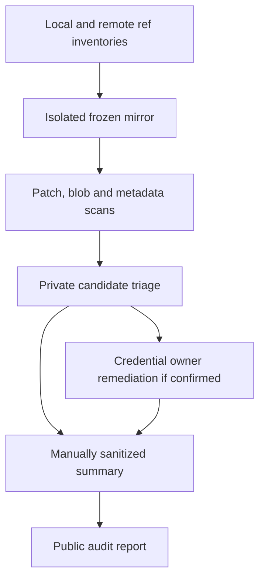
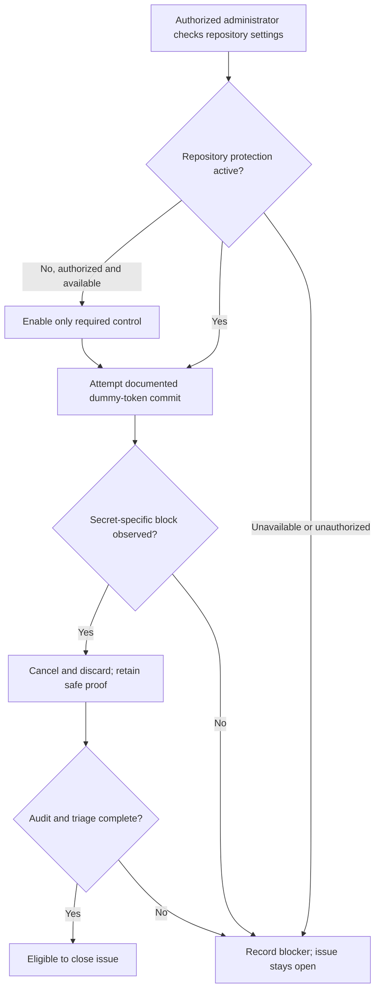

# Public History Audit and Native Secret Protection - Plan

## Goal Capsule

- **Objective:** Maintainers can account for secret exposure in reachable Correlia history and demonstrate that supported credential pushes are blocked before publication.
- **Means:** A private local history audit, environment-file Git exclusions, and administrator-qualified native GitHub push protection (KTD1–KTD4).
- **Authority:** [Issue #15](https://github.com/sh1ny/correlia/issues/15), the requirements below, and the user-selected native-protection-first approach. Current source establishes completed work; old CI results do not prove new secret controls.
- **Execution profile:** Small repository-policy changes plus a security-sensitive audit and an administrator-owned hosted check. No application behavior change or maintained scanner integration.
- **Owners and landing:** The implementer delivers the repository changes and sanitized audit evidence through a PR linked to #15. A repository administrator owns hosted settings and their qualification; credential owners own any revocation/rotation. Follow existing account, review and merge policies without bypasses.
- **Stop conditions:** Unknown credentials require confidential triage. Missing admin authority blocks U3, not the independent local work. Do not switch GitHub identity, rewrite history, force-push, rotate credentials, purchase services, or substitute a new prevention design without appropriate authorization. Issue closure requires all units, including external evidence.

---

## Product Contract

### Summary

Complete the remaining secret-exposure audit and prevention gaps using existing GitHub protection rather than adding a maintained CI scanner. Preserve the existing credential-free samples, Docker exclusions, dependency audit, and Linux verification infrastructure.

### Problem Frame

The public repository tells contributors to put real configuration in `.env`, but Git does not currently ignore environment-file variants. No full-history secret-scan report was found in the inspected repository records or merged PR evidence. These are prevention and verification gaps, not evidence of a credential leak.

Docker-context exclusions and dependency-advisory scanning already exist. Neither prevents Git from accepting an environment file nor establishes whether reachable history contains secrets. An authorized administrator readback confirmed that repository secret scanning and repository push protection are disabled.

### Key Decisions

- **Plan only the remaining gaps.** Governs R6. (session-settled: user-approved — chosen over rebuilding related safeguards: current source and merged work establish what can be reused.)
- **Use native repository protection first.** Governs R5. (session-settled: user-directed — chosen over a maintained local-hook-plus-CI scanner: avoid extra tooling while blocking supported secrets before upload; accept the administrator dependency.)

### Requirements

**History and confidentiality**

- R1. Audit all available reachable branches, tags, and their history with a maintained scanner; enumerate coverage and explicitly identify unavailable or unreachable history.
- R2. Publish a sanitized report recording scanner/version, audited revision/ref coverage, completion/errors, and triage status without candidate values, raw scanner excerpts, or sensitive local paths.
- R3. Any confirmed exposed credential requires privately recorded revocation/rotation outcome before remediation is declared complete; unresolved candidates remain unresolved rather than being classified clean.

**Future prevention**

- R4. Git ignores `.env` and `.env.*` at root and nested locations while `.env.example` remains trackable; inspect already-tracked sensitive files because ignore rules do not remove them.
- R5. Verify and, if necessary, enable native repository-level GitHub push protection, then demonstrate blocking with a documented synthetic non-secret fixture. Contribution guidance explains safe configuration handling and the protection's limits.

**Preservation**

- R6. Reuse existing samples, Docker exclusions, dependency verification, and the shared CI workflow. No new maintained secret-scanner task, hook framework, toolchain pin, or dependency lock is introduced by this plan.

### Acceptance Examples

- AE1. Given an untracked `.env.production` at root or in a nested directory, ordinary staging omits it; the corresponding `.env.example` can still be added. Covers R4.
- AE2. Given a scanner candidate from a deleted historical file, current-file cleanliness does not dismiss it; confidential triage determines its disposition. Covers R1–R3.
- AE3. Given confirmed repository protection, a documented fake-token commit attempt is rejected and cancelled without choosing bypass. A block caused only by branch policy or user-level protection is not repository-protection proof. Covers R5.
- AE4. Given inaccessible admin settings or a partial scan, the report identifies the missing evidence and #15 remains open. No absence of visible alerts is called a clean scan. Covers R1, R2, R5.

### Scope Boundaries

Included: repository Git contents and metadata needed to assess credential exposure, available PR refs, native protection qualification, safe configuration guidance, and a sanitized evidence artifact.

Excluded: a general privacy scrub of identities or personal documents, exhaustive scanning of issue/comment text or Actions artifacts, application secret-management redesign, dependency upgrades, CI refactoring, and a recurring audit service. Those hosted/non-Git surfaces are named as uninspected, not silently counted as covered.

#### Deferred to Follow-Up Work

History rewriting, cached-view removal, fork coordination, and broader exposure investigation require a separately authorized response if an actual credential warrants them. They do not replace R3. If native protection cannot be used or its coverage proves unacceptable, return the concrete evidence for a new decision; do not silently add the rejected scanner integration.

---

## Planning Contract

### Verified Baseline

Inspected local HEAD and GitHub `main`: `8fd4569ceafdb2b7040bf64953de3e4539e05dbc`. No open PRs were listed at the check. This is a source/evidence review, not a new audit or test execution.

| Existing surface | Evidence | Treatment |
|---|---|---|
| Environment exclusions | `.gitignore` excludes Python/tool state and local CE config only | Add the missing policy |
| Current tracked environment paths | Filename inventory returned only `.env.example` | Recheck at execution; no current untracking indicated |
| Docker exclusions | `.dockerignore` already excludes `.env*` and credential-file extensions | Leave unchanged |
| Safe samples | `tests/test_deployment.py::test_environment_and_config_samples_construct_strict_runtime_configuration` checks placeholders and strict configuration | Reuse, do not duplicate |
| Dependency audit | `mise.toml` invokes uv's locked advisory scan | Leave distinct and unchanged |
| CI | `.github/workflows/ci.yml` invokes the shared Linux gate on PRs | Preserve; post-upload CI is not exposure prevention |
| Hosted protection | Authorized sh1ny readback confirmed admin access, `secret_scanning.status: disabled`, and `secret_scanning_push_protection.status: disabled`; KintsugiBot restored and verified afterward | Enable under KTD7 during implementation; synthetic blocking proof still required |
| Historical scan report | None found in inspected records or PR #56/#57 evidence | Perform U2; do not infer historical cleanliness |

### Key Technical Decisions

- KTD1. **Use native repository push protection, not account-only protection.** Implements R5 using the user-selected prevention boundary. (session-settled: user-directed — chosen over local-hook-plus-CI scanning: use existing hosted blocking rather than maintain another scanner.) Administrator settings readback and a real blocked attempt are both required. Preserve existing unrelated settings and bypass policy; disclose relevant bypass limitations rather than silently broadening or tightening permissions. [GitHub enablement](https://docs.github.com/en/code-security/how-tos/secure-your-secrets/prevent-future-leaks/enable-push-protection).
- KTD2. **Use Gitleaks v8.30.1 temporarily for the independent audit.** Implements R1 without changing `mise.toml` or `uv.lock`. Obtain the official platform release outside the checkout, verify its SHA-256 against the versioned release manifest, and record the actual version and digest. Checksum comparison pins downloaded bytes, not independent publisher identity. [Release and checksums](https://github.com/gitleaks/gitleaks/releases/tag/v8.30.1).
- KTD3. **Audit a frozen ref snapshot in an isolated local mirror.** Implements R1. Inventory local refs and advertised remote branches/tags plus accessible PR head/merge refs, record their target object IDs privately, and reconcile fetch results against the inventory. Include relevant local-only refs separately. Check shallow boundaries and missing objects before claiming completeness. Scan reachable patches, unique complete blobs, and separately extracted commit/tag text; inspect the tracked-tip snapshot separately. Whole-blob coverage catches content that patch-only traversal can miss. Qualify bounded decoding/archive inspection explicitly: scanner defaults do not establish archive coverage. Distinguish enumerated inputs from inspected content, including skipped binaries/members, extraction errors, depth/size limits, and inaccessible LFS/submodule content. Never equate a patch count with commit coverage.
- KTD4. **Keep the audit's entire output private, not just matched values.** Implements R2, R3. Capture scanner stdout/stderr and JSON in access-restricted storage outside the checkout and public tool transcript. Apply that boundary to scanner/extractor temporary storage too, including archive copies; qualify its location and permissions before scanning. Use full redaction and no verbose output; do not assume redaction removes file paths, commit messages, author identities, or every sensitive field. Use bundled defaults without baseline, repository overrides, fingerprint ignores, or inline suppression. All nonzero exits and partial-scan diagnostics need a private disposition; findings are distinct from operational failure. Never submit candidate bytes to unapproved validation services. A manually reviewed allowlisted summary is the only public projection. [Versioned CLI and configuration](https://github.com/gitleaks/gitleaks/blob/v8.30.1/README.md), [finding fields](https://github.com/gitleaks/gitleaks/blob/v8.30.1/report/finding.go).
- KTD5. **Prove prevention on the selected hosted boundary.** Implements R5. Use only the fake token in GitHub's documented dummy-token exercise, not a generated or previously valid credential. The administrator performs the attempted web commit on this repository, observes the secret-specific block, cancels it, and discards the edit without bypass. Do not perform the later tutorial steps that create a real token or workflow. Record repository setting evidence separately so account-level protection cannot masquerade as repository protection. [Dummy-token exercise](https://docs.github.com/en/get-started/learning-to-code/storing-your-secrets-safely#2-committing-a-dummy-token).
- KTD6. **Report only exercised outcomes.** Implements R2, R5. Use `docs/security/secret-exposure-audit.md` for the dated public report, with safe ref-category counts, audited tip SHA, scanner version/digest, scan modes and limitations, triage-category totals, and native-control proof. Keep raw ref names, candidate locations, remediation records, and screenshots private unless individually reviewed safe. Never create a public candidate fingerprint from a secret value.
- KTD7. **Use a narrowly authorized administrator session.** Implements R5. (session-settled: user-directed — chosen over a human-only administrator handoff: permit the assistant to complete the native-control step without broad account authority.) The user authorized read-only sh1ny verification during planning and, only after implementation is separately authorized, necessary Secret Protection/repository push-protection enablement and the non-secret blocking test. Verify effective identity before each scoped session and restore and verify KintsugiBot in a finally path, including after failure. Other GitHub operations remain KintsugiBot operations. This does not authorize unrelated setting changes, protection bypass, real-token creation, history rewriting, or changing Git commit authorship.

### High-Level Technical Design

Audit data flow and publication boundary:

Hosted qualification and completion gates:

### Sequencing and Ownership

U1 and U2 are independent. U3 can begin under KTD7 once implementation is authorized; it need not wait for the historical audit. U4 consolidates U1–U3 evidence only after their results are known. Repository changes may land while hosted qualification is pending, but that is partial delivery, not completion of #15.

### Risks and Dependencies

- **Hosted authority is scoped, not general:** KTD7 resolves the administrator prerequisite and admin capability was read back successfully. Reverify effective identity and current settings at execution; expired authority or unavailable native features block U3. The separate standing exception for review-request comments grants no additional settings authority.
- **Detection is incomplete by nature:** Signature scanning can miss low-entropy passwords and unsupported formats. Supplement with private contextual inspection of credential assignments, credential-bearing URLs, key/config filenames, and tracked sensitive-file candidates. Native protection covers a subset of patterns and has documented size, timeout, and bypass limits; it is not universal credential prevention.
- **Copies may outlive refs:** Deleted/unadvertised commits, forks, clones and cached SHA views cannot be declared clean by a reachable-ref audit. No remote deletion or ref rewrite is part of obtaining coverage.
- **Private storage is required before real scanning:** Verify permissions for the audit workspace and keep it out of synced/public directories. A scanner report or failure log is sensitive even with redaction. Transfer confirmed findings only through an approved private channel; ask for the owner/channel if a candidate cannot be safely handled with existing access.
- **Unexpected dummy acceptance:** The fixture is non-secret, but acceptance still fails U3. Stop, record the safe created ref/commit if any, and request authorization for any remote cleanup. Do not bypass protections or rewrite history to make the proof appear successful.

### Sources and Research

- [Issue #15](https://github.com/sh1ny/correlia/issues/15): original criteria and reconciliation against [PR #56](https://github.com/sh1ny/correlia/pull/56) and [PR #57](https://github.com/sh1ny/correlia/pull/57).
- `scripts/verification.py` inherits child stdout/stderr; it is not a sanitizer for scanner output. Existing `mise.toml` tasks and `.github/workflows/ci.yml` remain unchanged under R6.
- `docs/solutions/security-issues/plugin-notification-boundary-convergence.md`: raw exceptions can disclose secrets. `docs/solutions/architecture-patterns/bounded-operational-visibility-across-runtime-boundaries.md`: publish bounded projections rather than raw operational records. Both inform KTD4 and KTD6.
- [GitHub scope and limits](https://docs.github.com/en/code-security/reference/secret-security/secret-scanning-scope), [supported patterns](https://docs.github.com/en/code-security/reference/secret-security/supported-secret-scanning-patterns), [secret-scanning REST permissions](https://docs.github.com/en/rest/secret-scanning/secret-scanning#list-secret-scanning-alerts-for-a-repository).
- [Credential remediation](https://docs.github.com/en/code-security/tutorials/remediate-leaked-secrets/remediating-a-leaked-secret), [sensitive-history cleanup limitations](https://docs.github.com/en/authentication/keeping-your-account-and-data-secure/removing-sensitive-data-from-a-repository), [Git ref traversal](https://git-scm.com/docs/rev-list-options).

---

## Implementation Units

### U1. Close the environment-file staging gap

- **Goal:** Ordinary staging excludes local environment files without hiding the sample.
- **Requirements:** R4, R6; AE1.
- **Dependencies:** None.
- **Files:** Modify `.gitignore`, the safe-configuration section of `CONFIGURATION.md`, and the now-stale environment-ignore statement in `AGENTS.md`. Preserve `.env.example` and `.dockerignore`.
- **Approach:** Add root-and-nested `.env`/`.env.*` exclusions with an explicit `.env.example` exception. Reinspect tracked filenames and private content candidates at the implementing revision; do not remove tracked files automatically. Explain ordinary staging versus forced staging, already-tracked files, and historical exposure.
- **Patterns to follow:** Existing narrow ignore entries and `CONFIGURATION.md`'s operator-secret guidance.
- **Test expectation:** No permanent test file for ignore-rule text; use real Git behavior in a disposable repository with the proposed ignore file.
- **Verification scenarios:**
  1. Covers AE1: root and nested `.env`, `.env.local`, and `.env.production` are absent from the index after ordinary staging; root and nested `.env.example` are staged.
  2. A previously tracked synthetic environment file remains tracked despite the new rules; documentation does not claim retroactive removal.
  3. An unrelated ordinary config file remains trackable; the actual checkout still tracks `.env.example`.
- **Verification:** Record the index/ignore outcomes using non-secret fixture content; preserve the user's worktree and index.

### U2. Audit reachable history and triage privately

- **Goal:** Establish the actual historical exposure evidence and its limits.
- **Requirements:** R1–R3, R6; AE2, AE4.
- **Dependencies:** A private audit workspace per KTD4; no dependency on U1 or U3.
- **Files:** Create the audit portion of `docs/security/secret-exposure-audit.md` only after sanitization. Temporary mirrors, scanner binaries, extracts, and findings remain outside the repository.
- **Approach:**
  1. Qualify the pinned scanner and data-extraction coverage with a disposable local Git repository before reading real candidates.
  2. Inventory and freeze the available refs per KTD3; record start/end remote snapshots and any movement, missing refs, shallow boundaries or inaccessible content.
  3. Execute the independent scan passes per KTD2–KTD4. Reconcile blobs, commit text, and tag annotations independently against actually inspected inputs; capture exclusions and scan errors separately.
  4. Privately classify candidates as proven non-credentials, confirmed credentials, or unresolved. Retain a per-candidate reason and reviewer/owner disposition; format intuition or uncertain validity is not evidence of a false positive. Supplement automated signatures with the contextual review in Risks and Dependencies.
  5. Obtain R3 outcomes from credential owners where applicable, then prepare KTD6's sanitized report. Do not mark an unresolved candidate remediated.
- **Execution note:** This is an audit, not new product code. Use throwaway coverage qualification; do not introduce a permanent audit engine or fixture library.
- **Test expectation:** No permanent test file; disposable scanner/extraction qualification and the real private audit are the evidence.
- **Verification scenarios:**
  1. A non-secret sentinel governed by a temporary fixture-only rule is found in a deleted historical file, a tag-only reachable history, and merge-only complete-blob content. Separate fixtures exercise commit-message-only and annotated-tag text. A harmless archive-member fixture proves configured traversal; unsupported/binary fixtures appear as exclusions rather than clean content. Production scanning does not retain the fixture rule.
  2. Missing refs, corrupt/missing objects, scanner errors, unsupported content or partial reports produce explicit coverage gaps, never a clean conclusion.
  3. Candidate values and hostile sensitive metadata do not appear in the public report; inspect the final projection rather than trusting scanner redaction.
  4. Covers AE2: a current clean snapshot does not erase historical candidate status. Covers AE4: inaccessible coverage remains visibly incomplete.
  5. If a real credential is confirmed, private remediation evidence exists and its outcome is reported without the value or a sensitive private-record link.
- **Verification:** Identify actual scanner version/digest, audited tips, ref categories, unique object coverage, triage totals and exclusions. A negative result is scoped evidence, not a security certification.

### U3. Qualify native repository push protection

- **Goal:** Demonstrate the selected pre-publication blocking mechanism on Correlia.
- **Requirements:** R5, R6; AE3, AE4; KTD1, KTD5, KTD7.
- **Dependencies:** Separate authorization to begin implementation. Administrator access has been verified and its scoped use is authorized under KTD7.
- **Files:** Update the hosted-control evidence in `docs/security/secret-exposure-audit.md` and contribution guidance in `CONFIGURATION.md`. No workflow or dependency changes.
- **Approach:**
  1. Reverify identity and repository-level settings under KTD7; retain safe before-state evidence and distinguish account-level protection. The planning readback establishes both required controls are currently disabled.
  2. Reuse active controls unchanged. Enable only necessary available native controls when authorized, then read them back; preserve unrelated settings.
  3. Identify an authorized target ref and its initial tip, and check whether existing branch rules permit the attempted web-commit path. Do not relax protections. If no permitted target exists, obtain explicit authorization for an alternate target before attempting the fixture.
  4. Exercise the documented synthetic attempt per KTD5, cancel/discard it, and establish that the target ref did not advance because of the fixture.
  5. Record timestamp, repository/control identity, secret-specific block, cancellation and limitations. If evidence is unavailable, leave the unit and issue incomplete.
- **Patterns to follow:** `CONFIGURATION.md` already distinguishes repository-owned verification from administrator-owned protection activation; preserve that ownership boundary.
- **Test expectation:** No permanent test file; the real hosted interaction is necessary proof. A local scanner test or copied settings assertion cannot substitute.
- **Verification scenarios:**
  1. Covers AE3: repository protection is visibly active and the dummy attempt receives a secret-specific block without bypass or publication.
  2. Missing permission, unavailable feature, branch-policy-only rejection, timeout, or user-only blocking does not satisfy the repository-control claim.
  3. Cancellation leaves no fixture commit/file on the target; an unexpectedly accepted fake fixture follows the failure handling in Risks and Dependencies.
- **Verification:** Settings readback plus sanitized interaction evidence from this repository. Record what remains unproven about other supported push surfaces rather than claiming all paths were exercised.

### U4. Publish the completion record and finish guidance

- **Goal:** Make the issue's disposition auditable without disclosing findings.
- **Requirements:** R1–R6.
- **Dependencies:** U1–U3 outcomes; complete closure requires all their acceptance evidence.
- **Files:** Finalize `docs/security/secret-exposure-audit.md` and `CONFIGURATION.md`; link the report from the existing guidance. Update #15 with a sanitized summary only when publication is authorized.
- **Approach:** Map each issue criterion to its evidence, distinguish historical audit from current prevention, and document ongoing native alerts/bypass review ownership. Include safe `.env` handling and the fact that secret scanning does not cover every credential. Keep private remediation records with their owners, not in Git.
- **Test expectation:** None for prose; review report fields, links, and claim-to-evidence mapping. No source-string tests.
- **Verification:** Every stated pass has new evidence for its actual surface; unavailable administrator work or unresolved triage stays visible. The public report contains no raw scanner excerpts or candidate values.

---

## Verification Contract

| Check | Applies to | Required outcome |
|---|---|---|
| Disposable real-Git staging smoke | U1 | AE1 and already-tracked limitation observed without touching the working index |
| Disposable scanner/extraction qualification | U2 | Synthetic historical and complete-blob cases detected; errors remain failures |
| Actual private history audit | U2 | Frozen reachable-ref coverage, candidate dispositions and coverage limits recorded |
| Native settings and dummy-token interaction | U3 | Repository-level control read back; secret-specific block observed; cancelled edit does not advance ref |
| Existing sample contract | Only if sample content changes despite expected preservation | Run the focused existing `tests/test_deployment.py` sample test; no replacement assertions |
| Repository integration gate | Eventual implementation PR | Existing required `Linux verification` / `mise run ci` remains authoritative; no second deployment smoke after it |
| Windows development subset | If used during implementation | `mise run check:portable` is reported as portable-only, never hosted-protection or history-audit proof |
| Public evidence review | U4 | Allowlisted summary reconciles scope and outcomes without sensitive metadata |

No application build, tests, secret scan, or hosted mutation ran to create this plan. Existing PR #57 results establish only their previously exercised verification, not acceptance for #15. No release-validation or publication workflow is added.

---

## Definition of Done

- U1 staging behavior is observed and safe configuration guidance matches the implemented policy.
- U2 produces a sanitized audit report with tool/version, reachable-ref/object coverage, triage status and explicit limits; R3 is satisfied for every confirmed credential.
- U3 has administrator-qualified repository settings and synthetic blocking proof; inaccessible evidence is not completion.
- U4 traces every #15 criterion to observed evidence and preserves the distinction between Git policy, native protection, Docker exclusions, and dependency auditing.
- Existing sample and CI infrastructure are preserved under R6; no rejected scanner integration or speculative runtime changes enter the diff.
- Audit-created temporary mirrors, scanner downloads, extracts and disposable fixtures are removed after safe evidence extraction. Required private incident evidence is transferred to its owner before cleanup; unrelated user data is untouched.
- No issue closure or claim of a clean history is made while scan coverage, confidential triage, or hosted qualification remains unresolved.
