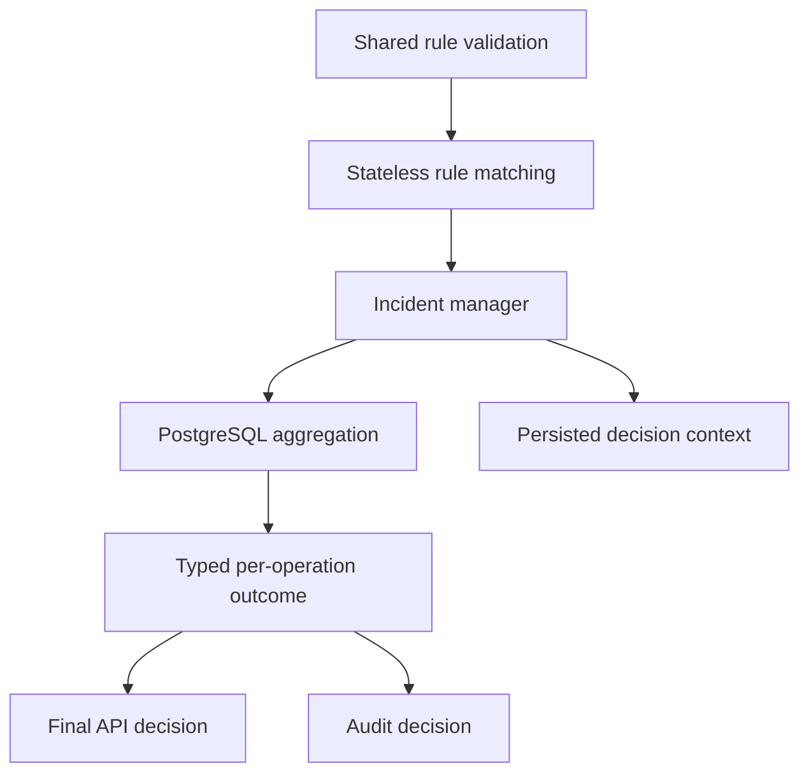
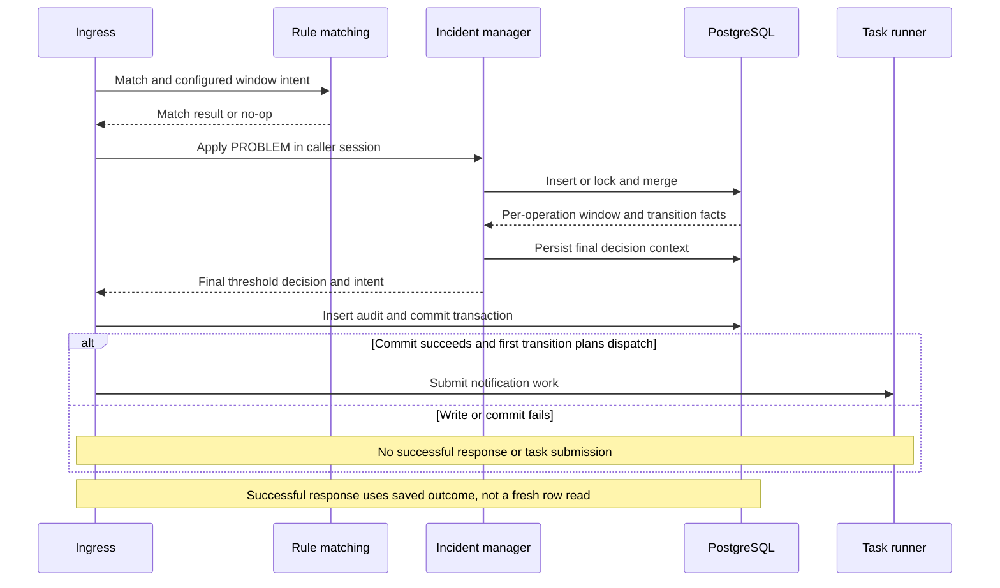
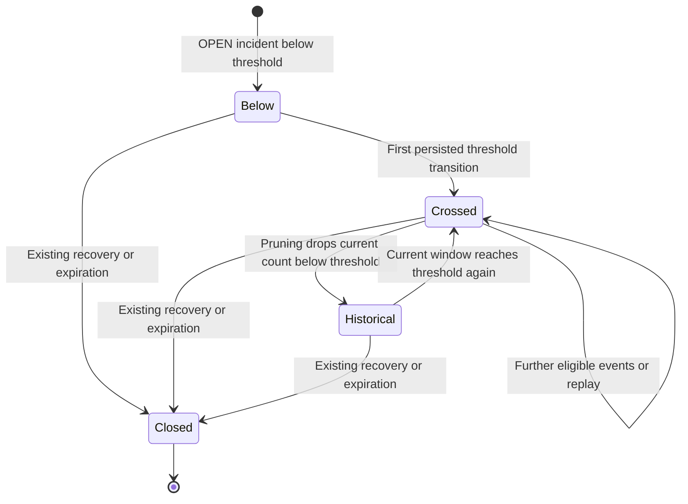
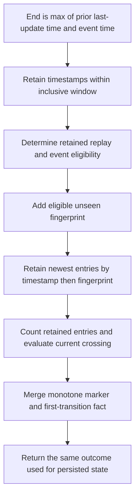

# Durable Threshold Authority and Capacity - Plan

## Goal Capsule

- **Objective:** Operators can trust the threshold outcome reported for each accepted problem event, including after restart or concurrent ingestion, and cannot configure a threshold the service cannot reach.
- **Means:** PostgreSQL aggregation supplies threshold outcomes; stateless rule matching supplies intent; shared validation enforces the supported capacity (KTD1–KTD3).
- **Authority:** Requirements below preserve [#27](https://github.com/sh1ny/correlia/issues/27), [#28](https://github.com/sh1ny/correlia/issues/28), and the selected maximum. Requirements govern behavior; technical decisions govern mechanism; implementation units override neither.
- **Execution profile:** One coordinated change, with capacity enforcement preceding the authority cutover and PostgreSQL regression proof accompanying it. No partial release that fixes only the response while leaving an unreachable threshold accepted.
- **Stop conditions:** Do not silently increase capacity, invent lost fingerprint history, change recovery membership, or replace the existing transaction/notification boundaries. Escalate evidence that the selected bound or existing persistence representation cannot satisfy the requirements.
- **Completion owner:** The implementer completes U1–U5, obtains the Linux verification evidence, and hands off through the repository's normal review/merge policy. This document does not authorize publication or claim completed implementation.

---

## Product Contract

### Summary

Remove process-local threshold history and derive API and audit threshold results from the persisted aggregation outcome. Retain the supported maximum of 100 distinct retained fingerprints, reject unreachable thresholds at configuration and repository boundaries, and preserve the first-transition notification rule.

### Problem Frame

`RuleEngine` and the incident repository maintain separate threshold histories. The API serializes the engine result before persistence, while the repository independently handles replay, event-time pruning, and the incident's first crossing. Restart and out-of-order arrival can therefore produce a response that disagrees with the committed incident and audit decision.

Configuration currently accepts thresholds above the repository's retained-fingerprint capacity. Persistence truncates the window before counting, making those thresholds unreachable. Historical design notes justify bounded JSONB growth but do not establish 100 as a measured optimum or PostgreSQL limit.

### Key Decisions

- **Retain the supported maximum rather than expand storage.** (session-settled: user-directed — chosen over support for thresholds above 100: keep the existing capacity while correcting authority and reachability.) Governs R6, R7, R8.

### Requirements

**Threshold authority — issue #27**

- R1. Rule matching retains no per-group fingerprint or threshold-window history; it continues to select the first priority-ordered match, grouping, summary, actions, and configured window parameters.
- R2. For a successfully committed PROBLEM aggregation, both API threshold-decision projections and the audit decision describe that request's repository outcome, including replay, out-of-order arrival, and restart.
- R3. Current-window count/crossing remains distinct from the incident's monotone crossing marker; notification intent continues to depend on the first persisted transition, not a later recrossing of the current window.
- R4. Concurrent events for the same rule/group preserve one OPEN incident and one first-threshold transition; each successful request reports its own serialized transaction outcome.
- R5. Incident mutation and audit insertion remain atomic, with notification submission only after commit; recovery, no-match, and rejected requests must not acquire fabricated threshold outcomes.

**Reachable capacity — issue #28**

- R6. New rule configuration and compiled domain rules accept integer thresholds from 1 through 100 inclusive, with 101 and other unsupported values rejected during loading rather than silently clamped.
- R7. Every new repository input enforces `1 <= threshold_count <= max_window_fingerprints <= 100`; every accepted threshold is reachable with that many distinct eligible fingerprints in one group/window.
- R8. Configuration errors identify the offending rule entry and threshold field, and operator documentation states the maximum, rejection behavior, and converter implications.

**Existing data and contracts**

- R9. Preserve existing persisted history and schema readability, including records created under formerly accepted unsupported thresholds; do not infer a past crossing or backfill missing fingerprints.
- R10. Preserve current PROBLEM response field names, audit schema shape, and notification delivery records while replacing the threshold source of truth.

### Acceptance Examples

- AE1. **Restart before crossing.** Covers R2, R3. Given threshold 2 and one committed fingerprint, a fresh application runtime receives a second distinct in-window fingerprint. The response reports count 2, the incident and audit record the crossing, and one notification submission opportunity is produced.
- AE2. **Late event and replay.** Covers R2. Given a durable window ending at time 100 with duration 60 seconds, a distinct event at time 80 counts, its retained replay does not, and an event at time 39 does not enter the window. API window bounds/count and corresponding audit facts match each committed operation.
- AE3. **Count falls after crossing.** Covers R3. After two events cross threshold 2, a later event ages both out. Current-window count is 1 and current-window `crossed` is false, but incident/API/audit `threshold_crossed` remains true and no new first-transition dispatch is planned.
- AE4. **Maximum is reachable.** Covers R6, R7. With threshold 100, 99 distinct eligible fingerprints do not cross; the hundredth does. Threshold 101 fails loading, and a direct repository input requesting threshold 3 with capacity 2 is rejected before database work.
- AE5. **Concurrent threshold ownership.** Covers R4. Two independent sessions ingest events for the same OPEN key at the crossing boundary. One OPEN row survives, counts reflect serialized distinct-event processing, and exactly one operation owns the first transition.
- AE6. **Audit failure rolls back the crossing.** Covers R5. A database audit-write failure after aggregation yields no successful response, no committed incident mutation or audit row for that request, and no task submission. Retrying the event can still own the first transition.

### Scope Boundaries

- Preserve the existing bounded event-time algorithm, inclusive window boundaries, deterministic truncation order, and retained-fingerprint replay semantics. This work does not provide unlimited deduplication after an entry is evicted.
- No new tables, migrations, threshold-history backfill, broker, or dependency is planned. Existing schema and the partial OPEN-incident unique index remain in use.
- No change to recovery membership, expiration policy, threshold grouping identity, or configuration hot-reload policy.

#### Deferred to Follow-Up Work

- Active-object membership capacity and correctness remain [#30](https://github.com/sh1ny/correlia/issues/30).
- Larger threshold representations, durable notification queues, notification retries, and delivery guarantees are separate work; Task Acceptance remains distinct from delivery.

---

## Planning Contract

### Key Technical Decisions

- KTD1. **Move the existing capacity constant to a dependency-safe domain owner.** Place `MAX_WINDOW_FINGERPRINTS` in `app/domain/incidents.py`; configuration, domain rules, and persistence import it directly. Reuse it for the existing map/max-size limits and new write-side threshold limits under R6–R7. Do not conflate this bound with host/service/member limits or leave a persistence re-export alias.
- KTD2. **Separate match intent from a finalized rule decision.** Introduce a stateless match-result type in `app/domain/rules.py` containing the existing match metadata and configured `RuleWindow`. `RuleEngine.evaluate` returns this or `NoOpDecision`; `RuleDecision` remains the completed PROBLEM response model. The manager consumes configured duration/threshold directly instead of reconstructing them from speculative window dates. Governs the mechanism for R1, R2, R10.
- KTD3. **Extend the existing repository write result rather than reread the row.** Carry the applied threshold, persisted window start/end, and current-window crossing alongside its existing count, retained fingerprints, replay, inside-window, counted, monotone marker, and first-transition facts. Compute threshold comparisons at the repository boundary and pass value snapshots upward. This preserves R2–R4 under concurrent updates without a post-commit read that could observe another request.
- KTD4. **Finalize both response projections from one typed outcome.** The manager constructs `ThresholdDecision` from KTD3's snapshot; ingress uses that same decision for the nested `rule_decision.threshold_decision` and top-level `threshold_decision`. Build the audit summary from typed match/result fields, removing threshold extraction from serialized dictionaries. Recovery already returns `NoOpDecision` before matching and retains its null threshold decision. No new recovery projection is needed. Governs R2, R5, R10.
- KTD5. **Keep serialized persistence and post-commit notification ownership intact.** Extend the active `record_problem_incident` path: insert with conflict-do-nothing, then lock/merge the existing OPEN row. Preserve manager decision-context updates and existing Notification Delivery Records within the ingress transaction. Preserve the existing no-dispatch precedence and use only the committed first-transition intent for submission (R3–R5, R10).
- KTD6. **Tighten new inputs without making historical JSONB unreadable.** Enforce R6–R7 in `RuleWindowConfig`, `RuleWindow`, and `IncidentUpsertInput`; require actual integer threshold/capacity values rather than bool/float coercion. Keep historical `IncidentWindowState.threshold_count` readable even when it exceeds its stored capacity. Its existing map/max-size bounds still use KTD1. A later valid aggregation replaces window parameters through the normal merge, preserving the prior monotone marker and retained facts; it does not repair history (R9).
- KTD7. **Use the shared loader for converter rejection and preserve safe diagnostics.** `scripts/migrate_vigilo_config.py` already calls `load_rules_config` during staged validation before promotion, but its broad exception handler discards the rule location. Keep that single validation policy and project recognized threshold errors into the existing `MigrationIssue` report using only the structured rule index/threshold-field location and code-owned supported bound. Never serialize raw error inputs, exception text, arbitrary context, or configuration values; unrelated failures retain the generic sanitized error. This satisfies R6 and R8 without changing the report schema or file-promotion mechanism.

### High-Level Technical Design

**Component ownership**

**Transaction protocol**

**Threshold lifecycle**

`Crossed` and `Historical` are explanatory states, not new stored statuses. Both retain the monotone marker; the return from `Historical` to `Crossed` creates no second first transition (R3).

**Event-time data flow**

At saturation, a newly eligible fingerprint can be evicted by the existing ordering. `ThresholdDecision.counted_fingerprints` and `counted` describe the retained result, not every fingerprint ever accepted. The repository's existing per-event `counted` flag/event-count behavior is not redefined by this plan.

**API and audit projection**

| Surface | Meaning | Source |
|---|---|---|
| Both API `threshold_decision` copies: bounds | Applied event-time window | Repository outcome |
| Both API copies: `threshold`, `counted`, fingerprints | Applied threshold and retained window contents | Repository outcome |
| Both API copies: `crossed` | Current retained count meets applied threshold | Repository current-window result |
| API top-level `threshold_crossed` | Incident has crossed at least once | Persisted monotone marker |
| Audit/context `counted_count`, `threshold_count` | This operation's count and applied threshold | Same typed outcome |
| Audit/context `threshold_crossed` | Incident has crossed at least once | Same monotone marker |
| Audit/context `first_threshold_transition`, `replay` | This operation's transition and replay facts | Same typed outcome |

Replay/skip explanations must follow the repository's replay and outside-window facts; they must not expose raw payloads or manufacture a second count. Audit remains a bounded summary without full fingerprint lists. Later requests may legitimately advance the row beyond an earlier response/audit snapshot (R2, R4).

### Alternatives Considered

- **Keep engine counts and overwrite only selected response fields:** rejected because callers could still consume contradictory nested results and mutable history would remain under R1.
- **Read PostgreSQL in the rule engine before aggregation:** rejected because it adds a read without establishing authority at the locked write; concurrency still makes the prediction stale.
- **Introduce a separate threshold event table:** not needed for the selected R6–R7 capacity. The existing bounded representation and serialization path satisfy the chosen mechanism; no competing storage design needs development before implementation.

### Sequencing and System-Wide Impact

U1 establishes the input invariant. U2 adds complete repository outcome facts without changing the active write strategy. U3 performs the stateless matching and caller cutover as one coherent unit. U4 proves the cross-request boundaries, and U5 completes operator documentation and runtime qualification. Do not release U2 without U3 as a purported fix for #27.

Configuration authors will receive startup rejection for formerly accepted thresholds above 100. API clients retain the PROBLEM response shape but receive corrected counts, bounds, and replay decisions. Audit readers retain schema version and field meanings. Historical incident reads remain compatible under KTD6.

### Risks and Operational Notes

- **Historical rows:** A stricter persisted-state reader could make previously accepted threshold-101 rows unreadable. KTD6 deliberately constrains new writes instead; exercise an old row before declaring this safe.
- **Concurrent snapshots:** Comparing every completed response to the final row incorrectly rejects valid serialized outcomes. Correlate each request with its audit record; compare the final row to the final serialized result.
- **Bounded replay horizon:** A fingerprint evicted at capacity is no longer recognized solely from this map. Preserve/document that existing limit rather than promise global replay deduplication.
- **Rule changes across restart:** Existing writes apply the current configured threshold/window while keeping the monotone marker. Do not silently introduce rule-version reset or re-notification semantics.
- **Deployment:** Preflight the deployed rules with the updated loader before rollout. Unsupported rules require an operator-selected value in the supported range; never silently clamp them. Restart onto one consistent application version rather than claim mixed old/new workers provide the new authority guarantee.
- **Notification loss remains possible:** TaskRunner work is in memory. Exactly one first-transition opportunity is not durable or exactly-once delivery.

### Sources and Research

- [Issue #27](https://github.com/sh1ny/correlia/issues/27) and [issue #28](https://github.com/sh1ny/correlia/issues/28): primary acceptance criteria; historical PR #57 verification is not evidence for this change.
- `app/processing/rule_engine.py`, `app/processing/incident_manager.py`, `app/processing/ingress.py`: competing authority and caller-owned transaction.
- `app/persistence/incidents.py`: `IncidentUpsertInput`, `record_problem_incident`, `_next_window_state`, and `IncidentAggregationWriteResult` are the relevant active seams; the alternate SQL upsert builder is not the ingestion path.
- `app/domain/rules.py`, `app/domain/incidents.py`, `app/domain/audit.py`, `app/config/rules.py`: response, stored-state, audit, and configuration contracts.
- `docs/solutions/security-issues/plugin-notification-boundary-convergence.md`: preserve delivery records and commit-before-submission ownership.
- `docs/solutions/architecture-patterns/bounded-operational-visibility-across-runtime-boundaries.md`: keep Task Acceptance and terminal delivery distinct.
- `.planning/milestones/v1.0-phases/03-problem-aggregation-and-notification-dispatch/03-RESEARCH.md`: historical bounded-JSONB rationale, not authority for the exact numeric maximum.

---

## Implementation Units

### U1. Enforce one reachable threshold-capacity contract

**Goal:** Reject impossible configuration and direct repository inputs before they can create unreachable incidents.

**Requirements:** R6–R9; the Product Contract's selected capacity decision.

**Dependencies:** None.

**Files:** `app/domain/incidents.py`, `app/domain/rules.py`, `app/config/rules.py`, `app/persistence/incidents.py`, `scripts/migrate_vigilo_config.py`; tests in `tests/test_rule_topology_yaml.py`, `tests/test_incident_repository.py`, and `tests/test_vigilo_config_migration.py`.

**Approach:**
1. Apply KTD1 and KTD6 to the existing constant, rule models, and repository input validation; migrate imports without aliases.
2. Preserve the historical persisted-state read boundary and unrelated host/service bounds.
3. Apply KTD7 at the converter's staged-validation exception boundary so threshold rejection retains an actionable safe location; do not add a clamp, duplicate validation policy, or new promotion mechanism.

**Patterns to follow:** Strict Pydantic rule models, `IncidentUpsertInput.__post_init__`, YAML loader fixtures, and converter staging validation.

**Test scenarios:**
1. Covers AE4. Load a multi-rule configuration containing threshold 100 successfully; change that rule to 101 and assert a validation location identifies its entry and threshold field with maximum 100, without pinning incidental prose.
2. Direct `RuleWindow` construction accepts 1 and 100 and rejects 0, 101, bool, string, and fractional values; reuse parameterized model tests rather than source-text assertions.
3. Direct repository inputs accept threshold/capacity pairs 1/1, 2/2, and 100/100; reject 3/2, 101/100, capacity 0/101, and non-integer threshold/capacity values before any write.
4. A converter source threshold 101 fails staged validation, exits unsuccessfully, and leaves pre-existing output YAML unchanged. Its report identifies the offending generated rule entry and threshold field with the supported maximum; raw validation inputs, exception text, and unrelated secret-bearing config values do not appear. Unrelated staging exceptions retain their generic sanitized failure. Source threshold 100 is preserved rather than clamped.
5. A historical stored state containing threshold 101 and capacity 100 remains readable; new inputs cannot create that combination.

**Verification:** Both public loading paths and direct write inputs obey R6–R8; historical reads obey R9. These validation tests do not substitute for U2's reachability proof.

### U2. Return a complete per-operation persisted threshold outcome

**Goal:** Give callers all authoritative window and crossing facts without a second read or process-local calculation.

**Requirements:** R2–R4, R7, R9, R10.

**Dependencies:** U1.

**Files:** `app/persistence/incidents.py`; tests in `tests/test_incident_repository.py`.

**Approach:**
1. Extend the existing result under KTD3 on both insert and locked-update paths, using the window state actually written.
2. Preserve inclusive pruning, tie ordering, the partial unique index, and KTD5's first-transition logic.
3. Keep new values independent of later ORM mutation or transaction expiration; retain caller-owned commit.

**Execution note:** Establish the maximum and out-of-order expected outcomes against the active repository path before changing callers.

**Patterns to follow:** Existing PostgreSQL/Testcontainers fixtures and replay/out-of-window/first-transition cases in `tests/test_incident_repository.py`.

**Test scenarios:**
1. Covers AE4. Commit 100 distinct eligible fingerprints with threshold 100: count 99 remains below threshold; the hundredth sets current crossing, monotone crossing, and exactly one first transition. Query stored JSONB to verify the retained count/map.
2. With a reduced valid capacity/threshold of 2/2, the second eligible fingerprint reaches the threshold; this proves the effective-capacity invariant rather than only the global maximum.
3. Covers AE2. An in-window late event uses the existing durable end, a retained replay does not increment the count, and an event one instant outside the lower boundary does not enter the map; an event exactly at the lower boundary remains eligible.
4. Covers AE3. After pruning reduces the count, the current-window result falls below threshold while the monotone marker remains true and first transition remains false.
5. At 101 eligible distinct events with capacity 100, the returned retained count/fingerprints equal the stored post-truncation state. Include equal timestamps and an out-of-order event that loses the retention tie; do not require its fingerprint to survive merely because it arrived last.
6. Seed a valid historical JSONB row with formerly accepted threshold 101, then aggregate with a valid current rule; parsing and merge succeed without inventing history or resetting a true monotone marker. Preserve the existing empty-window-state fallback for older rows.

**Verification:** Insert and update results agree with the transaction's persisted state and expose all fields U3 needs; no API layer has to recompute threshold authority.

### U3. Cut over rule matching, manager, API, and audit together

**Goal:** Remove the second history and return one consistent persisted decision through all ingestion projections.

**Requirements:** R1–R3, R5, R10.

**Dependencies:** U2.

**Files:** `app/domain/rules.py`, `app/processing/rule_engine.py`, `app/processing/incident_manager.py`, `app/processing/ingress.py`; tests in `tests/test_rule_engine.py`, `tests/test_incident_manager.py`, and `tests/test_ingress_router.py`.

**Approach:**
1. Implement KTD2 and migrate every caller/fixture constructing or consuming engine results. Remove `_window_state`, `_evaluate_threshold`, and obsolete imports rather than retain a prediction path.
2. Supply repository inputs from the match's configured window and build the completed PROBLEM decision from U2's outcome under KTD4.
3. Update final DecisionContext and audit projection through typed fields. Remove obsolete dictionary threshold extraction; preserve Notification Delivery Records under KTD5.
4. Delay successful response exposure until commit; preserve existing recovery/no-op/rejection serialization and post-commit notification behavior.

**Execution note:** Start from a failing ingress replay/out-of-order agreement case. Move engine-history coverage to the repository/integration owner, rather than repinning tests to the new internal model layout.

**Patterns to follow:** Thin ingress router, typed domain models, manager context persistence, and bounded `AuditDecisionSummary`.

**Test scenarios:**
1. Covers AE2. Through HTTP ingress, assert both threshold-decision copies agree on persisted bounds, applied threshold, retained fingerprints, count, and crossing for new, replayed, and outside-window events; corresponding audit count/threshold/replay facts agree.
2. Covers AE3. Verify current-window false versus monotone true across response, audit, and incident detail after pruning; no second task is accepted.
3. Recovery still bypasses matching and changes only existing lifecycle state, with null threshold decision and null audit threshold facts; no-match and missing-group-field paths preserve their no-op behavior.
4. Matching priority, group-key construction, summary rendering, and selected actions retain existing behavior after the stateless result cutover.
5. A later aggregation preserves prior per-plugin delivery records and existing no-dispatch precedence; replay never becomes a new dispatch merely because the engine was reconstructed.
6. Invalid/rejected input performs no threshold aggregation and preserves existing safe error/audit policy; new projection errors cannot escape as raw payload/config data.

**Verification:** The API and audit no longer consume pre-persistence counts. No mutable threshold history or obsolete engine-result compatibility path remains.

### U4. Prove restart, concurrency, and rollback boundaries

**Goal:** Establish that the coordinated cutover holds across independent runtimes and real database transactions.

**Requirements:** R2–R5, R7, R9, R10.

**Dependencies:** U3.

**Files:** `tests/test_incident_repository.py`, `tests/test_ingress_router.py`, `tests/test_incident_manager.py`; reuse `tests/conftest.py` and module-local PostgreSQL fixtures without changing their lifetimes.

**Approach:**
1. Adapt the existing ingress runtime-reconstruction pattern used for notification-record persistence to threshold state.
2. Race independent sessions/connections using deterministic synchronization; never share an `AsyncSession` across concurrent tasks or use sleeps as ordering proof.
3. Inject an audit failure after aggregation has staged its database writes, then inspect durable state from a fresh session. Preserve production failure handling.

**Patterns to follow:** Existing module-scoped Testcontainers PostgreSQL image selection, transaction isolation/cleanup fixtures, and capturing task runners in ingress tests.

**Test scenarios:**
1. Covers AE1. Reconstruct engine, processor, and app against the same committed database between event one and event two; assert the same incident reaches threshold and one submission opportunity exists. Repeat retained replay and late-event assertions through the fresh runtime.
2. Covers AE5. Race first inserts for a previously unseen key at threshold 2: one OPEN row, count 2, one first transition, and two auditable request outcomes with counts 1 and 2 in serialization order.
3. Covers AE5. Seed an OPEN row one event below threshold, then race distinct events: exactly one first transition, no lost retained event below capacity, one planned dispatch. Also race identical fingerprints and prove no duplicate count or second transition.
4. At the HTTP/audit boundary, correlate each concurrent request with its own audit entry and outcome. Do not compare an earlier response with a row advanced by a later commit; final row count and marker must match the final serialized outcome.
5. Covers AE6. Cause an actual failed audit database write after an existing incident would cross. The failed request leaves the previous incident state intact, no audit row, and no accepted task. Remove the fault and retry: the event crosses once. Include the new-incident rollback case if the same fixture covers it without duplicate test machinery.
6. Observe successful task submission through a test runner that queries committed incident/audit state from an independent session; the callback must not see an uncommitted crossing. This proves ordering, not SMTP durability.

**Verification:** Real PostgreSQL establishes uniqueness, serialization, replay stability, atomic rollback, and post-commit visibility. Passing mock-only or portable tests is insufficient.

### U5. Document the corrected contract and qualify the running service

**Goal:** Give operators accurate capacity and threshold semantics, backed by an exercised service.

**Requirements:** R1–R10.

**Dependencies:** U4.

**Files:** `CONFIGURATION.md`; existing `config/rules.yaml` sample remains threshold 1 unless a concise bound comment improves its use. Review the repository guidance's current process-local-history limitation and update it only after the implementation removes that limitation. `CONCEPTS.md` contains the shared threshold vocabulary.

**Approach:**
1. Document R6–R8 alongside rule-window settings, including the relationship between duration, group, distinct fingerprints, and capacity.
2. Explain R3's two crossing meanings and KTD7's converter rejection behavior. State that 100 is the supported representation limit, not a PostgreSQL limit or a fixed threshold for every rule.
3. Exercise the running API against real PostgreSQL using disposable configuration/data, then run the final Linux gate from the Verification Contract. Remove temporary smoke fixtures afterward.

**Test expectation:** No wording/source-text tests for documentation. Runtime proof and the U1–U4 behavioral tests establish the contract.

**Verification:** Operator docs and running responses agree; no documentation claims database-only authority until U3–U4 qualify it, and no text upgrades Task Acceptance into guaranteed delivery.

---

## Verification Contract

No implementation, application execution, or test results are claimed by this plan. Existing historical runs and source inspection establish context, not proof that the proposed changes work.

- Use pinned Python 3.14.7, uv 0.11.7, and the existing `uv.lock`; verification does not update dependencies.
- During implementation, exercise the focused test files named by U1–U4 against their existing fixtures. Use pytest-asyncio as the sole async owner; do not add AnyIO markers or substitute SQLite.
- **Runtime smoke:** Start the actual service with real PostgreSQL and a temporary threshold-2 rule. Submit event one, restart the service without resetting PostgreSQL, then submit event two, its replay, and an outside-window event. Inspect HTTP responses, the incident, and audit records for the predicted counts/markers. Include the post-crossing pruning case and observe only the first transition scheduling notification work.
- **Capacity smoke:** Load threshold 100 and ingest 100 distinct eligible events through the API, verifying the boundary crossing and bounded retained state. Startup with threshold 101 must fail configuration validation before serving; retain diagnostics without exposing secrets.
- **Final qualification:** `mise run ci` on Linux with Docker/Compose is the required full gate and already includes deployment smoke. Do not append a redundant `mise run test:deployment` run. The `Linux verification` required check must qualify the actual implementation revision.
- **Windows development only:** `mise run check:portable` may support iteration but excludes PostgreSQL/deployment/POSIX coverage and is not completion evidence for this plan.
- Report the exact revision and exercised cases, including any missing prerequisite or unexecuted path. If Linux/Docker is unavailable, finish reachable work but do not describe database correctness or release qualification as passed.

---

## Definition of Done

- U1: New configuration/domain/repository write inputs satisfy R6–R8, including 100/101 and reduced-capacity boundaries; historical reads satisfy R9.
- U2: The active insert/lock/merge path returns a complete outcome matching the state it writes, with maximum reachability and saturation proof.
- U3: Every matching/manager/ingress/audit caller uses the new authority boundary; obsolete history, calculations, extraction helpers, and implementation-pinning tests are removed.
- U4: PostgreSQL-backed restart, fresh/existing-row concurrency, replay, rollback, and post-commit visibility scenarios pass with request-specific response/audit agreement.
- U5: Operator documentation reflects the exercised contract, runtime smoke succeeds, and the full Linux verification gate passes for the implementation revision.
- No abandoned prototypes, temporary smoke scripts/configuration, compatibility shims, or speculative framework code remain. No unrelated user changes are removed.
- Both issue acceptance sets are satisfied together; bounded replay, recovery membership, and in-memory notification-delivery limitations remain honestly stated.
