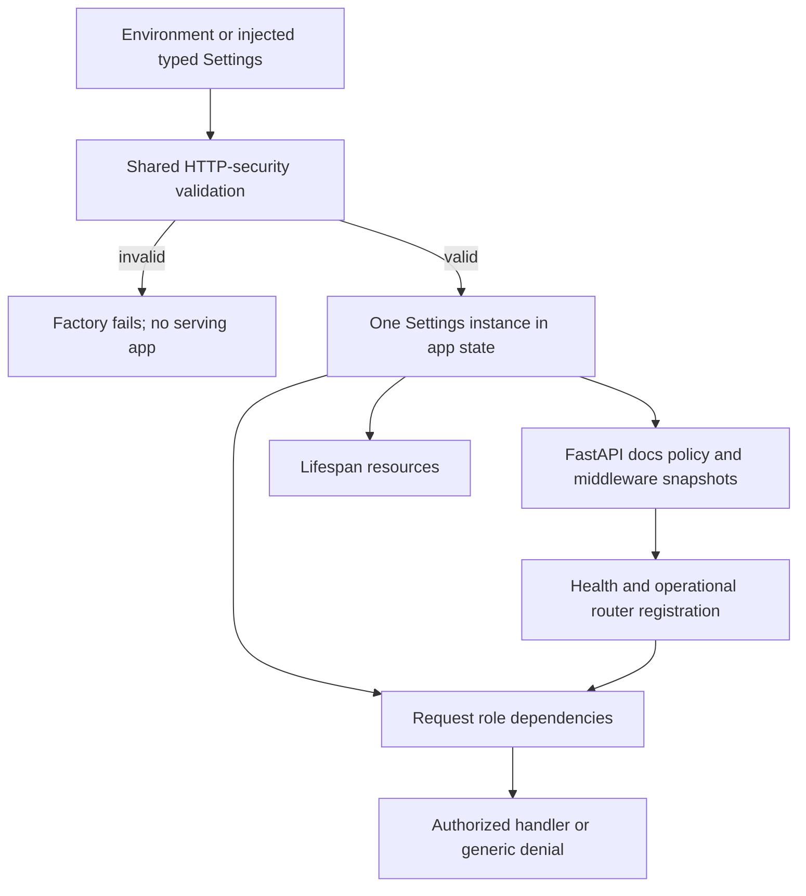
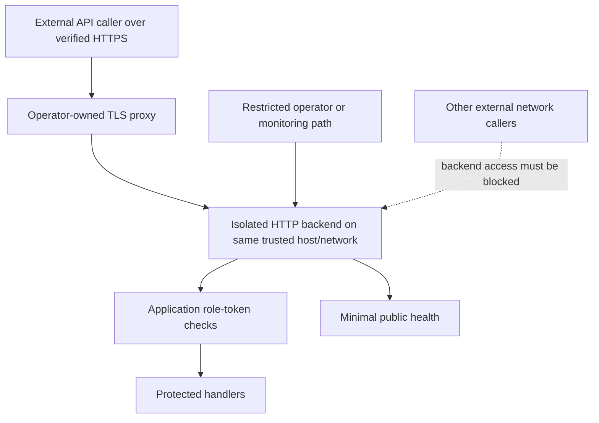

# Production Authentication and Route Exposure - Plan

## Goal Capsule

- **Objective:** Operators can deploy Correlia without accidentally opening protected API or operational endpoints through production configuration.
- **Means:** Environment-gated settings validation and explicit HTTP-surface construction using the existing static-token dependencies (KTD1–KTD3).
- **Authority:** The confirmed policy in R1–R6 and issue #12 define the outcome; current source defines existing behavior; repository guidelines define verification and deployment boundaries.
- **Execution profile:** Security behavior needs failing-before/passing-after regression coverage, then real image/Compose smoke proof. No runtime behavior was exercised during planning.
- **Completion owner:** The implementer completes all units and required Linux verification; the deployment operator qualifies their actual TLS/network boundary before public operation.
- **Stop conditions:** Stop for a required product-policy change, a prerequisite that prevents real PostgreSQL/Compose proof, or evidence that the documented transport boundary cannot be enforced. Do not replace deployment proof with portable tests.

---

## Product Contract

### Summary

Require application authentication in production, protect readiness and metrics, and remove production documentation/schema routes. Preserve nonproduction configurability and document how TLS termination and backend isolation complement application authorization.

### Problem Frame

`Settings.environment` already distinguishes local, test, and production, but does not constrain authentication or exposure. Both role dependencies deliberately bypass credentials when authentication is disabled. Readiness and metrics are public by default, while the factory currently uses FastAPI's default documentation/schema URLs.

Issue #12 identifies this as an unresolved production security policy, not an authentication bypass. Its prior PR #57 supplied verification rather than that policy. The checked-in Compose stack publishes loopback HTTP and supplies an authenticated readiness healthcheck; it does not configure or establish a production TLS edge.

### Requirements

**Production configuration**

- R1. Production requires application authentication with distinct, nonempty operator and ingress tokens, plus the existing separate audit HMAC key; there is no trusted-edge exception.
- R2. Production rejects settings that disable authentication or make readiness or metrics public, including unsafe omitted defaults; it must fail before the application can serve requests.
- R3. Local and test retain their current authentication/exposure combinations and default documentation availability; an omitted environment continues to mean local.

**HTTP exposure and roles**

- R4. Valid production exposes public minimal liveness only, operator-protected readiness/metrics and operator APIs, and ingress-protected Icinga2 ingestion, as enumerated in the route matrix.
- R5. Production has no HTTP endpoint for Swagger, ReDoc, OpenAPI, or the Swagger OAuth redirect; credentials cannot restore these endpoints.
- R6. Protected routes reject missing, invalid, and wrong-role credentials without exposing protected handler data or causing handler work, while correct-role calls retain existing response and mutation behavior.

**Deployment and evidence**

- R7. Deployment guidance requires HTTPS for external token-bearing requests, restricts direct backend reachability, and states the trust assumptions for the proxy-to-application hop.
- R8. Document and exercise the complete route-exposure matrix for nonproduction and valid production settings, including compatibility methods; distinguish application-policy evidence from TLS/network qualification.

### Key Decisions

- **No production auth exception.** Avoid a configuration-based trusted-edge exemption. Governs R1, R2. (session-settled: user-approved — chosen over a trusted-edge exception: the confirmed policy keeps application authentication mandatory.)
- **Minimal production public surface.** Operational data requires the operator role and documentation is absent. Governs R4, R5. (session-settled: user-approved — chosen over configurable public production operations/documentation: the confirmed policy limits anonymous disclosure to liveness.)
- **Preserve nonproduction flexibility.** Do not turn security policy into a local-development cutover. Governs R3. (session-settled: user-approved — chosen over applying the production restrictions everywhere: local configurability was explicitly retained.)

### Route-Exposure Matrix

This is the normative inventory for R4, R5, and R8. “Role” means the existing bearer dependency when authentication is enabled. Nonproduction auth-disabled settings bypass those role dependencies as they do today.

| Method and path | Local/test, auth enabled | Local/test, auth disabled | Valid production |
|---|---|---|---|
| GET `/v1/health` | Public minimal liveness | Public minimal liveness | Public minimal liveness |
| GET `/v1/readyz` | Public if `expose_readyz=true`; otherwise operator | Public, regardless of exposure flag | Operator |
| GET `/v1/metrics` | Public if `expose_metrics=true`; otherwise operator | Public, regardless of exposure flag | Operator |
| POST `/v1/icinga2/events` | Ingress | Public | Ingress |
| GET `/v1/plugins` | Operator | Public | Operator |
| GET `/v1/rules` | Operator | Public | Operator |
| GET `/v1/topology` | Operator | Public | Operator |
| GET `/v1/incidents` | Operator | Public | Operator |
| GET `/v1/incidents/{incident_id}` | Operator | Public | Operator |
| POST `/v1/incidents/{incident_id}/ack` | Operator | Public | Operator |
| POST `/v1/incidents/{incident_id}/close` | Operator | Public | Operator |
| PATCH `/v1/incidents/{incident_id}` | Operator; compatibility acknowledge/close | Public | Operator; existing compatibility semantics |
| DELETE `/v1/incidents/{incident_id}` | Operator; compatibility close, not deletion | Public | Operator; existing compatibility semantics |
| GET `/v1/incident-events` | Operator | Public | Operator |
| GET `/docs` | Public Swagger | Public Swagger | Absent |
| GET `/redoc` | Public ReDoc | Public ReDoc | Absent |
| GET `/openapi.json` | Public schema | Public schema | Absent |
| GET `/docs/oauth2-redirect` | Public documentation helper | Public documentation helper | Absent |

Denial expectations apply to supported methods with syntactically valid bounded requests and available rate-limit capacity. Existing size/rate/routing precedence remains; unsupported methods, malformed requests, or exhausted quotas need not produce 401. None may disclose protected handler output. Existing obsolete unprefixed paths remain absent.

### Acceptance Examples

- AE1. **Unsafe production cannot serve.** Covers R1, R2. With otherwise-valid credentials, production plus auth disabled or either public operational flag fails settings/factory initialization. Selecting production with unchanged local defaults also fails.
- AE2. **Operational failure stays private.** Covers R4, R6. With a failed readiness dependency, the operator receives the existing safe 503 checks response; anonymous, invalid-token, and ingress-token callers receive generic denial without evaluating readiness. Public health remains minimal and independent.
- AE3. **Roles do not imply each other.** Covers R1, R6. An operator token cannot submit an event; an ingress token cannot query, acknowledge, close, PATCH, or DELETE an incident. Authorized ingestion and operator mutation still work.
- AE4. **Documentation is absent, not hidden.** Covers R5. Production exact and trailing-slash documentation/schema/helper URLs return 404 for bounded GET/HEAD requests with redirect following disabled, both anonymously and with valid credentials.
- AE5. **Local configuration remains useful.** Covers R3. Local/test auth-disabled operation, independently configurable operational exposure, and default docs remain available.
- AE6. **Production-mode container proof is honest.** Covers R7, R8. The existing image serves the matrix under valid production settings and refuses effective unsafe overrides. Its loopback HTTP smoke is not evidence of external HTTPS or backend isolation.

### Scope Boundaries

- In scope: existing environment/flags, settings validators, factory/lifespan settings ownership, role/exposure regression coverage, the existing Compose smoke, and operator/sample documentation.
- No new authentication framework, identity provider, proxy service, TLS middleware, token format, environment selector, exposure setting, persistence schema, queue, or worker topology.
- No changes to incident aggregation, compatibility mutation semantics, authorization error status, rate limiting, or request-size limits.
- Deployment-specific certificates, proxy configuration, firewall rules, and external reachability qualification belong to the operator's environment; this work documents their obligations rather than claiming to have deployed them.
- Arbitrary malformed Python `model_construct` objects, dependency overrides, and deliberate post-factory mutation/replacement of application state are trusted-code bypasses outside the production configuration contract.

---

## Planning Contract

### Key Technical Decisions

- KTD1. **Reuse the existing environment selector and reject contradictory values.** Keep the existing exposure bool defaults and enforce R1/R2 in the established after-validator style. Resolved values matter, not the source that supplied them; no `model_fields_set` provenance checks, clamping, or environment-dependent defaults. Production requires `CORRELIA_API_AUTH_ENABLED=true`, `CORRELIA_EXPOSE_READYZ=false`, and `CORRELIA_EXPOSE_METRICS=false`. This avoids a second configuration mechanism. (session-settled: user-approved — chosen over a trusted-edge exception: this instantiates the mandatory-application-auth decision governing R1, R2.)
- KTD2. **Resolve settings once before constructing the HTTP surface.** The factory always stores the resolved instance, and lifespan uses it instead of loading settings again. Reuse non-mutating Settings validation at factory entry for already-typed injected settings, including every R1 role-token and audit-key invariant. Do not copy/round-trip or reparse the whole model. This closes source-traced drift between middleware/router snapshots and live request credentials without promising immutable application state.
- KTD3. **Prevent production docs registration at construction.** Set all four FastAPI documentation/schema/helper URL options to disabled in production; preserve current nonproduction defaults. Retain existing role dependencies and readiness/metrics builders. Do not delete registered routes afterward or add global auth dependencies, which would incorrectly protect public health. [FastAPI docs URL reference](https://fastapi.tiangolo.com/tutorial/metadata/#docs-urls) and [conditional OpenAPI guidance](https://fastapi.tiangolo.com/how-to/conditional-openapi/) support this mechanism. (session-settled: user-approved — chosen over keeping public production docs: this instantiates R5 by removing the built-in HTTP surface.)
- KTD4. **Preserve safe failures without treating validation records as redacted.** New policy errors name fields only. Enable Pydantic's input-hiding setting for formatted settings-validation exceptions so the new startup failure does not print supplied input; raw structured validation errors still contain sensitive input and must not be logged. Factory policy errors must not interpolate settings or credentials. This applies to settings presentation, not unrelated Alembic/plugin failures.
- KTD5. **Prove policy through HTTP and state, not schema or source text.** Maintain an independent expected method/path/role inventory in the existing security/exposure tests and exercise each row. Registry completeness includes ordinary HTTP routes and FastAPI API routes, accounting for built-in docs GET/HEAD pairs in nonproduction and their absence in production. Expected roles are policy values, never inferred from registered dependencies or OpenAPI. Authorized paths must demonstrate successful processing or real response/state behavior, not merely a 422 from an invalid payload. Database mutation proof reuses real PostgreSQL fixtures.
- KTD6. **Separate application policy from transport trust.** The repository retains its one-worker HTTP backend; the operator owns TLS termination and backend reachability. Document host-proxy loopback publication and containerized-proxy private-network/no-backend-publication as distinct topologies. Do not claim unpublished ports are proxy-only: host and same-bridge peers can reach them. [Docker publishing](https://docs.docker.com/engine/network/port-publishing/) and [OWASP HTTPS/access control](https://cheatsheetseries.owasp.org/cheatsheets/REST_Security_Cheat_Sheet.html) govern this distinction.

The consequential HOW is settled by existing settings, factory, and dependency patterns. No structurally distinct design requires further development or a Bake-off.

### High-Level Technical Design

#### Configuration and HTTP ownership

Factory failure precedes application lifespan resources. Container startup still runs Alembic before invoking the factory; this plan does not promise rejection before migrations or Compose dependency startup.

#### Environment/flag decision matrix

| Environment | Auth | `expose_readyz` | `expose_metrics` | Construction result |
|---|---|---|---|---|
| local/test | true | Any bool | Any bool | Existing role-token validation; exposure per route matrix |
| local/test | false | Any bool | Any bool | Existing auth-disabled behavior; audit key still required |
| production | true | false | false | Accept only with existing valid distinct credentials |
| production | false | Any bool | Any bool | Reject |
| production | true | true | Any bool | Reject |
| production | true | Any bool | true | Reject |

#### Deployment trust boundaries

The backend hop is plaintext unless separately encrypted. If it crosses machines or an untrusted network, protect that hop rather than asserting that public TLS encrypts it. A reverse proxy must preserve Authorization and must not inject a shared privileged token for unauthenticated callers.

### System-Wide Impact

- Operators migrating to production must set the selector and both exposure flags explicitly; existing production auth-disabled/public-operation configurations stop working rather than silently widen access.
- Monitoring uses the operator token. Public-edge routing should exclude or restrict readiness/metrics even though the application enforces credentials.
- API consumers retain the same business URLs, tokens, response contracts, and compatibility methods. Production schema discovery disappears; local/test schema discovery remains.
- Factory and lifespan share one settings owner. Middleware order, transaction ownership, background work, and one-worker startup stay unchanged.

### Risks and Operational Notes

- **Environment selection is explicit.** The application cannot infer that a deployment is production. Operators must set `CORRELIA_ENVIRONMENT=production`; leaving it local retains local policy. Do not add network/location heuristics.
- **Compose defaults are local.** Compose already sets readiness false but metrics true. A production-only selector override intentionally fails until metrics is false. Shell interpolation can override `.env`; effective container values, not the file's appearance, determine safety. Host-side Settings does not automatically load `.env`.
- **Policy rejection is not a reason to weaken policy.** Prepare KTD1's production inputs and operator-authenticated monitoring before activation. On rejection, correct effective inputs or keep the service unavailable; never switch to local/test or disable controls as an availability workaround. Roll back only to an image/configuration proven to preserve R1–R6. Migrations may already have run, so check image/schema compatibility and do not automatically downgrade the database.
- **Startup error visibility needs runtime proof.** Fixed messages alone do not sanitize Pydantic input records. Exercise formatted new failure paths with disposable secret sentinels and avoid printing raw rendered Compose configuration or stderr in test failure diagnostics.
- **Network assumptions need qualification.** Account for IPv4/IPv6, bridge membership, Docker direct routing/gateway modes, and Docker-aware firewall paths. Docker documents a localhost-published-port caveat before Engine 28 and a [ufw interaction](https://docs.docker.com/engine/network/packet-filtering-firewalls/); a loopback binding or host firewall statement alone is not universal isolation proof.
- **Proxy metadata is not authentication or TLS proof.** Document explicit trusted connecting proxy peers. Pinned Uvicorn 0.49.0 defaults to trusting `127.0.0.1`, processes forwarded scheme/client IP, and does not reconstruct `X-Forwarded-Host`; preserve/set the real Host as required. Do not recommend wildcard forwarding trust without independently enforced isolation.
- **Static tokens are not blanket security compliance.** Restrict operational endpoints to an operator/monitoring network, consistent with [OWASP management-endpoint guidance](https://cheatsheetseries.owasp.org/cheatsheets/REST_Security_Cheat_Sheet.html#management-endpoints). No replacement auth design is required here.

### Sources and Research

- Product issue: [#12](https://github.com/sh1ny/correlia/issues/12), including its reconciliation against PR #57; historical run evidence is not proof of this change.
- Current settings/auth ownership: `app/config/settings.py`, `app/main.py`, `app/api/deps.py`, `app/api/security.py`.
- Current route inventory: `app/api/routers/health.py`, `app/api/routers/metrics.py`, `app/api/routers/ingress.py`, `app/api/routers/plugins.py`, `app/api/routers/config_status.py`, `app/api/routers/incidents.py`, and `app/api/routers/audit.py`.
- Deployment and proof: `compose.yaml`, `.env.example`, `scripts/container-entrypoint.sh`, `tests/test_deployment.py`, `tests/conftest.py`, `mise.toml`, and `CONFIGURATION.md`.
- Institutional constraints: `docs/solutions/security-issues/plugin-notification-boundary-convergence.md` and `docs/solutions/architecture-patterns/bounded-operational-visibility-across-runtime-boundaries.md`; keep safe errors and bounded readiness/metrics unchanged.
- Locked versions from `uv.lock`: FastAPI 0.136.3, Pydantic 2.13.4, pydantic-settings 2.14.2, Starlette 1.3.1, Uvicorn 0.49.0. No dependency update is required.
- Exact framework behavior: [FastAPI 0.136.3 construction](https://github.com/fastapi/fastapi/blob/0.136.3/fastapi/applications.py), [Pydantic model validators](https://docs.pydantic.dev/latest/concepts/validators/#model-validators), [Pydantic configuration](https://docs.pydantic.dev/latest/api/config/), [Uvicorn 0.49.0 proxy handling](https://github.com/Kludex/uvicorn/blob/0.49.0/uvicorn/middleware/proxy_headers.py), and [FastAPI behind a proxy](https://fastapi.tiangolo.com/advanced/behind-a-proxy/).

---

## Implementation Units

### U1. Enforce the production settings invariant

- **Goal:** Unsafe production configuration cannot construct a serving application.
- **Requirements:** R1–R3; AE1, AE5.
- **Dependencies:** None.
- **Files:** `app/config/settings.py`, `tests/test_settings.py`.
- **Approach:**
  1. Add the production policy using existing after-validation conventions and KTD1; retain all existing credential/audit validation.
  2. Reuse private, non-mutating Settings validation at factory entry under KTD2, including the existing audit-key check. Enforce production policy before any auth-disabled early return; do not duplicate credential rules or add a validation facade.
  3. Apply KTD4 to new validation failures; keep field names useful and credential values absent.
- **Patterns to follow:** Existing typed Settings fields, SecretStr handling, after validators, and isolated settings tests.
- **Execution note:** Start with focused invalid-production cases using otherwise-valid settings, so unrelated validation failures cannot falsely satisfy the regression.
- **Test scenarios:**
  1. Covers AE1. Reject every production combination with auth false or either exposure flag true; accept auth true/both false with valid distinct credentials.
  2. Covers AE1. Reject both exposure flags omitted and each individually omitted under production; constructor and process-environment inputs obey the same resolved-value rule.
  3. Existing missing, blank, equal-token, and reused-audit-key cases still fail under otherwise-valid production values; valid production credentials succeed.
  4. Covers AE5. Explicit local/test and omitted-environment local keep exposure defaults and auth-disabled combinations; unknown environment values remain rejected.
  5. Formatted new settings-validation failures contain the field/policy diagnosis but none of the supplied disposable database/token/audit sentinels. Do not persist snapshots or assert incidental exact wording.
- **Verification:** Focused settings regressions prove both the new rejection boundary and unchanged nonproduction behavior.

### U2. Construct the HTTP surface from one validated settings instance

- **Goal:** Registration-time policy, request credentials, and lifespan use one authoritative configuration.
- **Requirements:** R2–R5; AE1, AE4, AE5.
- **Dependencies:** U1.
- **Files:** `app/main.py`, `tests/test_exposure_config.py`, `tests/test_health.py`.
- **Approach:**
  1. Resolve loaded or injected settings before constructing FastAPI and invoke U1's shared policy check.
  2. Always store the resolved instance in app state; remove the now-obsolete lifespan fallback that loads a second settings instance.
  3. Apply KTD3 before framework routes register; retain existing health/metrics builders, role dependencies, middleware order, and injected service seams.
- **Patterns to follow:** Current factory injections and HTTPX ASGITransport/lifespan fixtures; no global service state.
- **Test scenarios:**
  1. Covers AE4. All four docs/schema/helper URLs and trailing-slash variants are absent for production GET/HEAD with no token and valid tokens, using fresh quota and redirects disabled; no Location or documentation body appears.
  2. Covers AE5. Local/test retain public default docs/schema/helper GET behavior and independent readiness/metrics exposure combinations, including auth-disabled operation.
  3. A valid injected production instance wins over contradictory valid local process environment; a valid injected local instance retains local behavior even with production environment inputs.
  4. Construct an uninjected production app, then change process environment before lifespan entry; original tokens and docs/operational policy remain effective through real HTTP behavior, not loader-call-count assertions.
  5. Covers AE1. Correctly typed injected instances with unsafe production flags, missing/blank/equal role tokens, or a blank/reused audit key are rejected at factory entry under otherwise-safe production settings; no full malformed-object validation contract is introduced.
- **Verification:** HTTP responses establish production absence and local compatibility; the environment-change scenario proves configuration coherence across construction and lifespan.

### U3. Exercise every route and role boundary

- **Goal:** The matrix proves denial, authorization, and preservation of real handler behavior across all methods.
- **Requirements:** R4–R6, R8; AE2, AE3.
- **Dependencies:** U2.
- **Files:** `tests/test_security.py`, `tests/test_exposure_config.py`, `tests/test_ingress_router.py`, `tests/test_incidents_api.py`, `tests/test_audit_api.py`, `tests/test_health.py`, `tests/test_metrics_api.py`; modify existing router/dependency files only if a coverage finding proves a gap.
- **Approach:**
  1. Implement KTD5 as table-driven HTTP coverage with explicit methods, valid UUIDs, and bounded valid bodies; include both compatibility methods.
  2. Upgrade selected real ingress/incident/audit behavior cases to explicit valid production settings and correct-role credentials, overriding their auth-disabled helper/fixture for those cases. Reuse PostgreSQL/processor fixtures rather than fake persistence or echoed processor results; preserve separate nonproduction auth-disabled coverage.
  3. Combine production protection with readiness failure and metrics rendering boundaries; reuse existing size/rate precedence coverage rather than changing status order.
- **Patterns to follow:** Existing generic unauthorized/Bearer challenge contract, pytest-asyncio ownership, PostgreSQL image fixture, and current compatibility transition tests.
- **Test scenarios:**
  1. Every protected matrix method rejects missing, invalid, and wrong-role tokens with the existing generic 401 and Bearer challenge for below-limit valid requests. Denied queries/mutations cannot reach protected handler work or data.
  2. Covers AE3. A valid ingress event succeeds with the ingress token and records its real processing result; the operator token cannot submit it. Replace the existing 422-only authorized-ingress examples as authorization proof rather than retaining their misleading handler-execution claim.
  3. Correct operator credentials return the existing safe results for plugins/config/list/detail/audit and acknowledge/close methods; wrong-role calls leave real incident/audit state unchanged.
  4. Covers AE3. Authorized compatibility PATCH acknowledges/closes and DELETE closes rather than deletes; denied versions preserve state and do not execute compatibility-handler effects. Reuse existing semantics coverage rather than duplicate lifecycle tests.
  5. Covers AE2. Production readiness is operator-readable for ready 200 and failed 503 states. Denied callers neither see checks nor invoke readiness probes; public health stays its existing minimal 200 independently.
  6. Operator metrics access retains Prometheus content/type; denied credentials receive no metrics body and do not render it.
  7. Existing oversize/rate-exhaustion tests retain safe 413/429 behavior without protected handler effects; ordinary auth/matrix cases use deterministic fresh capacity. Unsupported methods do not gain a new authorization-status promise.
- **Verification:** HTTP assertions and real processing/state outcomes cover every expected route/method; an inventory completeness check catches a newly registered route omitted from the expected policy.

### U4. Qualify the production-mode container and document deployment obligations

- **Goal:** The existing image proves application policy under production inputs, and operators can configure the transport boundary without mistaking local defaults for production safety.
- **Requirements:** R1–R8; AE1, AE6.
- **Dependencies:** U1–U3.
- **Files:** `tests/test_deployment.py`, `CONFIGURATION.md`, `.env.example`; keep `compose.yaml` and `scripts/container-entrypoint.sh` unchanged unless required to preserve their current contract.
- **Approach:**
  1. Change the existing real-stack smoke from test-mode to valid production inputs; extend it rather than adding a second stack or proxy topology.
  2. Add bounded negative startup qualification for effective unsafe auth/exposure overrides using the built image and existing database, with disposable credentials and sanitized diagnostics.
  3. Document KTD1's exact production values, constructor/environment/Compose precedence, route matrix, and policy-preserving rollout/rollback safeguards from Operational Notes. Keep `.env.example` local and annotate the required production changes.
  4. Document KTD6's TLS/network envelope and explicit proxy-peer trust. Correct the current guide's token-free healthcheck claim: Compose uses authenticated readiness, while health is public liveness.
- **Execution note:** Use otherwise-valid inputs and the healthy existing database for negative runs. Confirm allowlisted effective policy fields, the expected policy rejection, and the named negative container's nonzero exited state; Docker errors, migration failures, timeouts, or an unpublished host port are not passing rejection evidence. Reuse the existing `_assert_secret_absent`/fixed-message failure helpers and compare only allowlisted nonsecret fields, never full inspection/environment objects or captured streams.
- **Test scenarios:**
  1. Covers AE6. The existing deployed image runs valid production: public minimal health, missing/invalid/ingress-token operational denial, operator readiness/metrics access, absent docs/schema/helper paths, and normal authorized ingestion/operator behavior.
  2. Covers AE1. Effective production plus auth false or either operational flag true reaches the expected policy rejection and exits nonzero without serving. Identify the negative container rather than probing the valid stack or an unpublished host port. Include selecting production while retaining Compose's local metrics default.
  3. An unsafe override in the actual Compose subprocess environment defeats an intact safe lower-precedence env-file value and reaches application rejection; prove allowlisted effective inputs rather than sample-file text.
  4. New startup errors do not print disposable secret sentinels. Inspect captured diagnostics without including their raw content in assertion failures.
  5. The existing local sample still parses/loads with local auth/exposure behavior; no production restriction leaks into the sample contract.
- **Verification:** The existing deployment smoke proves production-mode application behavior and startup rejection. Operator documentation is checked against actual manifests. HTTPS, certificate trust, and off-host backend isolation remain separately qualified deployment obligations, not claims of this HTTP smoke.

---

## Verification Contract

| Gate | Applicability | Required evidence |
|---|---|---|
| Focused settings/security/exposure tests | U1–U3 | `tests/test_settings.py`, `tests/test_security.py`, and `tests/test_exposure_config.py` cover the policy matrix, role denials, docs absence, and nonproduction compatibility. |
| Real handler/persistence proof | U3 | Existing incident/audit/ingress/health/metrics tests exercise successful handlers and denied state preservation; PostgreSQL for persistence, never SQLite. |
| Real deployment smoke | U4 | Existing `tests/test_deployment.py` stack uses production settings; valid serving and invalid-startup paths are exercised through the built image. |
| Required complete verification | Final implementation | `mise run ci` on Linux with Docker/Compose passes its required full selection and smoke once. Do not append a second deployment smoke after this command. |
| Portable development checks | Windows or constrained development | `mise run check:portable` is useful subset evidence only; unexecuted PostgreSQL/POSIX/deployment paths remain explicit. |
| Operator production qualification | Before public operation | Verify public HTTPS/certificate trust, blocked backend access from external IPv4/IPv6/routable-container positions, intended backend peers, and restricted operational routing on the real topology. |

Verification uses pinned Python 3.14.7, uv 0.11.7, and the existing lock. Follow `CONFIGURATION.md#contributor-verification`; do not update the lock during checks. No tests, image execution, or deployment qualification were performed to write this plan.

Operator qualification must not send real bearer credentials over an exposed plaintext path. Begin with certificate-verified HTTPS; a redirect after sending a token over HTTP cannot undo disclosure. Keep credentials out of URLs and proxy/application diagnostics.

---

## Definition of Done

- U1: production invalid/valid combinations, existing token/audit invariants, safe new diagnostics, and nonproduction compatibility are proven.
- U2: one settings owner drives factory/lifespan/requests; production docs are absent and local/test availability remains.
- U3: every matrix method has role-denial and authorized-behavior coverage, including compatibility mutation, protected readiness failure, and metrics disclosure boundaries.
- U4: the actual image runs the production matrix, rejects unsafe effective inputs, and ships accurate production/local/TLS/network guidance.
- Required Linux full verification passes with real PostgreSQL and Compose; no portable-only release claim.
- All affected callers, fixtures, and documentation use the same policy; obsolete settings reload logic and abandoned scaffolding/throwaway scripts are removed.
- No new exception mode, proxy service, dependency, compatibility shim, lifecycle change, or unrelated hardening enters the implementation.
- Application-policy completion is not a claim that an unspecified production edge is TLS/network-qualified; the operator's separate qualification remains explicit.
